import hevc from "./sunrisefast-hevc.mp4";
import h264 from "./sunrisefast-h264.mp4";

Edits:
  - Added images from my time in Korea. See edit [here](https://github.com/VINXIS/vinxis.moe/commit/d0ccf5e46845c3771dbfb0eb37e65edcbd047bc5)

Happy New Year!!! I just came back from Korea and IMMEDIATELY resumed Masters LOL. Wanted to make a short blog post about this because I wanted to say just a couple things

It was an absolutely great time though, seeing so many people I've known for a while again. I met most of them for the first time around August actually when I went to the Netherlands, but I met a few more people too for the first time after knowing them for so long online.

The picture above was a bit after we watched the sunrise. I also have a REALLY TERRIBLY MADE video of the sunrise slowly showing up right below. Sorry for the shaking and the random ISO changes LMFAO it was on phone and it was actually the coldest time during my trip so hands were cold as fuck

<video controls preload="metadata" muted playsInline>
  <source src={hevc} type='video/mp4; codecs="hvc1"' />
  <source src={h264} type="video/mp4" />
  Your browser does not support the video tag.
</video>

I wish I was in Korea for longer man, everyone is actually still there and I'm lowkey hitting FOMO, but uni fuckin my ass so oh well

---

Every month I try purging all my body hair because I don't really like body hair on my own body. Frankly I don't really care if others have body hair or not though I totally wouldn't mind if the person I dated was the hairiest person alive, but I just hate body hair. 

This time instead of trying trimming it all I went with Nair, and I completely fukcing regret it man. First off the hair didn't even like really come off in the places I used it, and for a lot of the hairs they were like still stuck but barely, so I had to like pull a lot of them off. Second off I got some nasty fucking chemical burns and since then I have just been absolutely miserable.

Also a hemorrhoid fucking prolapsed at the same time and everything is just such a fuckgin pain to do with all this happening to my body rn, but whateverrr oh well

---

Still though, Korea was epic. ~Not sure if I can post pics from the trip yet so I have refrained from everything aside for the sunrise, but I'll update it later today/tomorrow if I can post some.~ I updated with some pics now!

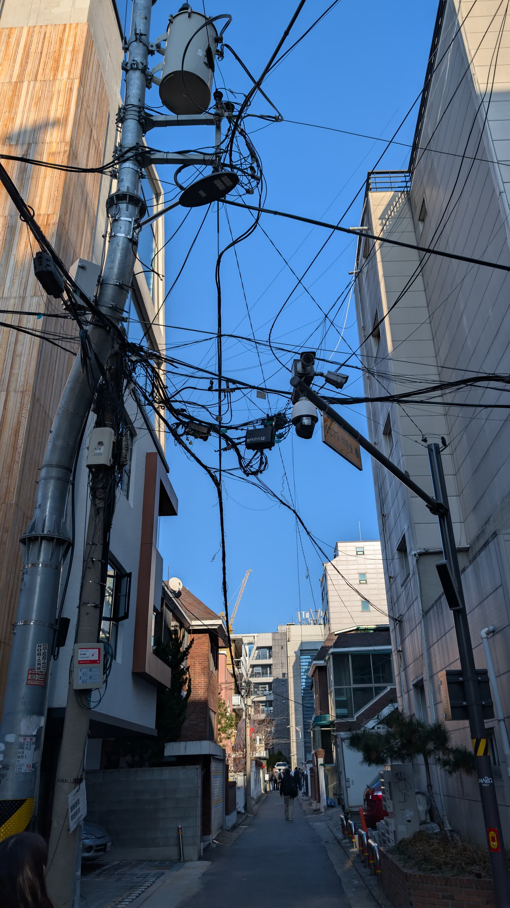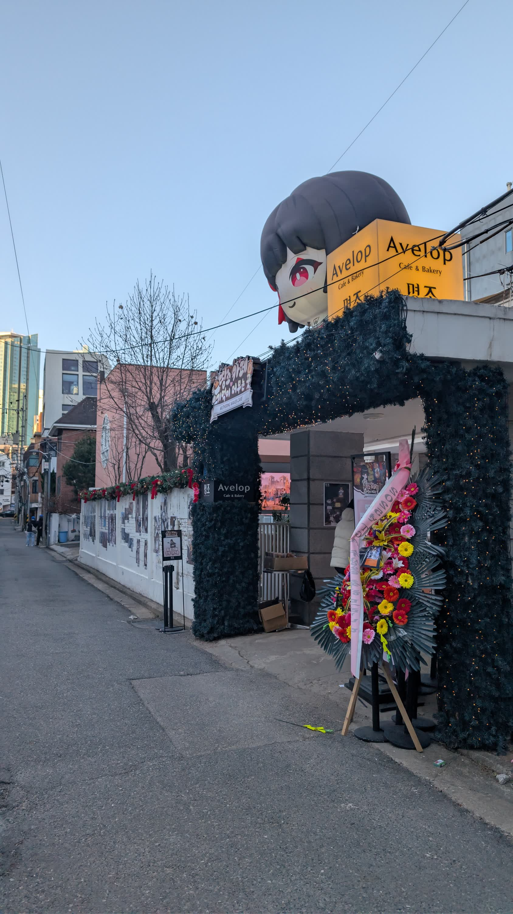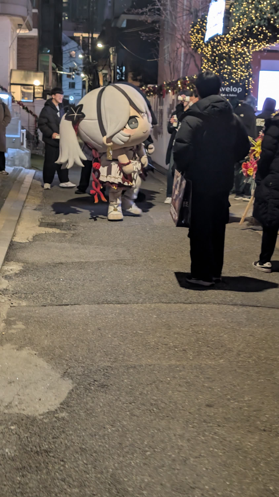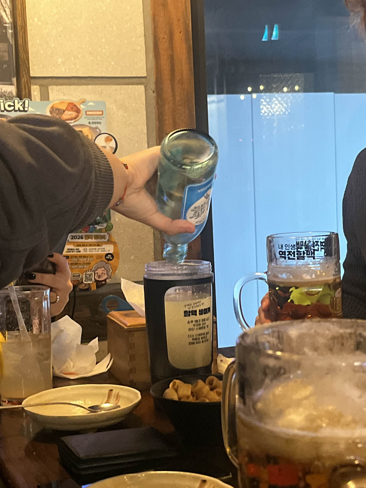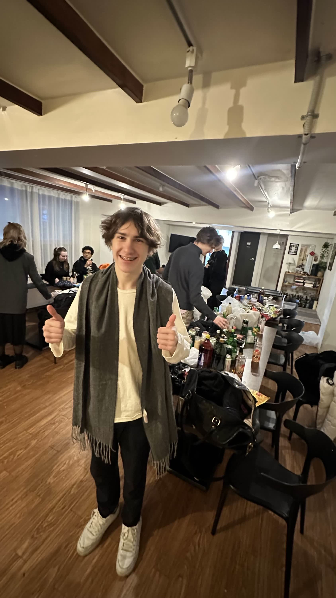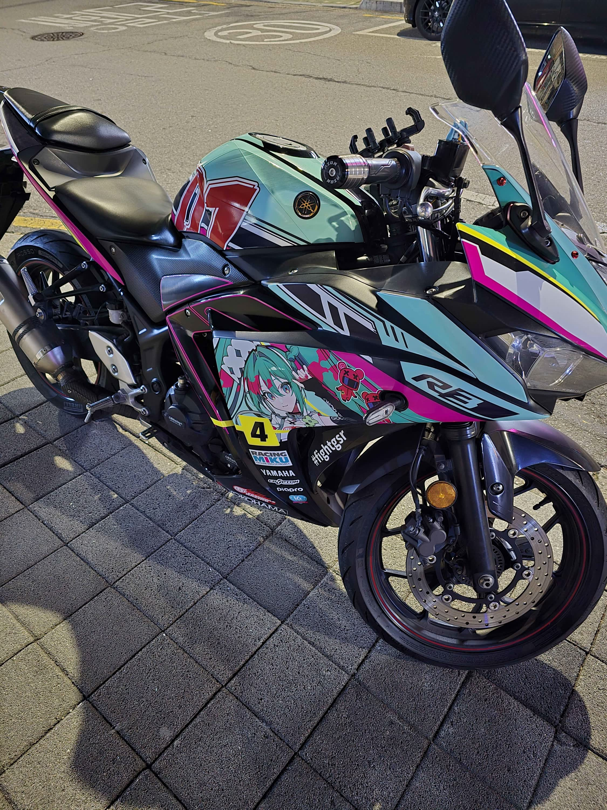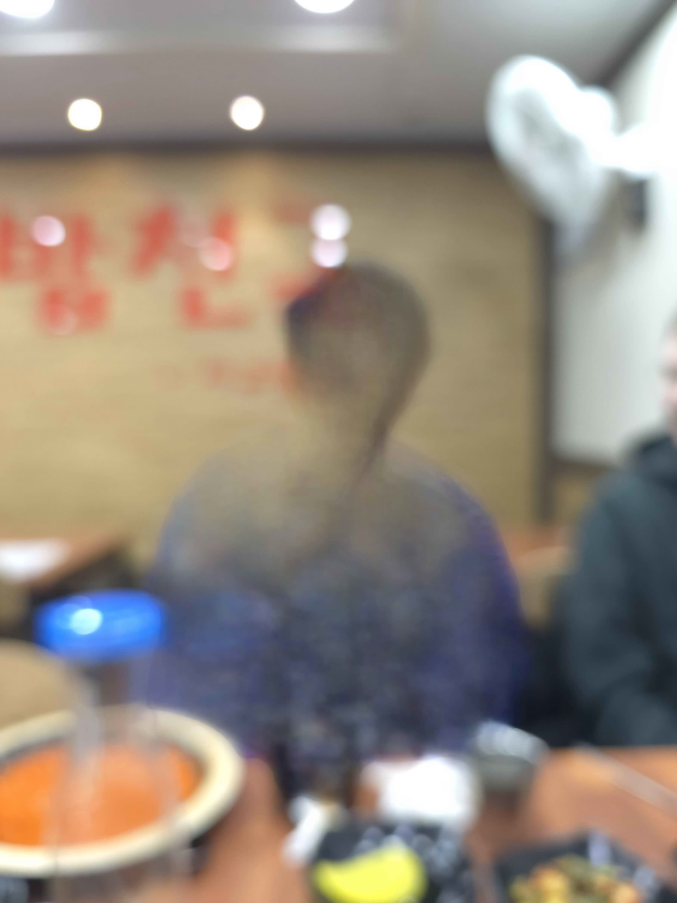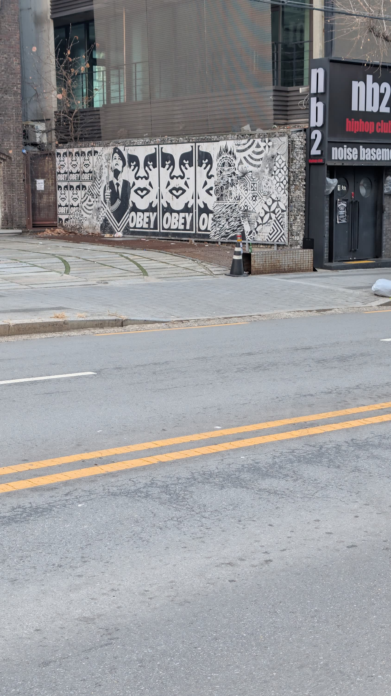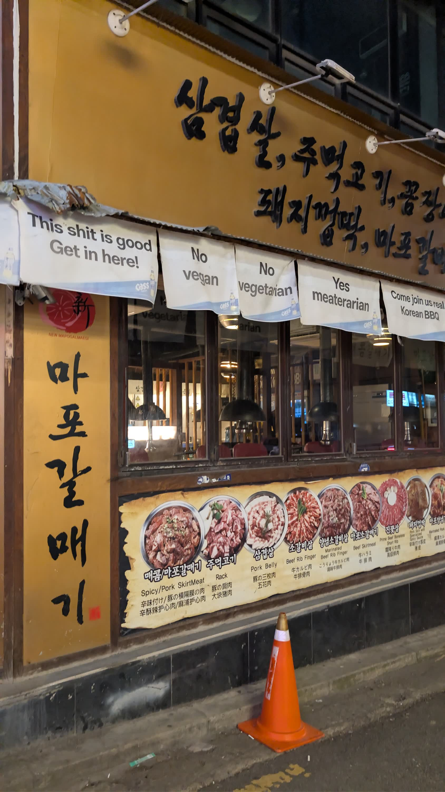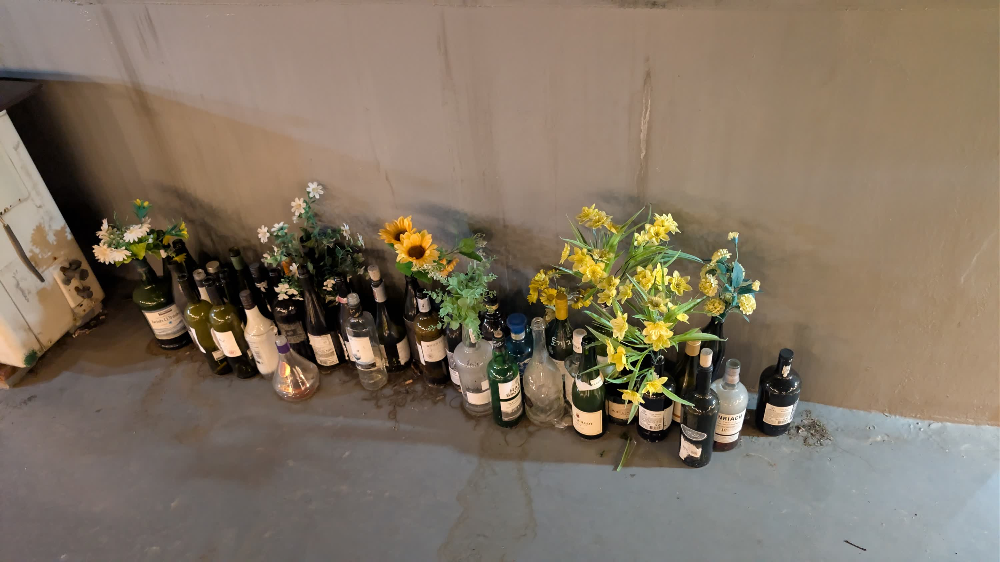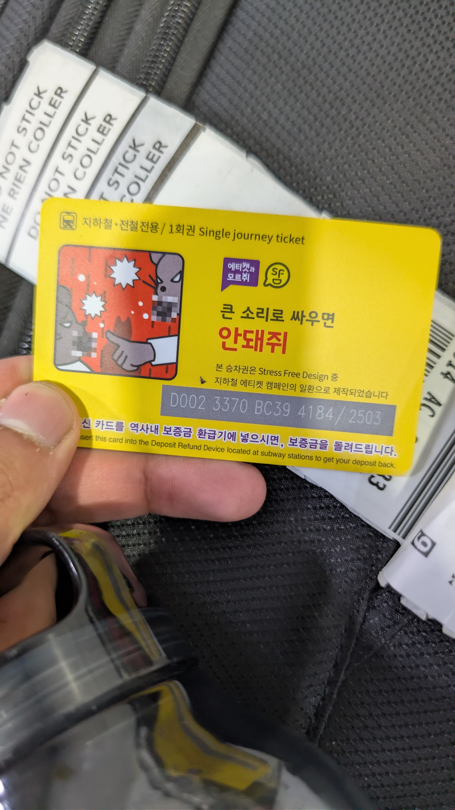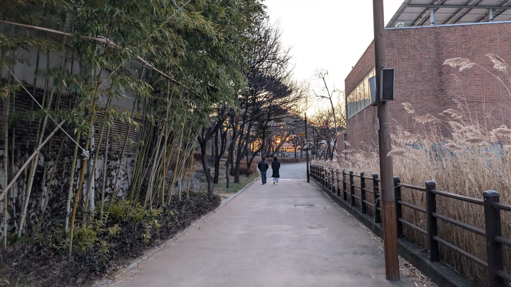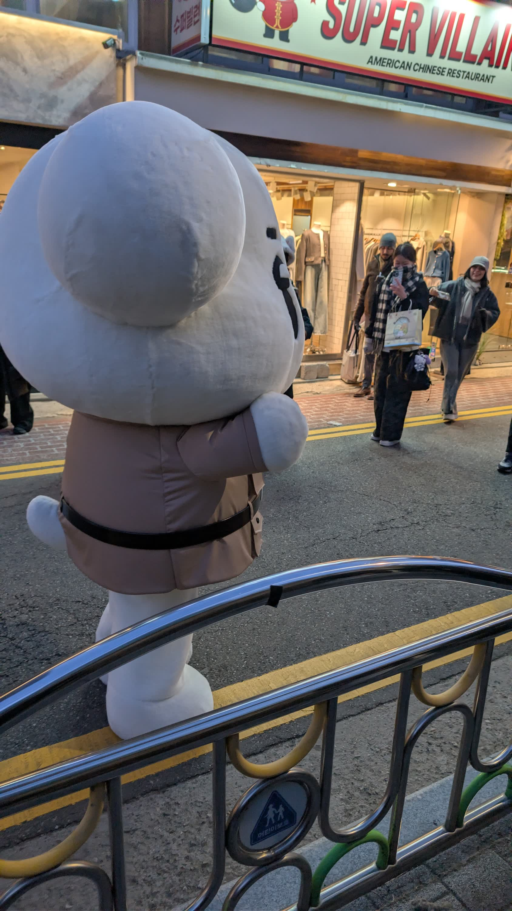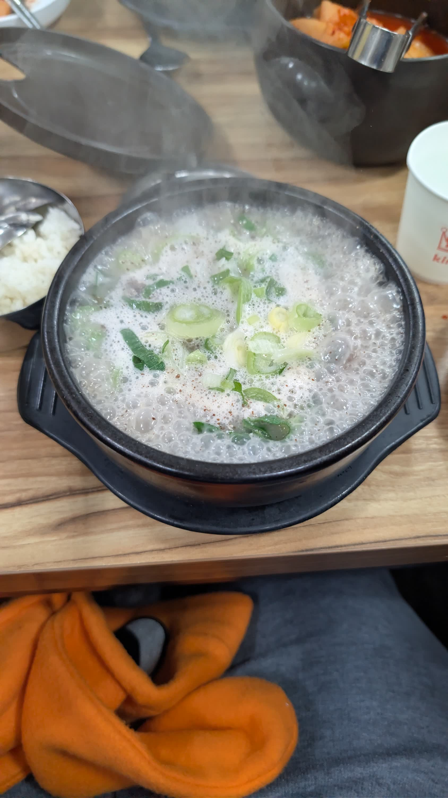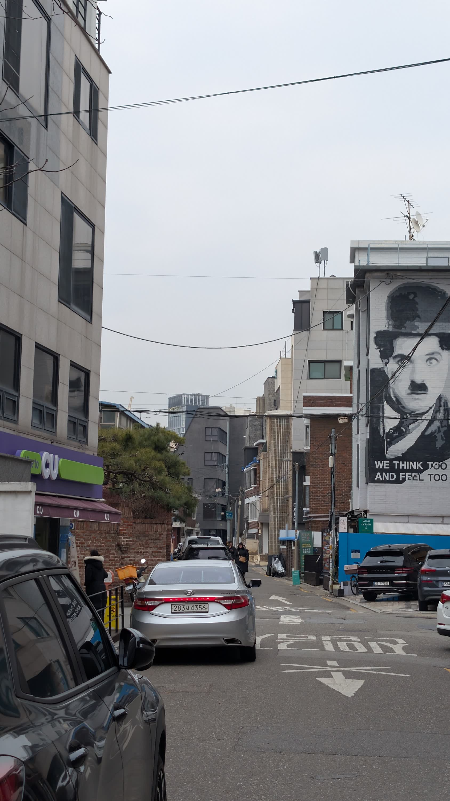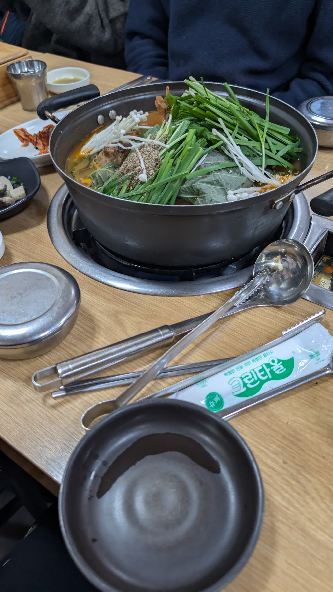

I'm in the back of the 5th picture with the black hoodie

Here's to hopefully a great year. So far it's already been absolutely epic and absolutely horrendous Lool. My 26th year in life was so monumental, so maybe the 26th year of the 2000s will just be as amazing

