Edits (Not related to new entries to post):
 - Retrospectively added images to previous days on April 14 JST. See edit [here](https://github.com/VINXIS/vinxis.moe/commit/caa9363bb169ac15dd68a8296a117a13875c0d81)

Wow, I'm actually in Japan.

I'll try updating this everyday for the period I'm here (Apr 1 - Jun 30) (even though I'm starting this April 3). I might also change this to be multiple blog posts instead of just one big one but idk yet...
# April 1 2025 JST
*Written at April 3 22:23 UTC*

The day of landing. It was so hectic because I wanted to try getting my pocket wifi at the same day, but I was likely not going to make it.

Immediately, it was interesting how much of a big deal they were making [[MERS]] out to be at the airport customs (I landed at [Narita](https://maps.app.goo.gl/tmUMzkEuivS5cKmX6)), and also their gate of entry was interesting. They had some camera + fingerprint machines that they had randomly select every 4 people out of 50 in the super longass lineup; I think it was meant to try to speed up the process or something? Because it's the same thing you do at the customs desks anyway, but I'm not sure.

When I was flying they made me check-in my carry-on bag because of space or whatever, but I had plates and bowls in that shit so I was kind of concerned they would just have completely broken. Luckily they didn't though everything came intact which was sick.

It was a downpour in Tokyo, and when I checked the weather for Sendai, it was also raining there. It was unfortunate since I had no rain gear or anything. My trip was to take the Narita Express to Tokyo station from Narita, and then take the Shinkansen from Tokyo station to Sendai. The plan was to get an umbrella at Tokyo station once I got to the Shinkansen gate. Unfortunately, once I got to the station, and right by the fucking shinkansen gate, my glass water bottle just Spontaneously exploded and fell to pieces for some fucking reason... So all my buffer time was wasted on standing around the broken pile of glass. This was mostly because the glass was hard to see and they needed to put down pylons to clean the stuff off.

Anyway, I didn't even say what the reason was for me to be in Japan. Basically, I wanted to get into Masters for Biomedical Engineering or the like, and I tried contacting professors from the University of Alberta, but ultimately got no response. So then, I tried contacting other places, and one of them was Tohokudai. Over there, they said I could come over for like a few months to visit the university, and also look at other labs potentially, to see what I'm interested in, and apply then. So basically I'm siphoning my parents money to go there.

I was meeting with 2 of the students from the lab at the station, and it was a good time meeting them. It was still raining like crazy, and everything was just so wet, and my shoes were already getting really soaked, but we went to a Palestinian restaurant ([Zaytoon](https://maps.app.goo.gl/JTadyUz8BzbodwKR8)) and got lamb sandwiches, and it was some really good food. I did find it funny that they served a lot of alcohol, but it's not like an issue or anything, just amusing that it was the case there.

By the time I got back home and left the other 2 students, it was too late to get the pocket wifi from the post office, but it was fine because I basically just hit the sack then and there.

Speaking of which, the room is really nice. I didn't understand the heating so I was sleeping in cold for a bit, but it's a really nice size for me. It's also got a laundry machine, and a stove. They also provided a pillow blanket and bed sheet as well.

# April 2 2025 JST
*Written at April 3 22:53 UTC*

I forgot that my suitcase was completely tied up, and I had nothing to cut it, so I could only hope that the FamilyMart by the apartment had something to cut... and they did! These convenience stores are honestly kind of amazing you can just get food for like 1 dollar in like 2 minutes. It's like when I'm at home and I want to just eat something I just look at the pantry and cop it. It's actually so nice. You go, get whatever, come back, immediately chilling. No need for bulk buying or anything when you can just go there anytime.

After that I went to Loft... this place is expensive honestly I ended up spending like 12.7k yen there (about 120 dollars) for shit I needed. Also it was still raining like crazy this day, but I was outside for most of it anyway. Also I did get an umbrella from FamilyMart, though by the end of the day my shoes were still completely soaked.

I forgot to mention, but at the Narita station, I ended up getting the Welcome Suica card, instead of an actual Suica card... but it was fine because this day I also got the actual Suica card. In the meantime though I am still using the Welcome Suica card to drain the money from it. I'm also gonna need to figure out how to recharge the money in this card... but that's for later I guess.

After that I went to the Tohokudai Aobayama Campus. This campus of the university is so confusing, but oh my god was it gorgeous. The reason I went there was because I know their Materials Engineering/Science buildings/faculty is located over there, and I wanted to just know where it was to make sure fully. It's possible I may go there sometimes if I get in contact with someone there.

The main picture of this blog post is from there as well! Very nice campus

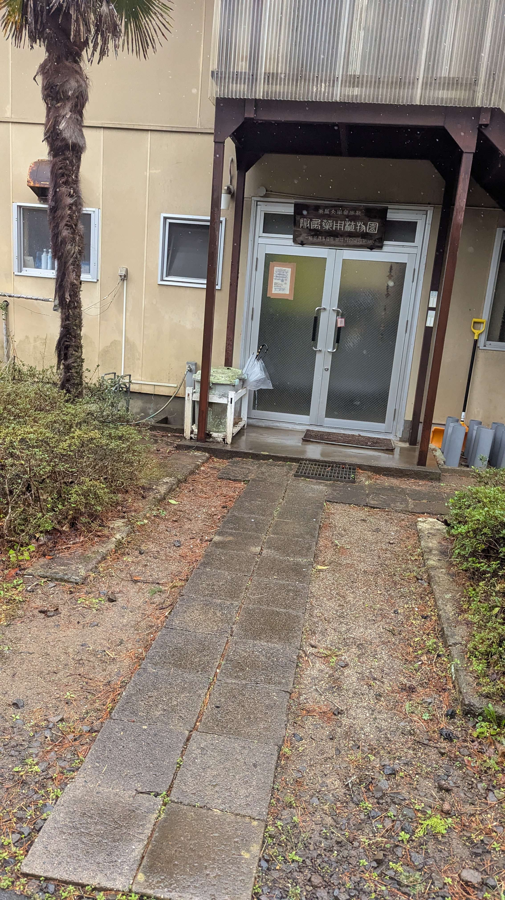

I realised I ended up buying some things at Loft tax-free, but I was going to use them in Japan... I completely misunderstood what they were trying to tell me so I messed up pretty bad. I guess I really only have to just keep this receipt and then pay like 13 bucks at customs though. I was considering going back to Loft, but I already troubled them a bunch by accidentally purchasing stuff tax-free, and I can only imagine they either can't do anything, or it'd just be even more extra overhead for them to deal with for no reason...

Anyway I got back home, and realised there's an insane smell... it was my shoes and socks...

I had no idea what to do about the shoes, but for the socks, and all the clothes I wore that day, I just put them in the laundry to try to get them cleaned. What I wasn't prepared for however was that this machine was supposedly a washing + drying machine, but the drying function actually doesn't do shit, it's basically just the spin function on a normal washer. So I didn't want the washer to dry some of the clothes because they needed to be hanged. Bad mistake as you'll see, but wow this has been like the most confusing part of the trip so far.

# April 3 2025 JST
*Written at April 5 10:24 UTC*

This was my first day at the lab. Started off with a presentation from one of the assistant professors, and then I gradually met most of the people in the lab. Massive lab by the way it spans across 2 floors. They gave me my own desk and a spot in the shoe rack even though I'm like not even actually a student which is cool. One of the PhD students that met me at the station 2 days before also gave me a tour through the entire 2 floors of labs that they use too.

I went with a good lot of them for lunch later at one of the cafeterias, and the food was actually so inexpensive, so I got like 3 small bowls of food and it was good as fuck; also quite filling honestly i was basically stuffed after eating all that.

After that not much really happened at the lab that day, I gave presents to the 2 professors, as well as the secretary that helped me a lot to get to Japan. Talking to some people later I was talking about how my japanese is pretty bad, but even saying `watashiwaomardes` was surprising to people, which was kind of pleasant to see honestly lol.

When I left I went to Loft because I wanted some more pillows, and I wanted hangers, but I couldn't find them selling pillows... AND their hangers were expensive, so I said gg, then I went to COOP to see what the grocery store is like, but ended up only really getting chocolate (and a huge bottle of Pocari Sweat). I'll probably get actual groceries soon though.

Also I had a nanachiki this day, it was so mid bruh whatever man

After that I slowly passed out to sleep.

Oh I forgot about the laundry thing, but yea that morning I woke up to look at the laundry I had running overnight, and apparently the water doesn't get flushed out at all or anything with no drying option selected, and I opened the washer to standing water and completely soaked clothes. So I haphazardly tried to ring out all the water from the clothes, and dried them at the tiny balcony drying rack that there was. They were still completely soaked by night time so I just left them outside. Before I left, I decided to just put my shoes in the washer at like the longest cycle there was which was 3 hours apparently. Those actually got dried after I took them out and put them by the front door overnight. They still smelled, but it was faint, nothing like the insane stench it had before...

# April 4 2025 JST
*Written at April 5 11:25 UTC*

Woke up and the clothes were still wet I guess, but its ok since the shoes were dried. Went to the university quite early, only a few people were there at the time. It's quite a chill atmosphere though it doesn't feel like there's any pressure at all that I was expecting when people talk about Japan's work places. It's also a little bit diverse, which probably is part of the reason to be honest.

This was the first day doing actual lab stuff, though I was just shadowing the work. The work basically just consisted of setting up cell stress and cell passaging experiments over the course of like 5-6 hours, going through the whole process of it.

Apparently the lab has a meeting with some company of some sorts, and they be giving the lab free food. They saved a box of lunch for me and it was epic as fuck it was actually so good I was eating like a king randomly.

I still needed some hangers, so after the lab, I decided to try Don Quijote instead of Loft to see if I can find any stuff there instead. What an absolutely absurd experience it is going into that store. Everything wants to grab your entire attention at all times, and its just an insane level of sensory overload. Everything is also very hard to find in that store since everything is just everywhere. SOMEHOW after a while I found packs of 7 hangers for less than 200 yen which is so crazy cheap and made the entire suffering worth it, but still no pillows. Asked someone if they sell any but they took me to the pet pillows so I guessed there wasn't.

Went to a ministop near me and got their chicken. I've been getting chicken from all the convenience stores to see what the hype is about, since everyone talks about the "konbini chicken". Yesterday was the nanachiki and it was mid, and this day was the ministop chicken. This was actually noticeably better, it wasn't like a sloggy slush of chicken this time, and it was nice. I'm shocked this is like 1-2 dollars and just right there at the konbini.

I forgot what happened after, though I do remember trying to figure out what the hell is happening with how to put out trash here. Supposedly for paper you should just tie it all up together and dump it in the garbage container? Which is possibly fine if I had any string I guess... and then for bottles, you are supposed to apparently put them in yellow containers, but I can't find them in convenience stores or near the garbage container, so idk. I did note down the days though at least.

# April 5 2025 JST
*Written at April 5 12:40 UTC*

Weekends are the day off! They don't really want the temp/shortterm/visiting people to come in the weekends especially considering not much is happening in the weekends, so I basically took advantage of this.

Supposedly its cherry blossom season, so I decided that it'd probably be a good idea to hit a cherry blossom viewing area. The area I chose was the [Sendai Toshogu Shrine](https://maps.app.goo.gl/nsKnVUzriPhSq3cL9) since it would've hit 2 checkboxes of a shrine and the cherry blossoms.

Regrettably... I can't really check off either which I guess I should've expected. The shrine was really cool and I did the praying gestures and all. Something about seeing it in person is much more interesting than online or in media that's definitely for sure; however, I couldn't really tell if I was allowed to go to the back building, and I didn't want to ask if I could because of some paranoia I don't really want to explain right now, so I ended up refraining from seeing all of it.

The cherry blossoms themselves also haven't really blossomed yet, so I guess I decided to do this trip a bit early; though it's weird since I had been constantly hearing that due to global warming, they are blossoming sooner or faster than usual. I guess the news was moreso for the southern part of Japan moreso than the Tohoku region I guess.

Either way it was a great trip. It was so absurd yet amazing taking the train, just going one stop over, and then suddenly it's like I'm in a completely different city. The entire neighbourhood and everything near the shrine looked so insanely different than from near the university campus and the city centre that I was kind of taken aback. The Aobayama campus itself didn't look out of place either because of the amount of really tall buildings on that campus. It was really cool. Definitely considering just taking random trains to random stations honestly.

I decided after, that it was time to try to go to Don Quijote ONCE again. This is because it was possible that there was a communication issue and they thought that since I was on the same floor the animal pillows were, I was looking for those pillows. Unfortunately, they just straight up don't have pillows. It's fine though I bought strawberry and white chocolate pocky to try later. They were decent, the strawberry one tasted better though, and it was also cheaper lol.

Also tried famichiki today for the first time, it was also noticeably much better than the nanachiki, and it was honestly quite good. If I didn't give a shit about how much oil they have, I'd just get this everyday to be honest.

My anki had been insanely flopping lately because I completely neglected it for a good 2-3 days. I open anki and it takes me like almost 2 hours to get through it. I don't even have crazy settings on it's like 20 new cards and 200 review max. Whatever though hopefully I can get back on track to doing Anki everyday.

And before I sleep, I'm just figuring out implementation for attaching pictures to this blog post, and then going to sleep. Also my clothes FINALLY dried, but I'm not fully sure if they smell fine or not. At the very least, the scent they have now is very... Neutral I suppose. I just hope that they don't start smelling like mildew once I wear them.

I'll add pictures after I wake up tomorrow. I added 2 for the first day... hopefully it just... works... and so all I'd have to do tomorrow is pic dump...

# April 6 2025 JST
*Written at April 6 10:32 UTC*

For some reason my Obsidian isn't expanding its window on my laptop. It's running NixOS, which... comes with its upsides and downsides, but I do enjoy using it so far.

Today was mostly just home improvement more than anything though. I still wanted pillows, and started looking at Amazon, but it was honestly relatively quite expensive looking at it.

Finally, a friend of mine though suggested to get it from Nitori, and so I went there, and not only did i IMMEDIATELY find pillows, I also found clothing hangers cheaper than in Donki, 10 hangers vs 7 for the same price. Crazy

After that I was finally able to put my suitcases to the side instead of having them filled with clothes, and get a bit more space in my room that was being taken up by my massive suitcase.

I still didn't eat at all today and I was thinking of starting to cook for myself, so I went to COOP and got some groceries. Took a bit, but I found pretty much everything I was trying to look for I think. Rice, meat, spices, egg, milk, coffee, sugar, bananas. Also got myself a 280 yen meal to eat today which was nice. I did forget oil though, but oh well..

I'm shocked that the milk here is actually just so much better than in North America. I took a sip of coffee and it immediately hit. I was like WHAT the hell??? The milk is so fucking good? and I got the cheapest milk there was in COOP. Absolutely mindblowing honestly.

Unfortunately I wasted a decent amount of my day fooling around online, so I ended up not having much time to add more pictures to this. Hopefully I get to it like this week or so.

# April 7 2025 JST
*Written at April 7 12:32 UTC*

Still had no time to add more pictures today, maybe tomorrow or the day after or the day after...

Lots of interesting stuff at the lab today. Saw someone do surgery on a rat with close-up gore. It was honestly very interesting though of how stroke models were being set up with genetic changes and all.

I also had ramen in Japan for the first time. I got some really mid ass ramen though from the faculty cafeteria for 5 bux, but honestly it compares similarly to the fuckass 20 dollar ramen u get in Canada so...

After that it was some more cell bio lab technique stuff, specifically PCR and E.Coli culturing. During that time I heard from one of the PhD students that Sendai is known for beef tongue, and for Zundamon, and that I should try the Zunda shake. Honestly I didn't even know that [Zundamon](https://voisona.com/song/artist/zundamon_ja_JP/)'s character design was based on Edamame, so that was an interesting revelation...

Afterwards I went back home, copped a Zunda shake for 380 yen, and a Lawson chiki. Lawson chiki was as good as famichiki, but yea that's the end of the chiki saga I'm not having any more in Japan lol. Zunda shake though.................. that was probably the best thing I've tasted here so far. Holy shit it was so fukcing good i want more even though it was kinda expensive at like 3-4 dollars for a small cup.

I was actually in the lab so long that it's almost 10 pm and I still haven't finished my Anki... oh well it probably won't be for as long tomorrow or the day after(?) There's new students coming this week though so idk, gonna have to see

# April 8 2025 JST
*Written at April 8 23:37 UTC*

Nothing super exciting really happened; today I met the prof again in the lab meeting and also discussed about how I do programming with him and an assistant professor later, and then watched some more PCR experimental process stuff. Was going to watch someone else do something as well, but they had to leave to do clinic work early.

I tried the [hagi no tsuki](https://www.sanzen.co.jp/english/haginotsuki/index.html) though. It was chill, not amazing but yea. Zunda shake still at top rn. Honestly though it was like 260(?) yen for one, and it was really expensive for what it was worth tbh, the zunda shake was worth its price much more in comparison.

Tried to do more anki when I got home but instead I watched ishowspeed china vods and then passed out lol. Was going to get more home appliances stuff but it was gonna start raining by the time I'd have been done so I just went home instead. I'm writing this the day after's morning if you can't tell lol

# April 9 2025 JST
*Written at April 9 12:43 UTC*

Reallyyy busy day today I didn't get home until 8 pm. Trying to remember what happened first off... ah watched more E.Coli culturing, and then talked about PCR results analysis, and then watched some insane process of the [[Northern Blot]]. I remember doing Western Blot in a biology class a few years ago, but my memory is barely there for that; watching northern blotting was kind of insane... also saw the production of Agar feed for E.Coli.

By that time it was around like 5 pm and people were heading out for dinner and invited me. One of them paid for my ramen which was REALLY epic of them, because I put a 10k yen bill into my Suica lol so I basically have no cash left.

The place we went to was a fish ramen shop, which was really interesting. It was also technically my first Official ramen because the ramen in the cafeteria for 5 bux doesn't really count. Anyway this fish ramen was fuckin epic it was way better than the ramen at the cafeteria. Actually surprising how good it tasted considering it's fish in ramen, a combination I didn't expect to work so well.

  

The city layout and planning in Japan is just so different, like you see how different it is online already, but when you're there in person it's really interesting how everything is laid out/side by side when you walk down streets of various sizes. Getting to the ramen shop you go down a decently-sized street in Sendai's standards, and even that is nothing like you would see in North America at all. It's so fascinating something so simple and fundamental and basic in Sendai is just nonexistent in North America. Man Canada fucking sucks.

This was also the first time I rode the bus in Sendai. I might just ride the bus from now on instead of the subway because it's not only cheaper (190 yen to 210 yen), it also takes less time, because most of the walking I do between the station and the university is covered by the bus. The bus ride itself was just a normal ass bus ride nothing crazy. Though it was interesting how you always have to leave from the front of the bus because of how payment works for them.

Also got myself bag clips for once, so I can finally cook some rice for myself, maybe for breakfast tomorrow if I wake up early enough, but we'll see.

I also started working on the comments section for my site, and will probably change the sort ordering for pages by last updated instead of created. Maybe both will be done tomorrow. Maybe I'll also finally add pictures to this blog post tomorrow too. We'll see. Tomorrow I'm with the lab until like 7-8 pm so who knows.

# April 10 2025 JST
*Written at April 10 23:24 UTC*

What a hectic day. New student came in to the lab this day. He's from France and he does look very french; that in itself was quite exciting honestly. After that it was a bunch more lab stuff, did some cell passaging and made my own cell culture plate for [[HEK]] cells, and then I also watched the final process of the [[Northern Blot]] which is such a long process honestly and it seems difficulty to deal with the gel and stuff. After that was further [[Ribonucleic Acid]] extraction from E.Coli cells.

Ah before the lab, I had a meeting with professors back at the University of Alberta, hoping to see how that goes. Ideally, I can get into a sort of double masters thing where I can do a masters at both Tohokudai and UofA, but I don't really know yet. Next week is going to be very stressful to try to figure all of this out.

Ate lunch at the university cafeteria this day, and got a nice bowl of rice and crispy fried fish, and it was like a total of like 250 yen or something. It's kind of crazy how even the most basic of foods tastes so much better than in Canada for so much cheaper man I don't understand how Canada flops like this.

I'm also running out of money; luckily a friend of mine found some bank spots and stuff that can convert usd to yen, so i gotta do that [april 11](#april-11-2025-jst), i also want a zunda shake again SO BAD its fucking gkilling me man

That evening was the "hanami" but there wasn't really any cherry blossom viewing happening. So basically the entire neurosurgery departments of Sendai rented out an all you can eat yakiniku spot across the city, and there were like hundreds of people there it was crazy. Ironically almost no foreigners though and the foreigners were like in their own little corner lol. It's not like it really mattered that much just amusing. 

Anyway the food there was probably some of the best food I ever had. What the fuck. Someone ordered a pizza at the yakiniku LOL but it was like the second best pizza I ever had???? At a yakiniku???????? Like what the fuck. Also the meat was so fucking good, the fries were so fucking good, the kimchi was epic, the almond jelly was fucking amazinf. I can't believe it. And it was free because all the neurosurgeons basically paid for the meal lololol

We DID take an entire massive group picture by the cherry blossom trees after the food, but it was night so it's not the greatest picture. It was really pretty though multiple layers of cherry blossom branches on top of another, and the trees were also lined up side by side as well. Really gorgeous sight honestly.

Some point after someone asked me about if I have a girlfriend in Canada, and then it later on devolved towards the idea of "You should get a girlfriend here in Japan" and "Are you thinking of dating/Why don't you wanna date?" And Honestly at the moment it wasn't that bad, I just said it's complicated over and over until they stopped picking on it, but it's been kind of rotting my brain.

The inherent issue is like, how do I truly discern if I can talk about gender and sexuality at a given space? Even in Edmonton/Alberta/Canada it's kind of impossible/inscrutable to discern this usually, and it's not like it's any easier in Sendai lol. Like I'm not even sure if I'm asexual or pansexual or even like women or men or anything else for that matter, but I can't really talk about that because it's never clear if it's safe to talk about stuff like that or not. 

Even if I were to try dating women in Japan, I'm not really sure if I could handle the cultural differences truly? If I were to date someone it'd probably be someone who doesn't really give a shit about gender, but I am PRETTY sure gender identity is very strictly adhered to by people here, at least the cis people here.

Ok I don't really want to ramble about this brainrot because it's just really drunk people asking me about stuff because they are really drunk, so I'll just end that there. I got home at like around 10 pm? While I was going to the station from the university, I also saw my professor behind me when I turned to go into a 7/11, and he had a massive smile and waved back at me. He's so epic

Hopefully I get pictures up soon. Comments should be up [April 11](#april-11-2025-jst) though.

# April 11 2025 JST
*Written at April 13 2:01 UTC*

Comments DID go up this day let me tell you. They did in fact go up. I'm actually really happy about it even though at the time of writing there hasn't been new comments lolol. Hopefully I also get table of contents up for pages like these as well for easier nav.... and also the pictures...

Not much actually happened this day I believe. The majority of the lab was basically knocked out I think from the night before because noone was there. I left a bit early as a result since there wasn't really much to do this day. I wanted to ask about a project the professor was talking about on the bus as we were going to the dinner, but he wasn't there either.

I also converted the USD i actually brought now finally, honestly the fact I was able to survive for a week off of like just 150 CAD is pretty impressive in my opinion. Like I had to get home appliances and stuff too, and I still ate out, and it still all fit in 150 CAD the past like 9 or so days. Anyway I lost 10 dollars apparently because the USD JPY was like 143 JPY per dollar? and I exchanged at 140. Oh well

After that I think I basically did nothing. I finally got on discord VC for once after so long. Back home I'd always be on discord VC like basically every waking moment, so it's kind of crazy how little I was on discord VC since until now. Since my laptop is running NixOS and it's honestly like my first time using a Linux OS that isn't just like a server or like WSL or something, it was a bit of a hassle. The audio drivers still bug out for some reason, which I'm not sure why, but it's manageable so far.

Proton works really well too, I'm kind of shocked. I just turned on the steam play toggle thing and I was immediately able to just play Neon White. Weirdly though, the mouse feels like its polling rate is really low for some reason? It's the same mouse I used at home, so I think it's just something with the drivers of this computer currently, but that's an investigation for another time.

# April 12 2025 JST
*Written at April 13 2:29 UTC*

This morning was hell. The night of [April 10](#april-10-2025-jst) was brainrotting me like crazy. Something about it was just bothering me so much but I couldn't really figure out why. The whole thing of being asked if I have a GF and that I should get one and that I should go to Osaka and whatever the fuck. Like it's not really the issue of them saying all that, but the issue of me not being sure if I'm allowed to respond how I want to when that shit is brought up.

Also I have to contemplate a lot about what to do for Masters. I didn't bring it up for the [April 11](#april-11-2025-jst) day, but basically they said they are chill for me to come as a Mechanical Engineering masters student to their lab September or January; however, I asked them if a double degree situation would be possible, where I would be able to do a dual masters program between Tohoku University and the University of Alberta, and they said the administrative work is not feasible at the current time. Which I get, but it's also very unfortunate and annoying that this is the situation now...

I REALLY do not want to be stuck in Edmonton for so much longer, and the lab at Tohokudai is so fuckin chill (so far), but the degree at U of A would be really beneficial. I am considering basically 3 options now:
1. I'm just fucked and I just do the masters at UofA and stay stuck there for more years I guess
2. Suggest if I can just do the paperwork for them or something maybe
3. Do 2 simultaneous disconnected Masters at the same time.
In order of preference, I guess it's just 2 > 3 >= 1. 3 sounds like an insane hassle to try to manage. If they let me do 2 then that would be really nice. 1 would be so fucking sad, but maybe I could just do PhD at Tohokudai after? But if I get offered in U of A again, I'd end up having to take that instead.

Whatever, anyway I went out for a long time this day. I was craving some eel, but before that I also needed to get cream, so I went window shopping for a long time. They have SO MUCH lotion here, but no cream... in the end I went to hell (Don Quijote) and I found some moisturising gel, which sounded quite interesting. I found out it's like even lighter than lotion later though, but honestly considering my skin is not really that oily or dry, I figured I should try it. The reason I used cream before was because it lasted super long, but it wasn't like much better than lotion in the first place for me.

After that, I ate at an Izakaya that specialised in eel dishes. I got 2 dishes, a Garlic Harami Bowl, and an Unaju Take. The reason I got 2 dishes was because I failed like crazy getting the Garlic Harami Bowl because I thought it was an eel dish but it was steak... and I'm eating at an eel place... and I'm craving eel... so I HAD to get the Unaju Take. It was kind of a mistake because I was already full by the Garlic Harami Bowl, but I had to get some fucking eel man. The Garlic Harami Bowl was 1980 yen, and the Unaju Take bowl was 1990 yen; both were on the bit of the pricey side, but they were some really bougie dishes I can't lie, and they tasted fucking amazing so like I honestly don't care they could've charged me like 25 bux for each instead really.

 

I did some more window shopping but ultimately didn't really get anything, and then just went back home. I have been slacking like crazy on Anki, so I was thinking of doing some of that, but I just passed out for like 2-3 hours apparently. Woke up and forgot that I have to finish some food that's in my fridge because the best before dates were coming up on them...... so I had to eat EVEN more lol, but it's ok.

A friend gave me a [[Made in Abyss]] mug for my last birthday, and I found out that since I'm in Japan, I could go to the store he got it from, the name of which is Cospa. It was apparently in the building I went to at some point while window shopping, so I'm going to go again [April 13](#april-13-2025-jst) to check out what they got.

Tried writing a Statement of Purpose but failed finishing it last night, so I'm gonna have to do that [April 13](#april-13-2025-jst) as well. Oh well, hopefully though I catch up on Anki and get pictures up on this page soon.

# April 13 2025 JST
*Written at April 14 2:51 UTC*

Today I did the household choress as in I kind of barely cleaned my room, and cleaned the kitchen area. After that I went to the building. The building itself was called [EBeanS](https://maps.app.goo.gl/2m2PPFMrdMansVYq8) and it was about like 11 floors of mostly otaku shit, which was kinda epic.

  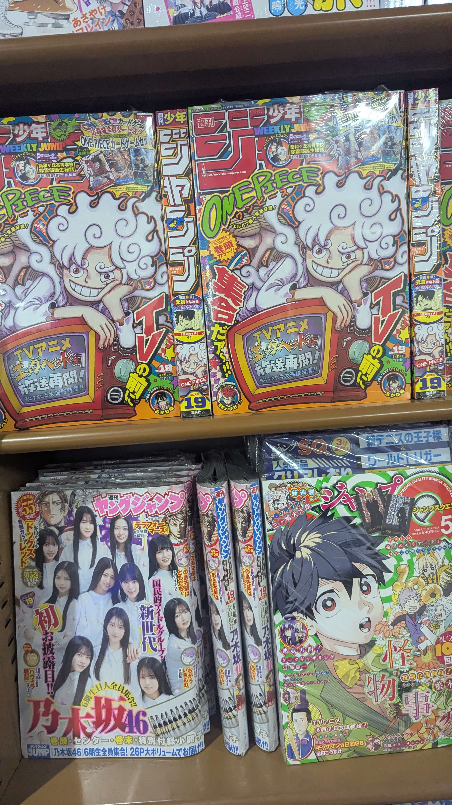       

The biggest highlight for sure though, was finding the last volume of [[Houseki no Kuni]]. If you've seen the [[They is me]] blog post, then you'd probably know how much I love this series. I got both versions because I obviously had to: the normal edition because the cover is ABSOLUTELY gorgeous and pretty, and the special edition, which also has a very beautiful cover, but it's not the same as the normal edition one, it's still a fucking insanely epic cover though. The special edition also came with a massive book of poems which I obviously cannot read at all, but hopefully I can sooner or later. I wanted to find some HnK merch as well... but unfortunately I couldn't find much.

        

Today was the first time I ate a Monaka ice cream wafer sandwich. It was really good honestly. Man japanese food is just so much better for no reason it's crazy even the random sweets in the fuckin convenience store is so much better... still not as good as a Zunda shake obv but still amazing. 

I also "caught up" on Anki today. 2 hours total of going through shitty cards man. Also I have caught up on quotations because with how Anki works, almost all of them are just going to be reiterated [April 14](#april-14-2025-jst), so it's gonna be a bit before I'm like actually "caught up" and don't have hundreds of reviews to deal with lol

It was raining but I still hung clothes out outside because idgaf, regretting it though because it started raining pretty hard. Oh well

# April 14 2025 JST
*Written at April 14 12:09 UTC*

Finally got pictures up on this blog post!!!! So many pictures!!!! Can't wait to add more!!!

Today I woke up SO late, somehow I was really tired last night I guess I slept a good like 8 hours or so. I was still falling asleep though at the lab somehow I don't really know how or why...

Some stuff has happened in the lab though which was cool; discussing a project with one of the new students about [[Astrocyte]]s and the lab's use of them for [[Moyamoya Disease]] research, and how a cell line is kind of faulty currently, so the research is to find a possibly better alternative to it.

Alongside that I talked with the professor about a project he had in mind to give me. It has a lot to do with [[Ribonucleic Acid Splicing]] and modelling predictions on gene expressions with splicing results. Basically between these 2 projects I now got a LOT of work to do lolol

After the lab I went to Matsuya. I was told this is like the fast food of Japan, so my expectations were at that level. Let me tell you though in terms of fast food, this was EASILY S tier blowing literally any NA fast food chain out of the fucking water man. First of all it's ACTUALLY fast food, the food gets out in like 10 minutes to you which is crazy. Second of all, the food itself is like miles better than the slop you get from McDonalds and shit. I actually can't believe it. If I would be able to pay for a smaller sizing, this would be an insanely crazy place to go often because it's just insane as a fast food place. The sizing I got was way too much for me lol. The miso soup was definitely some miso soup. Nothing crazy obviously. The eel shop I went to obviously had better soup lol

Thank god I got pictures up on this blog post LOL can't wait to keep adding them
# April 15 2025 JST
*Written at April 15 23:59 UTC*

Projectss projects projects. Projects have finally started for me in the lab which is kind of exciting. One is a bioinformatics project the prof has pitched to me. The other is finding an alternative control cell line for glial cells to observe moyamoya disease. I think I already talked about these actually but yea

There's an "event corner" in the actual hospital itself, and today they were selling Zunda Mochis and Dangos there which was sick. Uhhhh but I didn't get any of the Zunda food there though lol I took a set of 3 variety Dangos. One was walnut, one was red bean, and one was seasame soy sauce. They were all decent, but the walnut one was the only one I'd probably have again willingly, that one was really good. I kind of regret not trying the Zunda Dangos now though lol but they'll be back in like a week

Nothing much else really happened this day. No updates from U of A, and I basically just went to the COOP grocery store after the lab and went home.  I did get Mitarashi Dangos from the COOP store though and those were firee, not as good as walnut IMO.... IMO..... but they were pretty fire. Also had takoyaki and they were good, but they really made me want to try restaurant takoyaki now lol

# April 16 2025 JST
*Written at April 17 0:35 UTC*

Progresss on projects is happening. Learning a lot about bioinformatics for genes and RNa sequences. Also a lot of cell culturing stuff. Not much else about the lab itself rn aside for just grinding. I did feel like a combination of being really hyperactive alongside being really locked in on the work I was doing somehow. It was like it felt really apparent I was getting really locked in in a way that I never really felt before. Not really sure why tho

I got acceptance for the University of Alberta's Course-based masters for Biomedical Engineering... Currently that's like prio # 3 now though. Prio # 1 is the masters program here at Tohoku, and then prio # 2 is the thesis-based masters in Mechanical Engineering at U of A, cuz it's thesis based and not course based, but yea it's like hmmmmm that's nice I guess. I have to respond by like May 6 though but there's an option to defer it so I'll probably do that

After the lab I went to a cafe I wanted to go to becuase it looked interesting. It's called [MILLS](https://maps.app.goo.gl/D47KeC7L9NPJoWrp6) The picture was making me expect that the front of the shop looks like that, but it doesn't. That picture itself was like 4-5 years old. The new location is in a basement actually, but the vibe is pretty much the same as that picture though honestly. 

It was completely empty, there was noone else there aside for me, the barista who was just chillin, and one other person who left shortly after I came in. I ordered a hot cafe au lait and nothing else, and basically was just chilling there for an hour looking at stuff and talked a really tiny bit to the barista. Honestly it was sick as fuck how chill it is I'm gonna go again Friday.

 

After that I just copped some COOP food, chicken skewers, and then went to sleep pretty much lol

# April 17 2025 JST
*Written at April 17 16:18 UTC*

Exhausting day at the lab even though I wasn't really doing anything. Really all I was doing today was just constantly researching and learning about [[Ribonucleic Acid Sequencing]] and everything that leads to rMATS to then start on the actual project later, but it feels like I'm not progressing a lot on it, and that it's too slow as a result. It's fine though I think.

I guess tomorrow (friday) I won't be going though because I was notified that the fire inspectors for the apartment may need access to my room during their inspection which is from 10:00 to 16:30. LONG ass time period I won't lie... but it's chill I'll just be in my room I guess

Went to a ramen shop near my house called [Yokoyokoya Sendai](https://maps.app.goo.gl/YJYJUvw2sqRma8fg9). Somehow, like the cafe, there was basically noone there. There was basically a group of 2 people (talking in english too), and the ramen cook, and that's pretty much it. Kinda epic as fuck though that I'm just going to these shops with noone in them and just chilling.

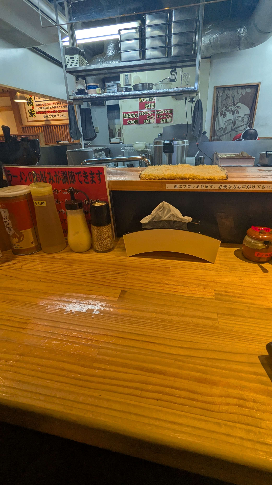 

Anyway I basically only ordered the basic ramen option they had in the vending machine thing they have in ramen shops and gave it to the cook, and got the ramen pretty quick honestly. It's like just a basic tonkotsu ramen. It was really fucking good though I honestly drank the whole broth.

Also bought a weighing machine today from Nitori. Found out I've lost like a total of 10 pounds (4.5 kgs) since the start of this month holy fuck. Japan be making me lose that shit fast which is kinda nice, but I was already losing weight since last September so it's honestly kind of scary lol

Nothing else really happened today. I did go to FamilyMart at midnight, and was kind of shocked for some reason that the streets were just dead empty. Like noone was there, no cars were out moving AT ALL, dead silence in the middle of the city. Kind of mind blowing in a way it was cool.

Not going to the lab tomorrow so I've just been up lol, hopefully I can basically feel like I've grasped a very deep dive level of knowledge for all the content I need to understand before I can start doing the research work, because that is honestly quite exciting for me.

# April 18 2025 JST
*Written at April 19 10:26 UTC*

Fire inspection today. I was planning to stay home all day and not go to the lab, but they ended up inspecting my room at like 10:00 instead of 16:00 (JST) so I was like whatever fuck it I'll go to the lab today too.

You know, I forgot to mention that on [April 17](#april-17-2025-jst) was the main professor's birthday. It was kinda sick as fuck one of the students gave him a Rubik's Cube and he was destroying that shit it was crazy. Also little known secret of mine but I really don't like cake, but the cake they had there was actually so fucking nice I'm not gonna lie it wasn't nauseatingly sweet it was good as fuck.

Anyway when I went to the lab today I got a lot of clarification about one of the project's that I've started working on, discussing with an assistant professor as well as the main professor about it, and further intricacies. So over the weekend and next week I have a pretty good idea on where to go now.

Nothing else really happened, I got a Zunda shake (peak drink), COOP food, and then I actually tried ice cream at a Mini Stop. They say Mini Stop got the best ice cream or some shit. I got a matcha ice cream in a cone, and they give u a spoon u can eat too with it. The ice cream was just fine thuogh honestly it wasn't worth like the 350 yen or whatever that it cost...

# April 19 2025 JST
*Written at April 19 10:56 UTC*

Today was a sitting inside day. I was contemplating as to whether I would make this day a going to random station and walking around day, or staying at home day, and the latter won. I had """promised""" friends that I would watch stuff they suggested.

First series I watched was [Shadowstone Park](https://www.youtube.com/playlist?list=PLI6HmVcz0NXoK8w682PPy2g-kr8apXhne) which is made by the same person who made Charlie the Unicorn. Good 1.5 hour watch straight on youtube if you're interested. Dialogue is very very tightly packed, and the lore and consequences in the story are quite interesting.

Second series I watched was [Sparkle on Raven](https://www.youtube.com/playlist?list=PLuSEX5dm72SFhpVyM7Bqm456A3XnVrHKu) which is made by SOMEONE idk who the channel is owned by really. Anyway it was also good it's not really about anything it's moreso just focused on maximizing parody and got some good jokes using/focused on  animation/audio/tropes.

After that I was basically just doing nothing. I did Anki in the morning so I was chilling. I went to a ramen shop called Menya Togashi today though, and it was probably the best ramen I've had so far honestly. The broth wasn't like just full of oil and shit so it was great to finish up.

Andd at the end of the day I'm basically just writing yesterday's and this day's blog posts, and then potentially doing something for research projects or something else. I do want to make some music and work on creative stuff though man but I haven't gotten any time lately

# April 20 2025 JST
*Written at April 20 13:51 UTC*

This day was kind of an entire blur. I cooked for myself today and the rice actually came out nice this time. The ingredients in Japan are honestly better than in Canada or something man it actually tastes so much better somehow. Like I just made myself egg and rice and it was so fucking good.

I really don't remember what else I did today aside for that, study for some projects (A TINY BIT, GETTING DISTRACTED THE REST OF TEH TIME) and getting some snacks from FamilyMart. I wanted to go to the cafe today and maybe hop off some random JR station and walk around, but I was like I should really just study for my projects... Here we are now

# April 21 2025 JST
*Written at April 23 01:05 UTC*

Chillin, mostly researched more on the projects I was working on, and it's beeen chill. I'm working with the new french guy for one of them basically, and for the other one I'm doing it myself, but the one I'm doing myself is all just on the computer so it's chill tbh.

I basically just ate the same rice and egg I made myself in the morning. It's so good for no reason man. Ah in the evening I had Matsuya's beef bowl, and it was like 500-600 yen or something, but it was so fucking good like I can't believe this is Japan's level of fast food and in NA it's just shite. They do have shit like McDonalds and stuff obviously but like they aren't "originated from Japan" like how they are "originated from NA".

Also went to hell (Don Quijote) again, and bought stuff. My toothbrush started to just comlpetely break apart into pieces so I had to buy a new one for like 30 bux and it was better than my old toothbrush lol. I also bought lotion because the gel honestly wasn't really moisturizing enough, so I was like whatever let me try buying lotion. Turns out the lotion is so fucking thin too it's LITEARLLY LIKE JUST WATER. It's nothing like Aveeno's products so I'm just stumped honestly don't know what I'd do next. The lotion IS pretty nice though I put it on in the shower after patting myself dry a bit.

Nothing much else happened that day. I bought this bag that had chunks of weird caramel-like candy and it was fucking awful but it was less than a dollar so whatever; i'm definitely not finishing this shit though so idk

# April 22 2025 JST
*Written at April 23 01:32 UTC*

Meeting with the professor, I got the data so it's time to go to town with it for research lol. Still learning and figuring out how [[Percent Spliced In]] works though, but it will come soon.

Presentation is also almost done; I don't remember if I mentioned this but we are presenting this Thursday for the project lol. It's kinda chill though it doesn't really feel like I have a ton of expectations being laid down on me for the presentation you know, so I feel like it'll be fine regardless of what happens.

Also got a ton more Zunda food because the stall from last tuesday was back up at the hospital. I bought Zunda Dango + Walnut Dango, and Zunda Mochi. Honestly the walnut dangos are better than the zunda dongos, they are probably my favourite kind of dango loll. Both were really good though, same with the mochi too that was nice as hell.

Ate some ramen later too from the ramen restaurant I went to myself on [April 17](#april-17-2025-jst). I could finally understand the sign they give you to decide on the strength of various parts of ramen, so I could finally say....... "futsuu ii desu" LMFAO whateverrr, but honestly for some reason that time the ramen tasted EVEN better so like whatever changed for the ramen by just saying mid for everyhting is fine was honestly good as fuck. Didn't take a pic becuase the ramen basically looked the same as before lol, though the pork piece was bigger

<b>I ALSO STARTED DRAWING!!!!</b> I'm gonna try drawing for about 1-2 hours everyday now. The shit is way too ass for me to post it publicly, but hopefully I can get good enough to just start posting them out there sooner than later!!!

I was going to start drawing way sooner, but the nib for my apple pencil went missing. I was also way too lazy to like take everything out of my bag to try to find the nib by just shaking it hoping it fell, so I ended up delaying my start on drawing... lol it's ok though because I finally did it the day before, and started drawing this day, so it's epic

# April 23 2025 JST
*Written at April 24 23:52 UTC*

THE ELEVATOR WAS DOWN AT THE UNIVERSITY HOSPITAL but it was fine it was apparently fixed after like an hour or 2 lol. They also have more than one elevator so I'm just saying all that for no reason. Had breakfast from 7/11 because I was kind of running late to university (got out at like 9:20) and it was some good food. Convenience stores when good food.

Also finally tried the [Kinoko no Yama and Takenoko no Sato](https://en.m.wikipedia.org/wiki/Kinoko_no_yama_vs_Takenoko_no_sato). One of the lab members brought it. I ahve to say, I'm on the side of Takenoko no Sato, it just tastes better man. Everyone around me was a Kinoko no Yama believer though unfortunately, oh well.

Making progress in projects as well. Slides basically almost finished for the presentation on the 24th, even though I honestly had just been taking a backseat for the most part since I'm juggling 2 projects at once lol. He's gonna end up doing most of the presentation, but it's not too bad I guess he's been fine spearheading it for the most part, especially considering he needs to present something at the end of his stay here.

Afterwards I went back to the cafe that I went to back at [April 16](#april-16-2025-jst), and ordered a cold cafe au lait this time, with a cheesecake too. Good food and good drinks again. This cafe is really nice man I'm totally making this like a regular visit place for myself; so chill, not many people, the ambience and vibe is sick, and the music taste the guy has is epic. Spent the entire time there drawing to pass the time, and then I went to COOP to get some food and then dipped back home.

Also tried the BOSS coffee drinks for once. They are SO fucking bad man I don't understand. They taste like those really shitty double shot energy caffeine starbucks drinks or something. I don't really give a shit about caffeine content, but I don't think it actually has a lot of caffeine, but it still tastes as dogshit as those starbucks energy drinks what the fuck man.

Accidentally ate an entire bag of the COOP snacks I bought at teh end, oh well. Can't wait for this weekend since I'll be going to Kusatsu Onsen and Tokyo!!!

# April 24 2025 JST
*Written at April 25 00:15 UTC*

Presentation happened; it was pretty chill, but I also didn't even do the presentation lol it was all just the other guy I feel bad but he doesn't really mind so idk. For most of the day it was checking the lab's supply of materials we'd need for the project, as well as going into a really clean mice lab. You gotta wear like entire PPE bodysuits and stuff: showercaps, coverings of the feet, everything. It was so exhausting for some reason standing there, it felt like the building was REALLY hot or something and I was getting dizzy and stuff. It's kinda crazy. It was cool tho very interesting area of the hospital.

Most of the lab also went out for Karaage. It was so fuckin good brah I got garlic chicken karaage, and they give you a bowl of rice with vegetables and fried chicken on top. Really fucking good. They also had a map of the world that you could put a sticker on for where you came from. I naturally had to place mine at hell LMAO

Also went for a little walk out later that day. I had to get tickets for the shinkansen tomorrow but I wasn't sure what was the best way to go about it. In the end though I checked the station I'd ahve to transfer on, and it seemed not bad at all actually. Regardless, I bought non-reserved seats this time because I just wasn't really sure exactly; I hope I can still put my carry-on suitcase somewhere though, I believe it should be fine. Last time I took a reserved seat and stuff so I don't know if it might be any different. 

I also have to take a bus later to get to the Kusatsu Onsen, so I hope I don't get fucked there either. I think it'll probably be one of those big busses with space for suitcases and stuff though...... I hope.......

Ate some familymart sushi at night and it was honestly good as fuck. Even the convenience store sushi is better than the fuckass grocery store sushi in Canada man. How could this happen.... anyway I was drawing this night as well (yay for the streak), and I struggled way too hard this time. I was attempting to copy/ref off of [this drawing](https://www.pixiv.net/en/artworks/129169492) (really pretty drawing btw). The first day I was drawing I wasn't really trying to break the reference image down to basic shapes, but this day and the day before I was, and it's REALLY fucking hard man. I made much more progress the day before this, but this one was so fucked I basically got barely any drawing in at teh end after like 1.5 hours.

In the end I basically did laundry and stuff so I'm fully ready for shinkansen, I really clutched it though because the laundry was happening quite late at night and I wasn't really sure if they were going to be dry for the morning lol

Anyway time for Kusatsu Onsen!!!!1

# April 25 2025 JST
*Written at April 26 04:42 UTC*

Kusatsu Onsen day!!! I didn't end up drawing this day, but it's fine because so much shit was happening this day. First thing I set out to do today was to get some coffee from a "chain" cafe here. I went to Tully's and got iced coffee and a custard french toast thing that they warmed up for me. The custard french toast was honestly really nice, but I inted myself with the black coffe. my canadian ass brain thuoght they'd add the cream and sugar but they didn't, and I didn't realize I add that myself, so I just drank it black. Honestly though it was good black coffee, but it just wasn't what I was expecting so I inted myself. Next time I go to Tully's thuogh I'll be chillin

After that I was shinkansening. Took the shinkansen from Sendai to Ueno, and then a shinkansen from Ueno to Karuizawa. During that time I was trying to work on the projects, but made very little progress. Though I also booked my hotel for the weekend in Tokyo too, so it should be chillin for the most part this weekend. Afterwards I was bussing all the way through Gunma prefecture from Karuizawa to the Kusatsu Onsen, and then walked up a bunch of stairs and high incline to get to our hotel. Funny timing becuase my friends were coming from a completely different route from Tokyo station, and we ended up at Kusatsu Onsen at almost the exact same time LOL. 

  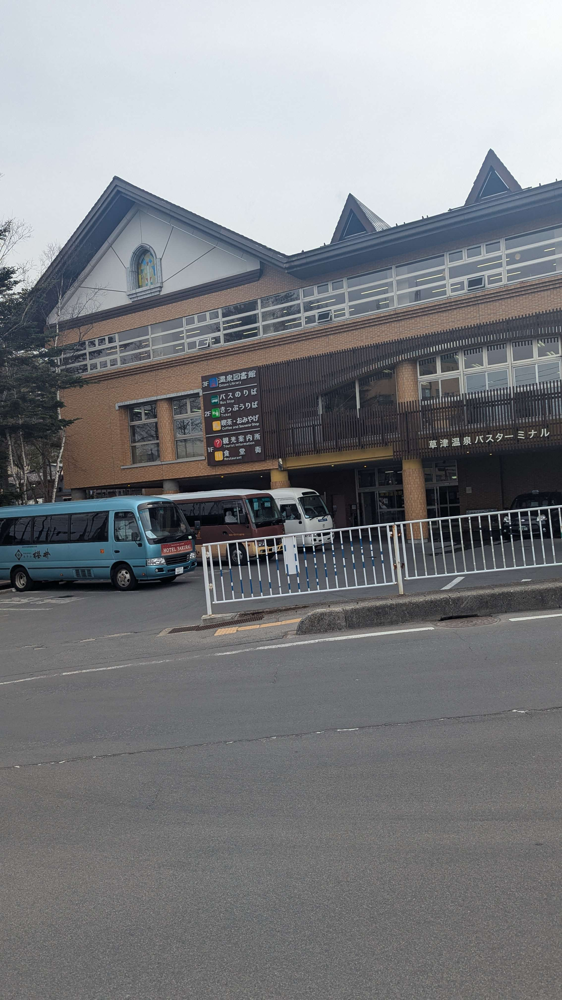  

I have to say though that the bus ride through Gunma was fucking surreal. I saw so many things I have dreamt of and envisioned my ideal future setting being like that it just blew my mind. It was making me very sentimental about myself because it's like "wow, it acutally just already fucking exists in this world, and I am being kept away from anything like it for ridiculous reasons". It was just so sad. I hope I get good at drawing sooner or later so I can draw out some of the things I saw. I would've taken pics of what I'm talking about but things were going past too fast in the bus because of how the routing is like there.

Anyway after settling into our room, we went to an open air public onsen a little walk away from our hotel. Oh yea I didn't mention yet but the entire town smells like rotten eggs. It's entirely just because of the fact that there's SO MUCH sulfur in the water though, since the water is super rich in minerals (and sulfur)... hot spring moment loll

Onsen experience was epic as fuck. It was also entirely not what I was expecting. Somehow everything just felt so natural. I was worried about the entire process/transition towards becoming completely naked and around other people, but somehow in that process it just felt so automatic that it was like as if noone was actually naked around us.

Obviously we were all still naked and you COULD see people's genitals and ass and shit but it's like barely noticeable unless you are very actively trying to look at that shit. I think this is mostly because of the fact that when you are in the onsen, you are kind of entirely consumed by the really hot mineral water reducing your blood pressure and heart rate down to very low levels. When I was in the water it was like I was meditating almost, except that sometimes it was a bit hard to breathe with the way my blood pressure and heart were slowing down a lot lol. Also the steam and shit coming out of the water was really sick too

Afterwards we went around the town and looked around at the stuff there. At this time most of the shops were closed out, so the streets weren't super busy or anything. We were able to chill a decent lot at the town centre which has massive water streams flowing downwards to try to cool the water further for use. The smell of rotten eggs from the sulfur there is REALLY strong, but it's sick as hell. Also looked at a shrine and some of my friends decided to pray to it. Quite the chill experience just walking around the town and seeing the stuff around.

       

After that was the greatest moment of Japan so far. The hotel reservation included a 940583250924 course meal for a REALLY expensive looking dinner even though it wasn't even actually expensive. It started off "mid", but then it got better and better, up to the point where it was just straight up some of the best food I had EVER tasted. I actually like almost cried when dessert was brought out and ate the strawberry. Even the fucking strawberry was amazing man fuck

    

After that, we basically went back to our room. 2 of us went for another bath, but not all of us. I decided to also just stay in the room. After eating that amazing fucking meal, my haed started to hurt, and I still felt a bit disoriented/dizzy from the earlier bath. I decided to try to just go to sleep at this point forward, hoping that I could possibly sleep away the headache.

# April 26 2025 JST
*Written at April 29 06:45 UTC*

So much shit has happened the past few days that I don't remember if I will be able to capture literally everything that's happened since... but oh well here it goes

This morning we were still at the Kusatsu Onsen. Took a dip in the hotel's own onsen instead of the other open air public onsen, and then had green tea with friends back in our room. Afterwards, we had an absolutely amazing breakfast from the hotel's restaurant, the same one that gave an absolutely amazing dinner the day before.

  

After that, we checked our from the room, and got a nice sweet snack with some mid black coffee from the hotel. Leaving our bags at the hotel we decided to just walk around and chill in the town. Ate some absolutely epic egg/vanilla ice cream in a cone, and a fried sesame currypan. 

       
 
After that we went left on a bus and shinkansen'd to Tokyo. My hotel was by Takanawa Gateway station via the Kehin and Yamamote lines, and it was kinda chill af. Got there quite late I think like 5-6 pm or so. I was actually going to visit my cousin because she's vacationing in Japan with her kids, but she already left to Kyoto from Tokyo by the time I was there.

       

After checking in and stuff, I met up with my friends again and we went to the BOOKOFF at Omori station. Also funny thing I should note that Omori is probably one of my least favourite games ever. I like almost nothing about that game, but it kind of blew my mind finding out that Omori is just big massive forest in japanese, which was so funny to me considering in headspace ur just generally in a massive forest for the most pat kinda. Since I didn't really learn japanese until recently I had no idea that there was acutally some semblance of thought put into the game honestly...

 

But now for the cooked part... we were going to go for dinner at a restaurant and I don't remember when it was supposed to be for, but it was like for 18:00 or something? Anyway apparently we needed a reservation, but this wasn't the case for the last time my friends went there before, so we went there and they told us it's gonna take like 2 hours to get in which was FUCKED. We booked a reservation anyway there though, and then tried to figure out what to do next...

Before that, we had to reach there via Shibuya Station. Apparently something was happening this day or something, becuase my friends said that there were like 3-4x more people there than usual at that evening. It was crowded as FUCK. Also it was actually the first time I saw litter in Japan LOL like I was kind of shocked that there was litter while trying to get out of the station's area. It was a very surreal experience to have. As we gradually went further and further away from the station though, it felt much more like the Japan I have seen though, much more chill and clean and everything.

             

Anyway after ordering the reservations we were figuring out a place to chill to get a snack/coffee or something for like the next 2 fucking hours or some shit. Everything was doomed. Shit was either closed, crowded as fuck, or too shitty to go to. In the end we just went to a dumbass fucking Starbucks, and even that was crowded as fuck. Somehow though we got seats for 4 at the last second as someone coincidentally left the shop.

After that we got back tot eh restaurant like around 20:45 or something, it's like super late now and everyone is pretty tired. LUCKILY, we finally got in. It was like a mix Okinawa - Chinese style Izakaya, and it's a really small establishment. Nevertheless there were like at least 100 people there sitting in a fucking 50 square metre restaurant LOL. It was chaotic as FUCK, loud as shit, red light everywhere, can't hear anyone anywhere. The food we ordered was so fucking good though it was amazing as usual sasuga Japan. My friends also drank like 82797239423 litres of ethanol down into their blood stream that night and got quite fuckin drunk.

After that it was sleepy time. Reached my hotel at like midnight lol

# April 27 2025 JST
*Written at May 6 02:57 UTC*

Oh boy... look at that written at date... lol

So much shit happened since, but hopefully I can recall most of the things that had happened. I had such a great time with meeting everyone that I had been wanting to meet for years even.

This was the day of [M3](https://www.m3net.jp/). A convention/event where a shitton of indie musicians in various scales come to sell CDs and stuff. You may or may not know any of these artists, but to give some idea of the scale, musicians and groups as big as Camellia, Nanahira, Hardcore TANOC, Diverse System, e.t.c. come to set up shop for the day. If you don't know any of these names though don't worry about it lol just know it contains a lot of musicians, as well as a lot of well known ones within the "japan electronic music/doujin/non-anime otaku" scene (as best as I could describe it for the layman... at the risk of describing it wrong...)

I also rode the Tokyo Monorail to get there. Very sick ride I highly recommend riding that at least once (though it costs about 5 dollars, which is VERY MUCH on the pricier end for transportation)

   

Honestly though I didn't buy anything lol I like vinyls more than CDs and everyone is just selling CDs. Honestly I should've just bought stuff just to support the artists I like a lot and just give the CDs to my friends so they can keep it but I'll still have the CD rips (since they would rip it) but I'm dumb as hell... wghatever . Though I did want to get a keychain from 1 of the stalls but they only sold that online apparently.

I also met a few friends there that I didn't get to see the day before on [April 26](#april-26-2025-jst) which was cool. Haven't seen some of them ever/for a very long time before this which was really cool.

Afterwards my friends and I from before went to Omori station which is where 2 of us were staying by (not me though), and we basically were trying to plan for lunch. The idea was supposedly that we get lunch at like 15:00 or so after waiting for some other friend to finish checking in.

That friend in question basically got fucked over by check-in apparently at night since he reached Japan at like midnight or so, and the check-in machine and stuff just wasn't working there or something apparently, and had to wait for the next day. He as a result stayed up like all night or something. So when we were trying to make plans with him, we were like ok lets have lunch at like 13:00 or something, and then he was like ok but I gotta check in at 15:00 so hold up, so we decided like 16:00 or something, and then he was like ok I'm coming it's gonna take a long ass time though, and then we kept waiting and there was like absolutely no communication from him because he was busy getting lost by the transportation system or something. I think by that time it was like 17:00 or 18:00 where we were just laughing at how absurd the situation was because he just never showed up and we still didn't eat. AND THEN since I gave him my location, he was like yo I've been trying to get to you guys but everytime I'm there you're somewhere else... and that blew our minds it was so fucking funny because at the time we didn't know he was so dead and exhausted and tired, so his actions of just never responding to us and then suddenly going like "YO I'VE BEEN TRYING TO REACH YOU ALL FROM GOOGLE MAPS" was just so fucking absurd LOL

Anyway here is Omori station:

                 

This was also the first time I went to an actual game center. I did go in a game center before but that was because I wanted to convert coins into bills/larger denominations, but I found out that the machines there don't actually do that they only do the opposite (bills to coins/smaller denominations) so I left shortly after and got mad at the coins I had.

Also during that time, one of my friends had other lunch plans as he was meeting with the creator of the game osu!, peppy. He used to work on the game with him so they know each other very well. While we were at the game center, we got a message that peppy would be down to meet with us, which was kinda epic. He was also at Omori in the station itself too, so it wasn't too far of a detour just to meet him. But yea he was chill as fuck and I was glad I was able to meet him (alongside the many other people I was able to meet between Apr 26-May 5).

      

Anyway after like 50 years, the friend we were supposed to have lunch with finally met up with us. Unfortunately like basically right after, one of my other friends had to leave because he had dinner plans with other people lol, also we ended up basically not having lunch as a result. In any case, we just kept walking around a bit more around Omori station before we basically left at the end back to one of my friend's hotel room.

This was an entirely different insane story now. We sat there for like 2 hours or so I don't remember exactly, but basically we were going to have dinner with a friend that lives in Japan, and he also brought another person in the group chat to plan. Because he ate yakiniku the day before, he was like naw let's eat something else. So we were trying to figure out what teh fuck After like an hour or something and he also brought another person into the group, and then the guy decided to just drink a Strong Zero can and just got drunk as fuck and vanished.

So in the end we basically went back to the yakiniku plan and also brought the guy he brought in too LOL it was good stuff though the food was good and we had a great time

After that was sleepy time yay. I TOOK 2 DAYS TO WRITE DAY...

# April 28 2025 JST
*Written at May 8 05:23 UTC*

Last day in Tokyo this weekend. To reiterate from the day before's blog post, 2 of us were staying in a hotel at Omori station, while 1 of us was in Akiba, and I was by Takanawa Gateway. The one at Akiba checked out really early and put their stuff in a random locker in Tokyo. I checked out but toko my suitcase to the Omori station hotel instead for them to hold on to also. The hotel there basically agreed to keep our suitcases for the meantime, and we just went to Mister Donut. I wanted to try the donuts that were in Japan becauseMister Donut in Japan is like basically the Tim Hortons of Canada except if Tim Hortons wasn't like a national icon for the country and shit. Anyway it was infinitely better than Tim Hortons lol... like it wasn't the best donut ever like gourmet donut level, but it's definitely better than the shit u get from Tim Hortons or Dunkin or Krispy Kreme LMAO After getting the normal donut and drink I tried the matcha donut they were selling. It was chill but overpriced. The normal donuts were good enough honestly

This day was also the first time I set foot in Akihabara. The Otaku Center as some people call it I guess lol. It was kinda crazy seeing the amount of ads that were there for random anime-adj stuff like gachas and shit (especially fucking gacha games) but yea it wasn't like super mind blowing just kinda funny. The epic thing was to see the Akiba square though that I've seen so many times in anime and shit, but in real life it was kinda Very different

   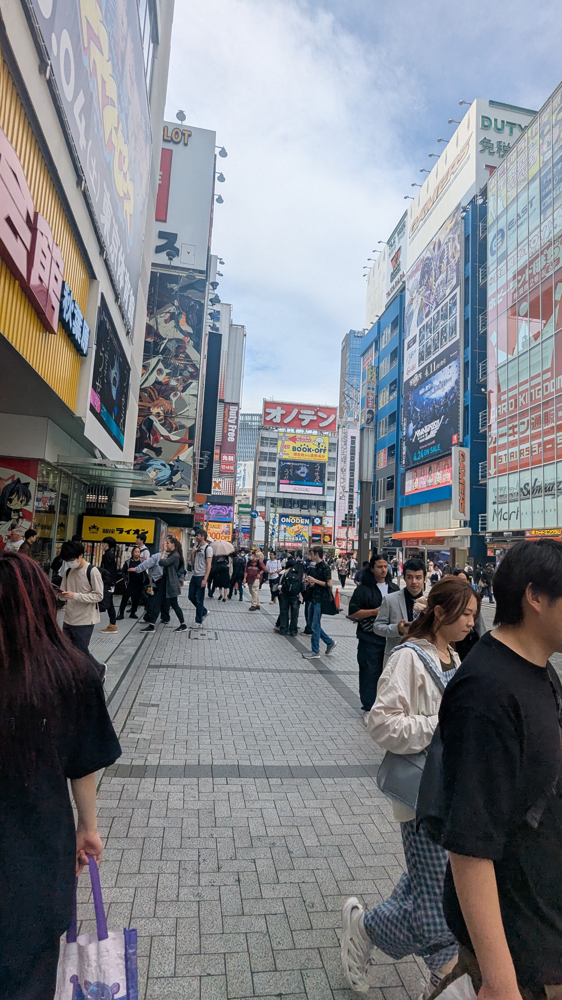     

After that we went to Shin-Okubo and walked around. The idea was to get lunch at a kebab shop that's there which is apparently goated as hell. it's called EFELIF. Crazy area in Tokyo honestly it's like a KoreaTown but with A LOT of SEA and South Asian people it's really interesting.

Anyway the kebab was fucking amazing. Here's some more pics

    

After that we decided to walk around for a while, and tried going to some parks and shit (we failed). We went to Shinnanomachi and walked around for a decently long time. Passed by the Meiji Memorial Museum and other stuff which was cool

      

After that we went back to Sendai!!!!!! Yay they all got hotels really close to Sendai, which as a result was close to where I have been staying at. It was pretty much evening/night time when we got settled so there wasn't much left that we did this night.

I told them about God's Given Gift, the Zunda shake. They liked it but they weren't as crazy about the Zunda shake compared to how much I was/ It was good tho

We went to the game center by Sendai Station tho which for some reason had a really old shit ass 2nd gen iidx cabin. Kinda fuckin crazy

  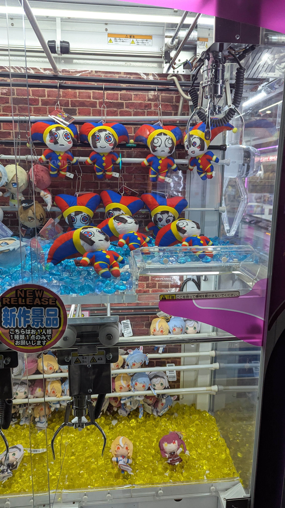 

After that, we went to the same eel restaurant/izakaya that I went to on [April 12](#april-12-2025-jst). I didn't know at the time but apparently izakayas just change their menus completely between lunch vs dinner. In any case though, we went in cuz I was talking about how epic the eel place was with my friends. I couldn't believe how good the dinner menu was man holy fuck.

THEY HAD THE BEST CRAFT COLA DRINK EVER DUDE

LOOOK AT THIS CRAFT COLA MAN IT'S SO GOOD

Anyway here's most of the food at that dinner. It was so fucking good man

  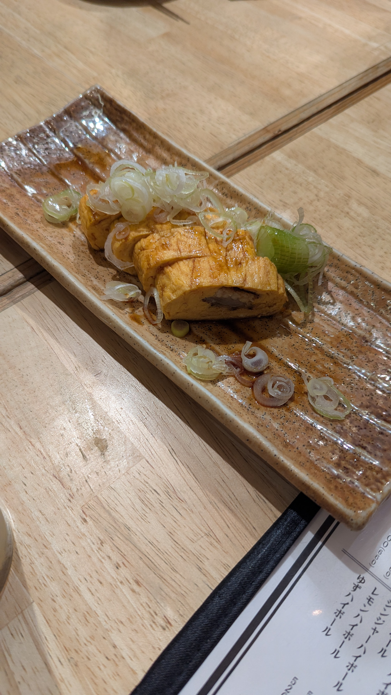      

So fucking good man

After that my friends went back to one of the hotels and started drinking, and then they all passed out lol. I went back to my room shortly after and slept too lol

# April 29 2025 JST
*Written at May 8 06:47 UTC*

Chill city day. We basically mostly walked around this day looking at stuff. They wanted to go to Melonbooks (a porn/doujin store) so we went there for a bit. It's legit like just 80% porn and then 20% touhou it's kinda absurd in a way lol. What was legitimately jarring though was someone just having their kid walking through the store. It's kind of crazy because like the porn is everywhere, but they don't really have explicit covers. The ones with explicit covers are in their own section with """curtains""" that are  """covering""" them, idk it was just so bizarre to me that someone just had their kid there even though they were just walking through the shop. Idk where else they would be coming from in that building though...

After that we went to EBeanS, which is basically the hobby shop mall in Sendai. I don't remember if I mentioned this before already but oh well. The building has shit like Cospa, Kikuya, Animate, Lashinbang, e.t.c. There's like 8 floors or something there of just hobby shops. 

After that we had sushi. Legit this was the first time I had sushi in Japan... it was kinda crazy that it took this long to get sushi for me lol. It was good as fuck thuogh had some interesting sushi there and they were all at the very least chill but it was mostly very good stuff

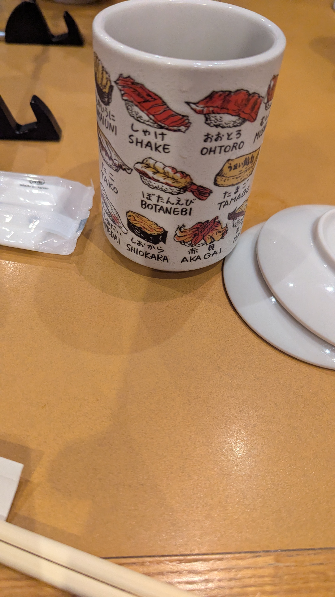       

After that we took a stroll around the Aobayama Campus. It's the same place I went at [April 2](#april-2-2025-jst) way at the beginning when I was first trying to figure out the way to navigate teh subway and stuff lol. It was as beautiful a campus as ever though even moreso at night. I also showed them a really old like bus stop shelter type thing that clearly isn't used by anyone, but is right there beside the sidewalk, with a really old dusty couch in it LOL

Also went through the path that I took to find the main picture of this blog. It was too scary for my friends to continue walking though so I didn't take a picture of that specific thing again. Oh well

        

Lol at how the dusty couch pics are the 200th and 201st pictures in this blog post now. This post is getting quite massive LOL

Anyway after that, we basically took the subway back to Sendai station and chilled for a bit (iirc). We decided that night to just go to an italian izakaya. I am not fucking joking when I say the 2nd and 3rd best pizzas I've ever had (so far) have been in Japan man. The 1st was obviously in Italy lol but holy shit. The pizza I ate today was probably like the third best pizza ever.

        

And that was basically the end of the day. Oh I forgot to mention that I had one of my friends also help me get a monthly pass that day. Their options were only in 1/3/6 months, and for a specific route only. I paid for 3 months for my route, only to then realize that I'm literally only here for 2 more months, so it probably cost me to get that pass more than it would've for the next 2 months to go back and forth from the university to home lol....... oh well.

I had him come over so I could give him 20k yen back and he also checked out my room. I found out from him that the washroom is actually a bit dated, though it made sense considering the building was constructed in like 2007 or so. He told me that whenever I rent a place for if/when I come back to Japan, there should be bathtub/shower settings that are just there right outside the bathtub/shower room that let's you set up the water amount and temperature and stuff (if the room was made in 2009 or newer). If it's not, I'm getting scammed. Good tip that I felt like I should also write here lol

yea that was basically it. My friends also got the IC cards from here too becuase they don't give Suica here, they give ICSCA cards lol.

# April 30 2025 JST
*Written at May 8 07:12 UTC*

This day was my first time back at the lab after so long LOL and even then it was only for this day and the next, and for very short times.

Either way I went and gave members of the lab Kusatsu Onsen cookies!! I should've bought a second box though because there clearly weren't enough cookies unfortunately... but yea they looked epic I wish I could try one

   

Anyway I left pretty early from the lab this day because I wanted to chill with my friends more lol especially since I wouldn't see them tomorrow as they would've left while I'd be in the lab that day, and one of them was leaving this day to China.

We went to Zunda Zunda, a cafe that basically just does Zunda stuff. I got the Zunda latte and it was so good man holy shit. I had a Zunda shake after but that was basically the same as the other Zunda shakes I had, but for like 200 yen/2 dollars more.... which is like Wtf. The latte was really good though it was crazy

 

Afterwards my friend left for China, while the rest of us went to the Sendai City Museum that detailed the VERY extensive history of Sendai lol, it was a pretty chill place nothing mindblowing but it was definitely cool to see the evolution of things like the japanese writing style and how maps evolved throughout time and other stuff too. Most of the text was in japanese though and my japanese is NOWHERE NEAR good enough to read it LOL only been like a month or 2 mann. but yea lots of pictures, so I selected only a few cuz it'd be kinda weird to post a lot of exhibits from the museum personally

                

Those sticky notes are really funny. There's a wall at the end of the museum that lets you write something on a sticky note. You're supposed to write "What do you wish for in life the most" or something along those lines iirc. The first one wrote something along the lines of "Getting into Tohokudai" and then crossed it out and wrote "Family" lol, the second one was a good One Piece sticky note.

I also was kinda surprised that they had an other gender option on the survey too that was really cool. A friend of mine also told me that he noticed that there was a gynecology clinic in Sendai or something that was talking about how if you are LGBTQ then don't be afraid to come in which is also really cool. I wasn't expecting that at all honestly because I thought Japan was very socially conservative when it came to LGBTQ situations but yea that's sick

After that we walked all the way up a massive fucking mountain to Sendai castle. It was quite steep honestly but the view was epic up there so nbd. Also coincidentally, one of the people from the lab was also there on their day off which was kind of surprising and funny considering they somehow also decided to check out the castle at the same day. The place in general wasn't super crowded or anything either

        

After that we decide to walk away from the castle to the other direction. Little did we know that we'd reach the Yaiyagami Zoological Park after walking forever, which was SO far away from the castle it's crazy. Just look it up on google maps, they are actually so far apart from each other LOL. Anyway we decided to have dinner at a famires called Coco's. They had some decent food there, nothing crazy. 

    

after that we walked for a while in the neighbourhood around the park and the famires. It was actually so quiet and it was like what 7-8 pm or something? Usually in Canada you can still hear a lot of noise at night because of the sheer quantity of cars still moving around in the city, so even if there was noone outside it'd just be loud all the time. There thought it wasn't even super night time and it was still quiet. It was crazy. We went around after walking through some neighbourhoods and reached a konbini where I got probably the worst food I ate so far: French Toast from FamilyMart. It was just so fucking bad man. But regardless, we walked a bit more to a hill and stopped there for a bit just to look at the view of the city. You honestly couldn't even see the end of the city it was kinda crazy. Such a dense city the same size as my hometown Edmonton, but it just looks so much more bigger and not isolated you know.

After that we took the subway back to Sendai station and I had them come over to my house. We basically chilled there for a little while before they both left for the night and I went to sleep.

# May 1 2025 JST
*Written at May 8 10:34 UTC*

This was probably the most normal day of the entire past 2 weeks. All my friends were gone from Sendai and I basically just went to the lab like usual. I had been working on a visualisation because I was getting a bit confused as to how I would use the data to model [[Alternative Splicing]] events observed to various stressors applied onto [[Messenger Ribonucleic Acid]] strains so that's basically what I was generally spending my time on in the lab, as well as helping figuring out stock/inventory for the other project that my friend was maining currently. For lunch though the lab went to an indian restaurant called RAJ, and the food was RIDICULOUSLY cheap for indian food it was crazy. I got a butter chicken set with rice and it was literally 660 yen in total. AND it was good as fuck man jesus

 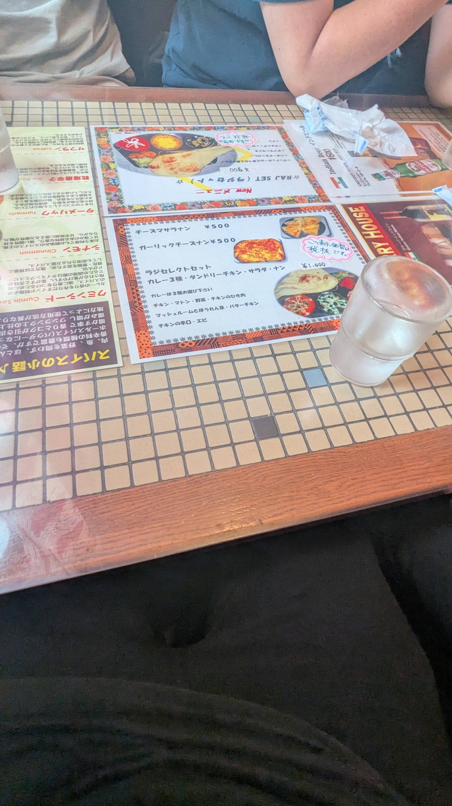  

After that I went to Don Quijote with the lab members for a very short period before we all split off. After splitting off I went with 1 of the lab members who told me that he started listening to english rap a lot, so naturally I HAD to tell him about Kendrick Lamar, and he was like damnn ok I'mma hop on (paraphrased obv). After the split off I was just walking around and went into a random book shop to see what they got, but didn't buy anything. I then went into some shopping alleys, and eventually went to a BOOKOFF, to then also not buy anything there.

Afterwards, I went to a FamilyMart, and decided to get French Toast again. I had to know if I was just going crazy or not becuase it was just so bad and I actually just straight up didn't have bad food in Japan upto that point. This time I bought it and went home to microwave to eat it, because it did have heating instructions and shit too so. After heating it though it was still not good, but it wasn't terrible though. It was like acceptable basically but I would never have it again because it just wasn't good man

This day I was also booking my hotel for the upcoming weekend since it is Golden Week. After I booked my hotel at APA, I then googled APA up because a friend of mine online was like "What does APA even mean anyway?" That is when I found out about the absolute insanity about APA lol. The owner is some crazy insane freak who constantly indulges in historical revisionism, and the company has faked earthquake safety data of all things, IN JAPAN>???? like what the fuck is up with this shit

Anyway I already booked it, and it was also too close to the date when I'd be going to Tokyo, so hotels were already super expensive in the first place lol

After that I basically just went to bed

# May 2 2025 JST
*Written at May 8 2025 10:53 UTC*

Honestly I completely forgot anything that I ate this day... I think I was trying to finish all the remaining food in my apartment before I left, so I ate a bunch of egg and rice this day. Regardless though I did go to the lab this day too to do some work on both of the projects again. Afterwards, I didn't bring my umbrella with me, so I got kinda soaked while trying to get to a konbini so I could just buy some fuckass umbrella there.

Before going to the lab I did some packing, but I had to go home after the lab anyway because I still had to pack toiletries and stuff, but I had to use them before leaving so yea. I also wanted to split my 10k yen bill but honestly I couldn't find a good place or time to, but I wanted to do that before I went to the station since I wanted to get another Zunda shake. Luckily though in Sendai Station there's a (cheaper) Zunda shake stand on the Shinkansen floor, and they also take credit card, so it was actually pretty chill.

I was considering buying tickets to the shinkansen on [May 1](#may-1-2025-jst) but I was like nawww fuck it I'll just chill... only to find out that the tickets were FUCKED. I still got a reserved seat on the Hayabusa (faster line from Sendai to Tokyo), but it was also a seat right at teh front, so the leg space was kinda fuucked

It was chill tho cuz I got to my hotel with ease from the shinkansen and the Ginza subway line. During this time though, the raining only got worse. It was already bad in Sendai, but as time passed, the forecast in Tokyo was just getting even worse. During my time walking outside, my umbrella just completely obliterated itself because the winds were just so fucking strong, so I had to buy another umbrella for like 500 yen real quick LOL.

 

So now I just had 2 umbrellas, 1 of them being completely broken, only until I met up with 1 of my friends at Akihabara station that told me that it was actually still fixable... so in the end I basically wasted 500 yen for another umbrella that was taking up my Hand Space. It was chill tho I didn't really mind it that much and it was kinda funny as fuck. Anyway I met up with 2 of my friends in total and we just walked around Akihabara. The plan was to have dinner at a conveyer belt sushi place, but the lineup was super long, so we were just killing time. Went to BOOKOFF and Surugaya to look at random stuff, but nothing crazy.

In any case we had dinner that night at the sushi place with another friend I had only met briefly before. The sushi was honestly like Fine/whatever like it wasn't really good but it wasn't terrible or anything. One of my friends was distraught that 1 of the tuna pieces were fucked or something though but it wasn't like absolutely terrible when I had it. 

Afterwards, we all just immediately split off... but something was kind of off with how everything went. I guess the vibes ended up off in the end because everyone's experience with the sushi place was quite varied to the point where I guess some people were uncomfortable in the end. In any case though I did a bit of walking around the city, and then went back to my hotel to sleep.

# May 3 2025 JST
*Written at May 8 11:45 UTC*

One of my friends that went to the sushi place yesterday kind of cut off from everyone else for the rest of the trip. There were plans that we'd have dinner on May 4, but he decided to just opt out. I tried sending a message asking whats good but no response, so I wasn't really sure what to do... aside for just giving some space...

The entire day didn't really have a plan so I met up with a friend and we went to Yokohama. That reminded me that IT WAS SO HOT this day and honestly the sunscreen might've not been enough. I was told that all of it was turning me into purple quite early on even lol

The idea was to go to a restaurant he knew of in Yokohama after walking around a bit and chilling there before heading back, so at the time we just went with that. We got to Yokohama station from Tokyo on a green car seat which was really nice. It was like 780 yen or something and you just go to the stand on the platform to choose your destination, and then tap your card on the roof wherever you're sitting when you get into the train car itself. 

The area(s) that we went to at least were very hilly/varied in elevation so there was a lot of incline and decline walking that we did. It was also VERY beautiful honestly, these pictures probably can't do it justice. My friends said that it's basically like Tokyo if it was chill and I completely agreed.

   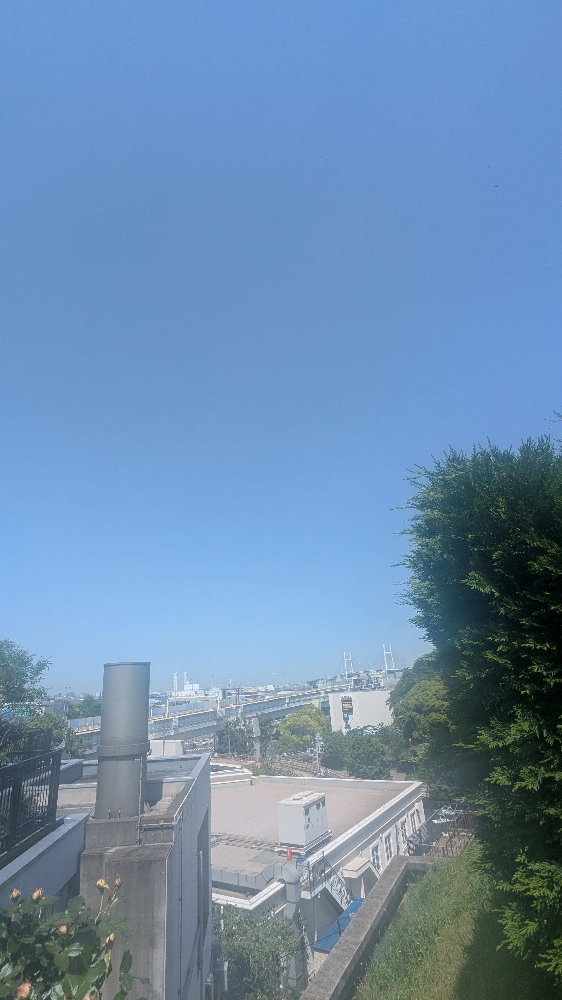     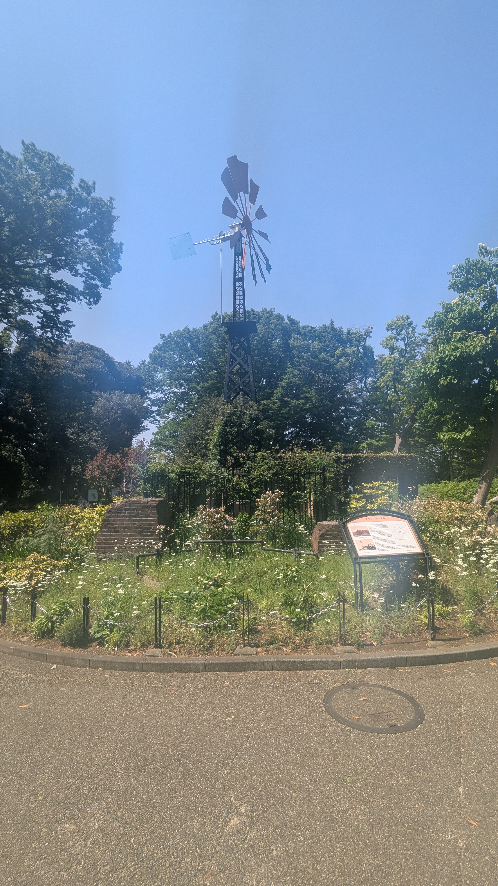   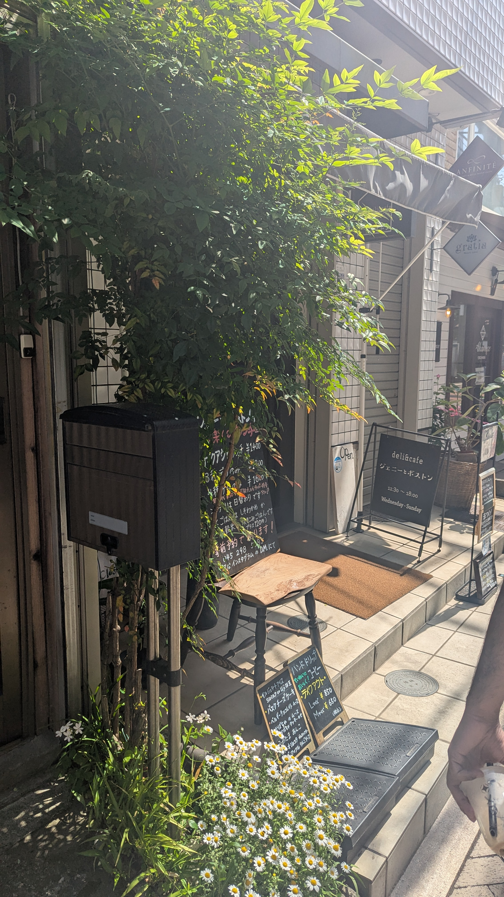   

Anyway we went to the restaurant and it was fucked . the lineup was just FUCKED, so in the end we went back to the main yokohama station and went to a Royal Host famires. I got curry and rice, and it was legit as good as the homemade curry and rice, so like honestly there is basically nothing I miss from Edmonton/Canada that also couldn't just come to Japan. Fuck edmonton and canada man. The dessert was also quite epic iirc it was really good

  

Afterwards my friend started dying and getting an insane headache so we split ways and reached our own hotels. I grabbed a snack of dried shrimp to nibble on while doing my japanese Anki for the rest of the day, and it was honestly not a great decision. Like it tasted fine, but my jaw was actually fucked it was in so much pain man.

Anyway you may or may not remember the guy who just completely vanished from dinner plans after randomly inviting someone and then drinking a Strong Zero and then just dying completely at [April 27](#april-27-2025-jst)... well I had been contacting him since and told him I'm back in Tokyo again, and suddenly the plan exploded into like a 10 person plan. And this time it was ACTUALLY happening he even reserved it the day of somehow. It was actually crazy because I knew a lot of these people for years but didn't get to meet them until now.

Some of the images below are by my friends

    

Absolutely absurd that this actually happened. I'm actually so grateful I was able to meet people that I wanted to meet for years man holy fuck. Everyone and everything is epic

# May 4 2025 JST
*Written at May 8 12:38 UTC*

Somehow I'm writing all of these on May 8. Actually crazy.

Anyway my cousin and her husband and kids were coincidentally vacationing in Japan, and were in Tokyo this same weekend. So we hit up at a Komeda's Coffee near Shibuya station to meet up. The food was epic, free bread AND ti was tasty as fuck bread.. it was so good.

 

After that I was about to go home, but then me and a friend were talking about lunch plans, and I was like wait I can ask this other person to also come through since I hadn't seen him in like almost 10 years.

That person then said they were currently at that very moment in line for a lunch place rn. So we all scrambled and met up at Harajuku at a Spontini. It was actually kinda chill. The pizza was good as fuck, not mind blowing but very good. I can't lie that shit gave me diarrhea later in the day though lol

 

Harajuku itself was so fucking packed. The Infamous street packed as usual. Honestly a friend of mine showed a picture of it when he went and honestly it wasn't as bad as when he went, but it was still crazy as fuck lol

     

After that we parted ways, and I went to Akihabara with one of my friends to meet with others that I also hadn't met in a while or at all until now. It was quite sick honestly we were just chilling in a Yodobashi and playing with the synths and stuff.

During this time my phone battery was also dying though I wanted to get some juice in it. We tried like 50 billion battery packs and none of them were charging my phone at all... The initial thing we did before Yodobashi was get a new battery pack. My pocket WiFi came with one, but it wouldn't charge my phone becuase I guess its output was only from the USB-A slot, and I had no USB-A cables. 

MY genius head decided to just buy another power bank instead of buying a USB-A to USB-C cable. It was like 2x more mAh so it wasn't the worst idea honestly........ I swear...... but in any case I tried plugging it into my phone and it just wouldn't charge at all for some reason. I was kind of dumbfounded... so when other people also came around to Yodobashi, I tried everyone else's battery packs, and none of them were working.

After we split off with them, I went back to my hotel, and plugged in my charger to the wall and my phone, only to find out it wasn't working there either... so I was kind of dumbfounded. It worked after a while thuogh so I charged as much as I could at the time...

AND THEN AFTER THAT we met up with my friend who was back from China, alongside another friend who I had never met but knew for a very long time. They were really cool to meet and I'll explain why in the next paragraph. We went to a ridiculously cheap restaurant that served amazing food. A fucking skewer of chicken was not even a dollar dude it was fucking insane and it was good food too

   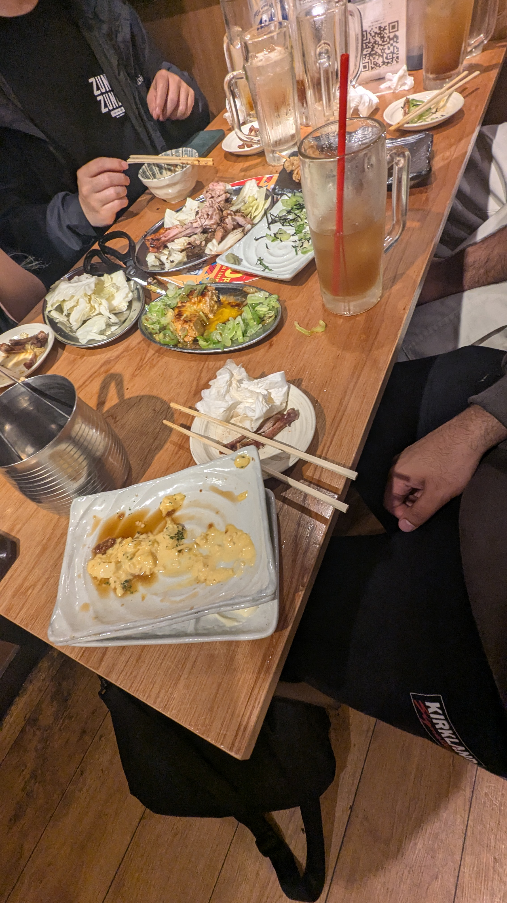  

Yea meeting them was epic. They wore very feminine clothing like a skirt and all, but sounded masc. One time when they went for a smoke break, there was a woman that talked to them, and she was shocked when they spoke. They also told me about a record shop in Sendai that I could go to, which I definitely will try to go to at some point this month. It was sick meeting them.

After that, it was time to say goodbye. I wasn't going to meet almost any of my friends for probably a very long time again, so we walked all the way back to my shitty hotel, and we hugged and parted ways. Fuuuck man hopefully I can stay in Japan August onward and meet them there though

# May 5 2025 JST
*Written at May 9 08:27 UTC*

This day my phone was also struggling to charge that morning. It was also my last day at Tokyo which was like ahh fuck cuz imma need that phone for when I travel back to Sendai on the train + shinkansen.

In any case I was thinking of going to Ikebukuro since I hadn't gone there yet at all my entire trip. I checked out, and put my stuff in a locker at Ueno. I was considering buying shinkansen tickets at the time, but I was like nawwww Fuck it ill just buy them later lol

I hit up the friend I met for pizza yesterday if he wanted to go to Ikebukuro, and he was like suree, so he and I were just walking around for most of the day through the streets and malls that were there. SO MANY malls man holy shit.

Before I met him I went through the massive Uniqlo store there, as well as the BOOKOFF too. After we met up we went through PARCO and the massive Animate store there, as well as Sunshine City. The place wasn't that bad when I first got there, but it slowly and gradually got REALLY fucking crowded man. Also interesting was that there was basically an entire floor in Sunshine City of random pokemon shops of various kinds. Like it was basically the entire floor honestly

     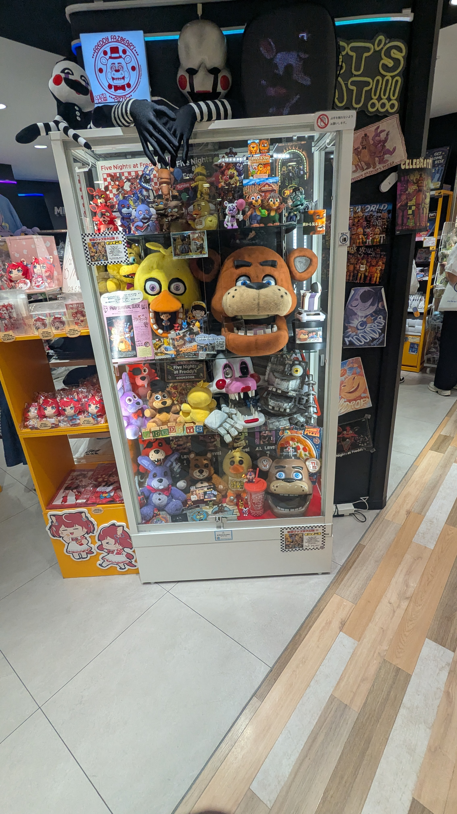      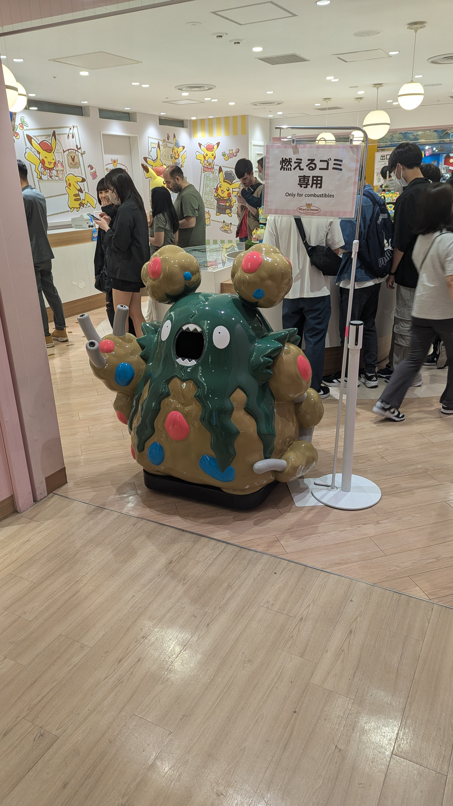    

Afterwards we ate some bakery stuff that was like fine, but also overpriced for Japan's standards lol, and then we parted ways. At this point I went back to Ueno station and looked up the earliest shinkansen tickets at the time, and it was FUCKED man. I ended up getting a green class ticket on the slower shinkansen line, which isn't the WORST, but man I really should've just booked tickets way earlier instead, oh well again it wasn't the worst.

Anyway, during our time there, I bought myself a sick Eva 3.0+1.0 artbook from the pop-up store that was there in PARCO, as well as a wanted one piece poster for my brother.

   

I was considering opening the artbook, but I feel like if I do that, then it'll probably get fucked when I have to go back to dogshit fucking Edmonton at the end of June, so I just left it closed. I can't wait to open it when I go back though. That'll be one of the very very few good things I can provide for myself when I get back.

# May 6 2025 JST
*Written at May 9 09:06 UTC*

So today was supposed to be my first actual normal day back at the lab........... but I found out that when Golden week holidays happen on a Sunday, then an extra free day is added either at April 30 or May 6....... and Golden Week supposedly was still on lol.

I was really confused as to why the amount of people at the subway and outside weren't that much, so by the time I reached the station I was supposed to get off, I asked my lab members if the lab is even happening, to which they said no, and was also when I found out by them that Golden Week was still on apparently. SO I GUESS I just had a free day today.

I decided to try the Mos Burger and Cafe that I had passed by many times before. I got a normal cheeseburger and cafe au lait. The tomato slice was fucking massive lol like the burger was basically just full of tomato, but it was decent. Like honestly it was still better than fucking McDonalds in NA which sounds like a low bar, but like it was decent as far as fast food burgers go so yea, the cheese wasn't even melted well and it was still better than McDonalds in NA lol

 

After that I was considering going to the record shop my friend told me at dinner on [May 4](#may-4-2025-jst), but by the time I left Mos, the shop still wasn't even open, so I kinda didn't bother and just went home. I did go to COOP after though and got some groceries and a premade meal though.

My phone was starting to get completely fucked though, charging almost never worked for the most part anymore, and I was assuming it was because lint is stuck in the port... but even after trying to remove the lint with a toothbrush and blowing on it and stuff, it was still not charging like 90% of the time. SO basically my solution was...... to get another fucking power bank. But this time, the idea was to get a wireless power bank instead. I honestly didn't even know if they existed or not, but I was like whatever man fuck it, I'll just go and see if they have any.

And they did

so that was kinda chill

The price on that shit was like 6000 yen or something, but I for some reason only paid like 3450 or something iirc? I was very confused as to why I was paying like almost half the price that was on the box, but whatever man. 

In any case, I took it home and tested it out. I tried opening the box as carefully as possible to make sure I didn't comepltely fuck it, in the off chance I could potentially talk to them to return it if it doesn't work. All the wireless chargers said that they are MagSafe or whatever the apple wireless charging magnetic thing was, and that it was compatible with the iPhone lineup, but I have a Google Pixel 6 Pro, so I really wasn't sure if it would work well or not... 

But it's fine, in the end after trying it out it worked out completely fine. So I guess now my charging habit has changed to just putting the power bank on charge, and leaving the phone resting on the power bank Loool

The bad news though... my pocket wifi charging also started to get really finnicky... it only worked like 50% of the time or something when trying to charge it, and it started making me worried honestly because it's not like I can wirelessly charge that, and also I literally need that to use my phone or laptop like AT ALL, EVER. So that was concerning, luckily I was able to RNG enough to make it work for the most part so it wasn't the worst thing ever.

In any case, I had decided to try to catch up on all of my blog entries this day, but as you can tell from these written at dates... that did NOT happen. I honestly don't even remember what I was doing on the computer the entire day lol, I do know that I caught back up on Anki or something because my Anki started exploding. Especially because the discharge from the phone's part being fucked kind of made me lose a day, to where the next day was a full 200 reviews, but I think at this point I had caught up. I don't remember exactly though.

These days though, I spent a lot of time shoving the random toothbrush (that I stole from APA) into the ports in hopes that the bristles will wiggle whatever lint is there in the ports (if at all).

# May 7 2025 JST
*Written at May 9 09:24 UTC*

Now this was my actual first normal day. Wake up, do Anki for a while, get ready, go to the lab, leave the lab, maybe go somewhere, and then chill at home. The usual routine, and honestly quite a pleasant routine. Almost no stress, and I honestly have not had a SINGLE bad day since I have been in Japan lol. Even with my phone and pocket wifi acting weird on charging it's chill

For my research, I was kind of confused as to how I should model it so that the alternative splicing data it's fed will output the predicted stressor more effectively, so before I had left for Tokyo, I basically had created a visualisation that shows the entire length for each stressor with all the events in like a "timeline" graph of sorts (trying my best to explain this to the average not knower). So then I showed it to the professor, who was also back from his trip back from Egypt, I thought he was coming back at like May 10 lol, but yea. Anyway he was like Damn this vis is actually crazy u shuold make this like a full fledged thing by adding like a few extra stuff, and then we can just make a paper on this and publish it and everything. So that was sick.

Honestly work like this is like very low effort for me, so I'm kinda chilling even more and cruising now as a result lmaoo

Anyway, after the lab, I went to Mos again and got another kind of burger. This one was the "vegetable burger" which is litearlly teh same burger but replace cheese with lettuce lmfao. It honestly was better though but idk if it's cuz their output there is inconsistent or something, or if the lettuce was just a better choice compared to the cheese. 

 

In any case, I still wanted some food at the time, so I basically went to FamilyMart and copped some dogshit food. I also noticed.... that there was literally concealer like RIGHT THERE.... and honestly I will take concealer and use it as foundation I don't give a shit, AND HONESTLY it was a shade that is WAY too light for my skin colour....... but I didn't give a fuck because tehre was literally no risk involved buying makeup from fucking FamilyMart lol I could just self checkout it all without worrying about what the cashier would be assuming at all about me because I'm buying makeup. So I just fuckin bought it. Honestly it's a fucking waste of money but I really don't give a shit man I had to it was right there

I don't really remember what else happened this day. I think my mind was also blown by someone talking about how they are "antiprofic" which is like???????? what the fuck are you talking about!!!!! That was the first time I heard of profic, and being antiprofic is just being antific man what the fuck are you talking abouttt. In any case it was kinda insane seeing that, like I can understand talking about antishipping or whatever becuase it's like sure it is weird when people make their entire thing just doing really weird ass ships from media, but anti/profic is like ?????? lol ok man

Anyway at some point I passed out to sleep lol

# May 8 2025 JST
*Written at May 9 09:39 UTC*

SO 2 others and I were supposed to follow one of the PhD neurosurgeon students to a mice MRI room, and apparently that was supposed to be like very early in the morning, but I thought it was just some shit we do at like 12 or something. So I came to the lab late, and I was like "well it should be fine since nothing's happening till later anyway" ONLY TO THEN FIND OUT that they were deadass waiting for me for 2 WHOLE HOURS......... AHHHHHHH FUUUCKKKK, but it was chill I guess lol. I got food from 7/11 but left it there to eat after checkout out the MRI room.

It was very interesting to watch honestly. They have a small scale MRI for mice, but the magnetic strength is much stronger. Supposedly, human MRIs usually have a strength of 3-4 Teslas, but these mice MRIs take about 7 Teslas. The reason is because the resolution required for getting vascular images of mice MRIs needs to be much higher because of how small the arteries and everything are compared to humans. Any higher though and it would add too much noise from other places of the body that they are definitely not interested in.

The PhD student was also telling me from before from [May 1](#may-1-2025-jst) how he was listening to rap. He was also listening to Kendrick Lamar since LOL I saw on his phone that the latest song he was listening to was just straight up "Not Like Us". In any case, I told him about a bunch more rappers, and then I also gave him a link to RateYourMusic LMAO, I was like yea you can find a lot of rap albums here since he loves rap. We also talked about random stuff and about the Japanese language as well. I then found out that I was deadass there for like 3 hours, and my rice ball and banana milk definitely aren't cold anymore...... so I hurried back and quickly ate that food lol.

Afterwards though I stayed pretty late honestly, because I was like fuck it, I'll literally just write my blog entries at the lab for the rest of the day, so I was there all the way until like 5 or 6 pm or something. Most of the lab members had already gone home by then LOL so I was just sitting there typing like mad for a bunch of days on this post there

It's chill though because I did catch up, which is nice.

Afterwards, I went to a book store called Tsutaya, which was a really sick bookstore actually. They had a corner for like an artist showcase which was really cool, as well as a playstation "pop-up" if we wanna call it a pop-up lol, it was like a table with random playstation merch which was pretty nice merch all things considered, but yea.

 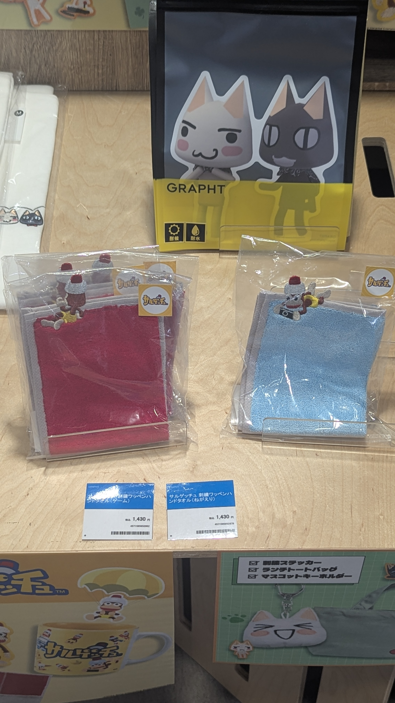      

I might buy that artbook later, I'm still considering..... it's like 2700 yen or something so I think it might be worth. It seems very interesting since it's like a combination of artbook and also PSD shenanigans so yea

After that I basically just went back home, and continued writing more of this blog post. The absolute worst thing happened though, the laptop's keyboard suddenly decided to stop accepting like any of my inputs... I started panicking because after both my phone and pocket wifi fucking up their charging over the course of like the past week, my keyboard now for some reason was also just fucking up too... So I hurried and tried to pull out teh mech kb I brought with me to Japan and connected it. At the very least, it seemed to have worked with the mech kb, and when I press caps lock the light literally showed up on the laptop keyboard too, so I had no idea what was going on. After doing like a full reset (or attempting to... idk if it actually fully reset) though it started working back to normal. My favourite Made in Abyss wooden mug's handle just completely broke off clean though...

After all that I actually got mad as fuck. It was like the first time after a month+ which is kind of crazy because before Japan I was generally quite emotional about a lot of things, so a month of not being angry at anything at all feels like an insane eternity honestly LOL

But yea after all that I just decided fuck this and went to sleep

# May 9 2025 JST
*Written at May 10 01:49 UTC*

Now that I'm caught up to all this I can finally draw and stuff again because it takes like no time to write the entry for the previous day (usually)

Anyway this day was pretty chill. I woke up quite late again so I just copped food from 7/11 again and ate it at the lab. It was just some salmon onigiri and iced coffee basically. Nothing particularly special happened this day, in fact basically no work was being done in general lololol everyone was kinda chilling, since one of the projects is basically waiting on materials to be shipped to the lab now. I did start the groundwork for rewriting the visualisation site for the other project though which was nice. 

Went to the same karaage place I went at [April 24](#april-24-2025-jst) with 2 other lab members. This time I ordered like a set plate instead of the usual karaage in bowl they give, and it was very good. Both meals I've had there was very good so far. They also use halal chicken which was interesting considering everyone working there seemed like they were japanese. Did they convert to Islam or something?

They also gave us free seaweed on our way out this time LOL that was random as hell but it was cool. I think the owner of the store knows one of the lab members I went with today.

After that I decided to just work more on the rewrite, and then left the lab at like 1630 or something I don't remember exactly. I had to shit REALLYYYY bad so I basically rushed back home and let it all out and showered and everything. I hadn't gone to MILLS in a while, last times were [April 16](#april-16-2025-jst) and [April 23](#april-23-2025-jst), so I basically stayed there and got the cold cafe au lait and cheesecake slice I did last time. To my surprise I found out that there's actually more than 1 person that runs the cafe. I don't know why, but for some reason I thought it was just 1 guy that runs it. Maybe it's cuz the traffic there is generally very low? Because when I went this time there was noone at the cafe again. There were a decent amount of people at April 23, but there was also basically noone at April 16 either so idk. But yea that did surprise me a bit. It's such a good cafe though in my opinion the vibes are impeccable.

After that I went to COOP grocery store again because I ran out of Pocari Sweat, and that's where I can easily get the big bottles for really cheap. I saw they were selling these really weird ass sandwiches and they were on sale too (lol 3 dollars to 2 dollars) so I was like whatever lemme try one. It was Fine like it really wasn't amazing but that was definitely a sandwich that exists and was decent so that was chill.

I also found out that the port for my pocket wifi isn't actually fucked, it was just teh cord that they gave me that was fucked. Once I started using a different cord that I luckily had (it's mini-USB), it was charging with no issues at all again lol, my phone is still fucked for charging though I had to do the wireless charging method overnight

# May 10 2025 JST
*Written at May 11 01:43 UTC*

Unfortunately.... I didn't start drawing, BUT this day I finally did what I've been wanting to do which was to fuck off to a random ass JR station and just walk around. Before that though, I also finally had time to mop my room for once. My floor was fucking shining when I was done with it man holy shit. Washing it is also chill u just take off most of the dust/lint off the microfiber attachment for the mop and then throw it in the washer-dryer for like 10 minutes. Much better than using a swiffer mop with 328929232 sheets actually it's really nice. Shit also has a velcro back to it to connect to the handle.

The handle kind of sucks though because u lock the height of the handle by turning it, no lock mechanism or anything... so basically whenever u turn the mop around on the floor there's like a chance ur loosening it up and then at some point itll just start collapsing lol

Anyway after that I also did a bit of laundry cleaning the bed sheets and pillow covers, and then I fucked off to a random JR station.

I decided to take the Senzan line because the stations on that line looked like they were the most obscure. The line goes through a mountainous + foresty area that connects Sendai to a smaller city more inland of Japan (and also just in a different prefecture I think). So I got off at Kunimi Station, and then just started walking around the area.

There was a random dead end after like a row of houses of various types (not just single family), and they were all also like separated a decent distance from other houses by road, so I just turned back and then started walking towards Kuzuoka Station from there. During that walk I had walked passed a MASSIVE cemetary, and supposedly there were a lot of buddhist temples nearby as well, but I didn't really see them. After the cemetary there was a MASSIVE garden, and it was also right beside the Kuzuoka station. I couldn't tell if I was allowed to go in or not though so I didn't go in it.

I thought Kunimi station was small (though Toshogu station when I went there at [April 5](#april-5-2025-jst) was smaller than Kunimi), but Kuzuoka was like an actually tiny as fuck station. There weren't even like any gates at all, just a place to tap with no barrier of entry or anything. That was kind of absurd to me because people could just get off between really empty stations this way without paying... I mean imo that's chill and honestly probably not a big deal for JR anyway considering the amount of people that use these stations is literally trivial it seems (Kuzuoka station transports only like 400 people a day or something).

There were also no bugs during my entire walk, it was only when I got to Kuzuoka station when I saw them at all. I have to say though those bugs were MASSIVE, and also I couldn't tell if they were mosquitoes or not, but they weren't fucking with me so I guess not? Also when they flew it legit just looked like they were just moving around T-posing or something, they looked really fucking funny and absurd by the T-pose and their sheer size LOL

                     

Anyway I went home, I was craving some ramen so I went tot he epic place for ramen again and it was epicc af, guy remembered I just want "futsuu" LMAO. I also did get cabbage this time for like only 50 yen more and it was really good

 

After that I was basically chilling at home. Went to the konbini for snacks a few times but nothing else really. I started looking up random stations because I was curious as to how empty these can actually get, and apparently they have a term for this called [Hikyou Stations](https://en.wikipedia.org/wiki/Hiky%C5%8D_station) with the Iida line specifically being very famous for it, but that's way too far from me so I can't really check it out unfortunately.

Afterwards I started thinking about my hometown Edmonton's infrastructure again, because it's like damn Japan can just let these really infrequently used stations still run without much issue, AND THEN I NOTICED THAT THE SCALE OF CITIES IN NA IS JUST FUCKED DUDE? Look at the comparison of Edmonton and Sendai here. They are literally teh same scale of length.

   

Roughly the same length scale in both images.

The picture in Sendai is like a significant portion of the city being captured within that image. There are more than like 15 stations in this image.

The picture of Edmonton is NOT EVEN LIKE A QUARTER of the city. THERE'S A TOTAL OF LIKE 1 STATION IN THE IMAGE.

Edmonton is like just fucked. People there would never be okay with increasing the general population density here at least in my lifespan. We are so far back in the race that it's not even a consideration that could be possible right now...

Regardless though I had an idea where I could suggest making the train jingles for the Edmonton LRT, so I sent them an email asking about it. I even said I could do it all for free, and even possibly work on the implementation of automating them for the LRT lines. We'll see if they ever respond though. I think it would be a really good thing to have even for the little infrastructure that exists there in Edmonton. 

Afterwards I was looking more in the history of JR as a whole. They were initially a government owned facility that then split into various private companies. I wanted to find out why they felt like they need to, and I found quite literally no convincing reason why. Any changes they needed to make could have been done while they were still government owned. The idea of developing and leasing corporate projects, as well as real-estate and housing planning based on station locations could have been done by the government. The debt could have honestly been easily managed as a result (for example: like how they literally did that with the private corps instead). And also they did a shitton of union busting, and massive layoffs for workers (25% of the workforce) which is just insane to me.

Either way though, it's not like its the worst situation altogether. They are still building lines in the Honshu island, and generating significant profits in this island still. Though.... Hokkaido is just fucked it seems, which is really sad to see. In the 1980s they closed so many lines there too it's like holy fuck. By the way things are going there Hokkaido is probably deserted within a decade or 2...

Oh well, despite the flaws and what could have been better in hindsight... Japan is still pretty much on top, or one of the ones on top in transport and everything...

# May 11 2025 JST
*Written at May 11 13:49 UTC*

It's like around 23 JST here? I decided I should probably write these the day of instead of the day after to save some more time.

Speaking of which, today I didn't get to draw either. It should be fine though becuase I think I am basically guaranteed to resume drawing starting tomorrow I think.

This morning I went to Tully's Coffee and sat there to write the blog post for yesterday. I was also talking a bunch with friends about the dynamics being played in the consumption of art. I was sitting there for like a good few hours I think. Oh yea I did have the laundry running back home while I was out too in order to just get them hung and dried by tomorrow morning.

But yea I was at Tully's Coffee until like lunch time basically, so I just went straight to Matsuya and got a normal beef rice bowl for like 460 yen or whatever and it was good stuff. LITERALLY the moment I walked into Matsuya after making the order on the kiosk, they had the food made. How the fuck? And it was all hot and fresh too it was fucking insane. Peak fast food LOL

I also went back to Tsutaya, and I bought the book I was considering buying at [May 8](#may-8-2025-jst), alongside another artbook that they added since to the store that was really pretty (the funny whale one).

After that I was gonna draw when I got home but I got distracted by the art consumption conversation again and then just started watching YT vids since [a friend of mine just uploaded it today](https://www.youtube.com/watch?v=uRb5T2WeBP0) (check it out btw its a TF2 funny clip montage vid) and then I passed out for like 2 hours. Then I went to COOP Miyagi cuz I was like damn I have no milk OR pocari sweat, so I went and copped some alongside some shitty junk food snacks and a cake that was just calling for me.

I was gonna start drawing after that.... but my apple pencil and ipad were like basically 0 battery. So I was like damn, and basically did nothing aside for search up random stuff about city planning and public transport and shit again because Edmonton just pisses me off so much, and now I'm going to sleep lol gn

I should probably have also worked on the website research project lol

# May 12 2025 JST
*Written at May 12 12:33 UTC*

I wanted to get to uni early today but I DIDN'T AGAINNN oh well. It's not like there's anything I have to do at the uni itself. When I was there I was basically working on my code rewrite nonstop that I completely forgot that time was passing, and it was suddenly like 1730 lol

I mean it's fine tho since I got a decent lot of that rewrite done today. It's almost back at the same position it was at before I started the rewrite which is nice. I do have a presentation next week though on this exact thing so I'd like to get a decent lot of it done by then... hopefully

After the lab I went to Menya Togashi for ramen again, the same one I went to at [April 19](#april-19-2025-jst). I got the black spicy ramen with a decent lot of noodle. Massive fuckin bowl it is. It's also pretty nice.

Honestly I think the best ramen I've been having is at Yokoyokoya though after the first time it was just so much better after I was able to say futsuu LMAO it's so good and so cheap. Also I prefer the first ramen I had from Menya Togashi before this one, but it was still nbd

CJ The X also uploaded a new vid today and [it's a really good fuckin vid](https://www.youtube.com/watch?v=d5mO-obJdTQ). I was gonna start my drawing streak today after finishing watching it.... but........ I got diarrhea like twice tonight, so I'm just going to sleep early because I really don't wanna deal with more of this, which makes me really sad because I wanted to start drawing again today man. Oh well

# May 13 2025 JST
*Written at May 14 12:30 UTC*

I forgot to write the entry for this day, I've just gotten so caught up in the project that I bascially have given myself way less time for everything else lately loll I DID DRAW TODAY THOUGH after like 3 whole weeks of not doing it holy shitt

I didn't do anything particularly interesting though anyway. I basically went to the lab, and did a bunch of work there, and then went back home. A bit earlier than usual becuase honestly my towel kind of smelled and I feel like it got on me when I used it that morning.

I bought a pack of 3 twist donuts at familymart for like half a fucking dollar and they tasted better than Tim Hortons donuts lol

yea nothing else too exciting though.

# May 14 2025 JST
*Written at May 12:57 UTC*

I've been letting the project basically consume my entire time lolol. I was planning to cook some rice today when I got home but I mean its already 22:00 here so it's kinda gg

I was also at the lab for a decently long time today. Yesterday I wasted a bunch of time because of a dumbass bug with the HTML canvas scaling, and today it felt like my progress was actually quite slow in getting things done, despite basically doing nothing but working on the site. I got a rice ball and iced caffe latte from 7/11 in the morning, but by the time I was about to leave I could feel the fatigue hit me like a fucking truck, so I probably got quite hungry again. Man the grocery store has good as fuck food though fuck

When I got home I did the laundry ONCE again, and then went to COOP to grab a quick meal for like 4 bucks lol and Pocari Sweat the goat. After that I let the site consume all my time again, and now I basically have no time to draw.... FUUUck oh well I will make sure to come back home not late and not spend a bunch of time working on this site again. I also haven't done all the anki for today either so I'll just do that until I pass out tonight I suppose.

# May 15 2025 JST
*Written at May 15 10:56 UTC*

Had an insane headache this morning so I popped a tylenol and slept for like 5 more hours or something until it was like 12 or 13:00. So obviously as a result I basically didn't go to the lab today. After I got up my head was much better, though the lingering effects were still there. I basically took advantage of the time and cooked myself some rice, and made myself a good meal with egg rice and seaweed.

After that I tried to force myself to finish Anki, but I literally did not finish it until like 19:00 lolll, I wanted to draw and work more on the site tonight but oh well. I got to do some drawing, but there's basically no time left for me to work more on the site, becuase I'm actually trying to sleep earlier now. I think it'd be better if I spent my time Anki-ing and drawing earlier in the day instead of after the lab now that the site is basically taking up a lot of my time, and I basically lose track of time too when I'm working on it.

That's the current plan at least, but I know the lab is going to be doing some karaoke tomorrow which will be fun, but concerning for my sleep schedule LOL. Either way it's not a big deal though because it's going to be a Friday tomorrow. I'm also going to be presenting next Thursday, so hopefully I can finish most of the stuff I talked about with my prof before then. Even Tuesday would be ideal since that's when the group meetings usually happen. 

Either way drawing seems to be back on schedule at least (for the most part). I gotta learn how to do perspective and get better at drawing basic shapes though man

# May 16 2025 JST
*Written at May 16 12:45 UTC*

Right so I absolutely was not able to draw today. But it's fine because a shitton of stuff happened today. I am pretty close to the next step for my research project, I just need to figure out some optimisation tricks, and finish implementing some graph types. Violin plots are so deceptively hard to make from scratch, and I'm only doing this for the interactivity since you don't get that with python's matplotlib lol.

It's very difficult though because I have had to restrain my parameters to reduce the size of the data stored in the browser by a fifth and a half, and it still lags half the time. It's like an array the size of 400k objects so yea lol, hopefully I get it done this weekend though because fuck going outside in this upcoming weather. Constant rain tomorrow and then like 30 C the next day.

Ahh I also forgot to ask my friend about applications and scholarships at the lab today, but it's fine I'll just ask on Monday. I did get the presentation board fixed with my laptop since at tuesday it was fucking up and I couldn't show it on the screen so that was also nice. Next tuesday should be chill, but hopefully I don't get fucked on thursday when my actual presentation happens lol

I kind of want to add japanese to both my presentation and website because it'll be like completely inscrutable otherwise for like 80% of the people at the presentation, but I don't really know if I'll have the time for that.. we'll see though

Around like 1600 or so 3 other lab partners and I went to karaoke and it was fuckin crazy. It was a [Karaoke ManekiNeko](https://www.karaokemanekineko.jp/) on a 4th floor, and they kept blasting [this song](https://www.youtube.com/watch?v=jF-l42n9nio) in the hallway/cashier of the place, and now it's just stuck in my fucking head now it's sticking harder than the shitty fuckin Donki song man WHAT the fuck they put crack in the melody for no reason.

But yea it was kinda pricey so only thing I drank was basically like a mango jasmine jelly soft drink thing which was like not good but it wasn't terrible or anything just overpriced. My standards of pricing have gotten so fucked in Japan man. Anyway we were there for like a good 3-4 hours I think? Sang a bunch of JP and English songs and it was an epic time. I kept accidentally picking songs that were just insanely hard to sing though LMAO fuck

After that we ate a soba noodle shop, and I ordered just their basic thing for 890 yen. I unfortunately didn't take a pic before I mixed it all up and shit, but I think those were the best noodles I had so far? I think if it was a little less oily it would totally have been worth the price to go there everyday for lunch for 890 yen dude what the hell. I'm 100% not doing that though LOL but yea those noodles tasted fucking great.

After that we copped taiyaki from a taiyaki stand nearby too. I got custard taiyaki and burnt the shit out of my tongue, but it was very good taiyaki. Not as good as Zunda taikyaki, but still very good

After that I walked all the way back home. There was a small low roof alleyway I found as I was walking by, so I walked through there as part of my route back home. I always wanted to primarily walk through these kinds of alleys so I'm glad I finally found one with A LOT OF STUFF TO POTENTIALLY GO TO, very cool stuff. I got home at around like 2100 and I'm basically dead so I'm just gonna do Anki until I pass out in bed. I'm pretty much done today's Anki anyway so that's chill, just sad I didn't get time to draw today

      

# May 17 2025 JST
*Written at May 18 01:35 UTC*

Completely inscrutable day. After finishing writing [May 16's](#may-16-2025-jst) entry, I immediately decided to just go and trim all my body hair entirely instead of going to sleep... so the sleep schedule fix plan was kind of thrown COMPLETELY out the window. My trimmer stopped working like 3/4 into 1 leg though, so I was like whatever fuck it and just charged it overnight and just went to sleep. Finished it all in the morning but I also had insane diarrhea in the morning (maybe because of the soba noodles? idk) at the same time which was CRAZY work. I lived though so it's chill

I also went to Sendai station this day, mostly because I was already outside to get stuff like toilet paper and batteries and shit, but I was like fuck it zunda shake time. There was a Palestine demonstration happening by the station surprisingly actually. Very cool to see. It was also raining so they were really out there I guess loll

But I just did my usual shopping of just getting groceries and toilet paper and whatever at familymart and coop and shit and then went back home. I actually ate so much random food this day beucase I cooked a massive bowl of rice and egg, and then got a meal from COOP and some other food too, so I really went and stuffed myself this day lol. I got this banana chocolate waffle thing and it was so mid honestly I kinda regret getting it but it's whatever

Also finally caught up on Anki because the day before I couldn't finish all the reviewing. I also drew today, but it was just practicing drawing lines. Before I was drawing basic shapes over and over again but I was like damn I need to learn how to make a line in the first place honestly. 

That's pretty much all that happened this day though. At Sendai station I was contemplating going to the garden by the cemetery but I decided otherwise to just get back home. I didn't give myself any time to work on the research project though unfortunately...

# May 18 2025 JST
*Written at May 19 12:04 UTC*

Actually crazy day. I ate SO MUCH food this day like it wasn't even good food or anything just random food from FamilyMart and also the food I had cooked before to gradually finish it. Somehow though I locked in and drew a bunch of random lines and shit, finished all my Anki, and then also deadass worked on the research project site for like 10 hours straight or something. I rewrote the entire state management system, and then basically finished like 80% of the project that was left straight up in 1 sitting it was actually crazy. I treated myself to some ramen from the epic place (Yokoyokoya) and it was epic

Nothing really much else to say about this day if I recall correctly. I barely went outside aside for FamilyMart and ramen, and I was busy being locked in all day lol

# May 19 2025 JST
*Written at May 21 08:57 UTC*

Been trying to battle with my sleep schedule, while also getting super locked in with the research project, that I kind of lost track of things. I think I gained like 2 kgs over the course of the weekend, but that could just be cuz of weight fluctuations and shit so it's probably fine. I think nothing really happened this day though, I basically just was working on the resaerch stuff all day LOL

I did notice at night though that the new sign they put up for the Tohoku University Hospital now has LEDs and shit for the night which is pretty sick. I don't think people can read the small text regardless though when they are driving, but I guess it works for when people are walking, though I don't think it's for anyone who is just passing by so idk

I also have been throwing email after email at the University of Alberta to try to get a dual degree setup working or something so I can be in masters at Tohoku University as well as the University of Alberta. 

# May 20 2025 JST
*Written at May 21 09:03 UTC*

Today was a LOT of progress actually on my research work. I also started thinking about the fact that I'm presenting on thursday lollll. I also hadn't really sent the stuff for the MEXT application yet to my dad so I was planning to do that the evening of this day. 

Either way I wanted to leave early this day because the day before I was deadass at the lab from like 9 to 19 getting consumed by the research project lool; so basically I left at around 14 this day back home. 

Though I wanted to grab some lunch at a new place this time though, so I decided to get curry at the nearest place when I searched for curry at the time, which was at [Moritatsu](https://maps.app.goo.gl/HFTrdVPvbpqK8Esk8). I ordered chicken thigh curry, and it was like 1280 yen, so I was like damn, this is fucking expensive for Japan's standards, this better be good as fuck.

Little did I know that the serving is just ABSOLUTELY FUCKING MASSIVE

THAT IS 5 CHICKEN THIGHS IN A ROW DUDE..... WHAT?
Somehow I ate it all, but I legit thought I was going to die with the amount of food I just ate dude WHAT THE FUCK? That was deadass so much fucking food. It was also quite good too I was very happy. Definitely worth the 1280 yen for its size, but I also definitely wanted a smaller plate LMFAO

After that I guess I went into a food coma, even though I was planning to get some shit done at home. I was completely passed out thuogh so it was kinda fuckin doomed. I didn't get to draw this day, and I also didn't finish Anki. I basically started and finished working on my presentation after I got up from passing out for a while though at least, which was nice. I have to start practising rehearsing the presentation though now.

Man that plate literally killed me

# May 21 2025 JST
*Written at May 23 02:13 UTC*

Not much really happened this day , though a decent lot of progress was done in the lab for the research work. It was also basically the first day where I started using the super beefy computer that they have in the lab that they use to run their scripts on massive data sets of RNA sequences. It's a real nice computer, someone also left a bocchi the rock keychain USB on the computer lol it was a real nice keychain though not gonna lie

I don't think I did anything else special that day though because I was just working and thinking about the presentation that was gonna happen tomorrow lol, someone brought belgian chocolate to the lab which was nice tho.

I talk a lot about food in this blog post LOL but the food here is honestly just so fucking good compared to Canada man I don't knoww, not only that but transportation in general and everything is just so nice so it's easy to just go anywhere to chill it's fucking sick.

# May 22 2025 JST
*Written at May 23 02:26 UTC*

Today I presented the project; a solid 20 minute presentation that I can't tell if people understood or not, but the people who were supposed to understand understood it so it's fine I guess. Lots of decent questions and everything so that was chill. It was interesting seeing some certain social dynamics play out.... but won't delve too much on that until things are certain IRL lol

Anyway it went well I think so it's chill. I was told good presentation and stuff by people randomly which was nice. This was like at around 10:00 and honestly I didn't wanna work on the project for most of this day so I just decided to chill around and do nothing for the most part, but eventually I ended up working on the project more. I feel like I'm doing too much everyday for the project though so I'm trying to scale it back somehow... workaholicism and shittt

Anyway the lab planned a yakiniku at 18:00 so I was there until then just chilling. Afterwards the 2 of us took a bus there while everyone else just had a bike so they just biked there while we bussed there and the bus was like a dollar lol. The gloriousness of actual options of how you move around for once

Ate so much beef it's crazy. Probably ate like every part that existed. I didn't really have a picture for when we started eating but it was good. Also had some "kinda raw" beef sushi which was also very nice. All good food. It was actually kinda expensive though (IN JAPAN STANDARDS) like 4000 yen each person so like 40 bux, which is probably like pretty much on the much higher end of what I've been generally paying in Japan lately lol

Anyway I found it really funny when we for some reason started talking about drugs that they were like Zomgg drugsss while at the same time taking massive gulps of alcohol like alcohol IN MY opinion honestly is just infinitely worse than doing something like LSD or Salvia honestly like at the very least ur not destroying ur entire body by chugging ethanol down into ur bloodstream that has severe consequences that are known to everyone, unlike psychedelics and shit that have been shown to not really do this. idk bruh, like marijuana is kinda shit cuz it can cause psychosis and schizophrenia and also the high sucks ass but yea idk whatever mann

After that I walked home and passed out. I forgot to do anki this day mann and I also didn't draw this day either but oh well

# May 23 2025 JST
*Written at May 25 03:58 UTC*

EVILLL day today first off I had diarrhea like twice and it was so epic that I just decided to not go to the lab this day. I basically decided though that since I'm owned I'd just go around places, so I went to Komeda's Coffee and chilled there for a while. I wrote the previous day's entry there, and I got the breakfast selection with some iced coffee, and a coffee jelly parfait.

I forgot what else I copped but I was just walking around a lot, I think I went to Matsuya though and copped their curry cuz I wanted to see how that fared compared to their other shit. Honestly it's mid as fuck, the beef bowl they give for cheaper is much better. It did come out fast as fuck like usual though lol. I did go again and get a beef bowl later in the day too after I had diarrhea AGAIN

When I was back home I found out from my friend of a new thing Google is putting out called Firebase Studio. It's literally actual vibe coding it's kind of crazy, so I tried to make the things I've been wanting to make but just haven't had the motivation and/or couldn't be assed to work on them.

Well after like a few hours I was like fuck this man, it felt like the most insane tedium I had experienced in a long while, and then near the end when I wanted to go get dinner at Matsuya it just crashed completely. I was like holy shit man whatever . But the food I got at Matsuya was good tho. My friend was having a GREAT time with Firebase studio though and honestly the fact that he started to make things as a result of it is really good imo I am glad that that is happening from that at least.

After that I was contemplating just playing Blue Prince, and then another friend just instantly brainwormed me by saying a specific thing while he was talking about his experience with Blue Prince and I just bought it immediaetly and played it until I went to sleep LOL

# May 24 2025 JST
*Written at May 25 05:48 UTC*

I decided to only play Blue Prince all day LOL. Also """""beat""""" the game and played some more. I actually just played all day I went to sleep after too lol

I did get ramen though from the goat place Yokoyokoya, but yea nothing really happened this day. Blue Prince is a pretty damn good game tho i cant lie

# May 25 2025 JST
*Written at May 26 00:49 UTC*

Lots of stuff was done today, and by lots of stuff, I just mean general living stuff. I was able to do a full deep clean of the entire room for once (man the previous tenants and the rental company themselves miss spots to clean which is fucking insane), and laundry and everything.

I also went grocery shopping but Imma be honest I just ate all the shit I bought that day too Fucvk, was supposed to be for at least the next 3 days or so but it's chill I can just walk there easily unlike Fuckinggg Canada

Played a little bit more of Blue Prince but i wanted to be productive today. Unfortunately after I ate all that bullshit I bought I had like a food coma for a good 1-2 hours so I lost a decent amount of my day that I had left after cleaning and playing a bit... BUT it's chill cuz I still got the Anki done for once (it's catch up time I guess) although that itself took much longer than usual lol, and also got the previous days added onto this page.

Also I didn't take a pic but the grocery store had eel this day for the premade food sets they make. It was so fuckin good the eel and rice and the seasoning they added to it. I also bought some takoyaki (which I had actually bought before but I don't remember when exactly) and it was just fine like before, though I wanted to save it for later but I just ate it at teh same time. Same with the bag of donuts and crisps I bought. OH WELLL

Anyway things are back on schedule, the 1 day i spent playing Blue Prince didn't really falter any of my routine at all which is very nice.

# May 26 2025 JST
*Written at May 28 08:11 UTC*

Today I found out the prof isn't at the lab for the week, which kindd of halts my current progress for the most part on the research project, since I have a kind of fundamental design problem I wanted cleared up. On the other side though, I basically started considering taking this week "mostly" off and just chilling and playing Blue Prince and going to random places instead.

Anyway after the lab today I went to Mos Burger cuz I wanted to try a different burger on their menu, so I got a burger with like 3 patties in it and a melon soda and fries as a whole combo meal to see what it'd be all about... honestly it was mid as fuck the burger kind of tasted like nothing and the melon soda was way too fizzy and the fries were so whatever; honestly afterwards I went to the taiyaki stand right beside and got a custard taiyaki just to feel somethin, and that was pretty fuckin good tbh

 

Anyway I decided this evening that I'll basically go to the lab tuesday and thursday this week; other 2 days I'll be chillin n shit in general. All of my Anki lately has also just been 200 reviews a day since I missed those 2 specific days... which I mean is fine it makes Anki take like 40 minutes instead of 1.5 hours, but damn no new words for me lately I guess I also did do the research presentation last week Thursday anyway and I am like technically "ahead of schedule" for the research project progress so it should be fine I think

# May 27 2025 JST
*Written at May 28 09:02 UTC*

This morning I met the guy who I was initially linked up with by my aunt to potentially study in Japan for Graduate Studies. Basically my aunt did her PhD from Tohoku University, and she visited Edmonton (my home hell land) and suggested to my parents that I should go study here since I was initially having no luck at the University of Alberta. From there she had me link up with a friend she knew from here who is now an Associate Professor in a Materials Engineering lab from what I understand, and that's how things ended up to where I am now in Japan today LOL

Anyway we met and chatted a bunch about life in Japan and my potential prospects in general of what's possibly going to happen later this year and stuff. He was also telling me abuot the things he liked and doesn't like about the happenings in Japan. Apparently the financial squeeze is really hitting because the CPI of Japan over the past like 5 years or so has been outpacing the changes in wages and the performance of JPY; though honestly it's still not as bad as Canada's financial situation, but it is there for sure which is tough, but it seems like Japan is dealing with it much better than Canada right now even so it's not the worst for sure I think

Anyway I think I legit got like no work done today for the research project. I basically implemented the new design but didn't push it fully or anything because I wanted full confirmation that this change would be fine for the project. 

Also I don't think I mentioned this before, but apparently I forgot to send an update to the professors at the University of Alberta that the departments have given me an offer for the MSc program there... I had emailed them as soon as I saw that they were asking for an update and that I apparently hadn't sent one earlier this month... but I still haven't heard back from them, no congratulations or anything lmao oh well

I was just reminded of it again because this day I had emailed the prof at this lab since he was gone out, asking him about the things that are basically blocking my progress currently for the research project since I'm not fully sure

Rest of this day though was just me playing Blue Prince LMAO man this game has a really fucking well designed feeding rate of the narrative, AND the narrative is fucking good. I do wish the actual game part of the game was better though but holy fuck I'm enjoying it a lot

# May 28 2025 JST
*Written at May 29 13:20 UTC*

Very uneventful day for the most part. Just did the usual, go to lab, oh there was a very interesting presentation actually about using red light to activate cell death, and potentially using this for patients with specific cancerous brain tumors. Very cool and interesting. Anyway went to the lab, left kind of early, went to Matsuya and tried their curry rice again except this time with beef and onions and it was kinda better but not amazing still, got a taiyaki, went to Matsukiyo for body soap, went to COOP for food goodies, and then went home and ate a bunch of shit and played Blue Prince all day

I am contemplating on if I should go to the lab tomorrow or not. I could technically work on a part of the research project I had been neglecting because it'd be kind of annoying and tedious to work on it right now, but also I could go to random train stops tomorrow and chillmaxx which would be really nice. I could also just do that on the weekend both days instead though, and honestly who is to say that I won't just end up playing Blue Prince all day tomorrow if I don't go...

So not sure. I do wanna say though Blue Prince is quite good, but there's things that make it pretty fuckin annoying because it's very often me going Oh there's this thing I can do but then I just get fucked over because the game for some reason is a roguelike when IT REALLY DOESN'T NEED TO BE THERE HAS BEEN NO JUSTIFICATION FOR IT TO BE A ROGUELIKE STILL, but whatever because I do keep stumbling into other random stuff that I go "ok I will entertain this thing" too so it's not terrible or anything, just not good that it does that.

But yea nothing really crazy today. We'll see if I end up going to the lab on friday or not.

I haven't been drawing lately...

# May 29 2025 JST
*Written at May 30 12:43 UTC*

Uhh I seemed to have mixed up the dates... basically everyhting I wrote for May 28 is for this day LOL because the presentation happened May 29 and I was contemplating if I shuold go to the lab May 30...

But I mean that's fine I guess because on May 28 I did fuck all just ate ramen in the middle and nothin else really. Ah the ramen shop was very crowded compared to usually thuogh that day which was odd. Also I did cook rice so I've been eating rice and egg everyday since too, but yea nothing else really happened on May 28 lol.

I don't really have anything to add for May 29 that I had before... thuogh Blue Prince is a fucker man I was thinking about that experience again in May 29 and it was pretty annoying as fuck honestly, but it's ok because its good again.

# May 30 2025 JST
*Written at May 30 13:07 UTC*

So I did end up deciding to go to the lab today because I realized there is something I could work on, so I decided to try and lock in. I basically just locked in the entire time I was there until like 14:00 or so, and then I left. It was a very cloudy day and it was going to rain so I took my umbrella with me, but by the time I was leaving there was no rain still so whateverrrrr

I basically went straight home no epic food that I copped from anywhere. I did get an eclair from 7/11 though. I was shocked that shit had actually snapping chocolate on it it's crazy. It was good stuff. Just played Blue Prince for the rest of the day this day too lol

Anyway.... we'll find out if I go outside tomorrow I guess. It'll be raining all saturday though so idk. Also my shower drain has been smelling really bad lately for some reason, so I need to inspect and fix/clean that too before I do anything, alongside laundry. Yeaa we'll see

# May 31 2025 JST
*Written at May 31 12:13 UTC*

Wow so I didn't go outside today, and that was a good fucking idea cuz it was raining like crazy today honestly; probably the harshest its rained during my time here so far.

Regardless though, I was able to get teh shower drain cleaned completely. Mission success. It did make my room smell like the smell of sulfur kind of for a decent while but ti rapidly dissipated especially since I turned the kitchenette exhaust on. Very nice. Also got laundry machine cleaner too for tomorrow/monday which is nice.

I ate a bunch of random bullshit today which was not good LOL like a lot of random bullshit like random snacks from COOP and FamilyMart, and also beef bowl from Matsuya, and rice and egg from my fridge. Lots of bullshit. I am planning to actually go outside tomorrow though because it shouldn't be raining anymore so that should be nice. I'll have some nice pictures for tomorrow yayy

# June 1 2025 JST
*Written at June 1 11:17 UTC*

Wow I went outside today, and that was a good fucking idea cuz the staircase I saw today was kinda crazy honestly; probably also the most exhausted I have been so far going somewhere in Japan LOL

I went to [Mogasaki/Dainenjiyama](https://maps.app.goo.gl/wA9jfFo371Tew9gz7) today. Unfortunately I didn't explore all of it today becasue the road was kind of flooded from yesterday's rain, but what I did explore was epic. The shitton of massive steps at the temple is an insane trek but it was so sick with the tree canopy above them. Then the walkways that were at the top, as well as the date clan graveyard were very cool to see.

                    

Needless to say though those stairs were actually exhausting as fuck I had never gotten that exhausted since a long ass time ago honestly holy shit. It was really good though had a good time today.

Afterwards I went back home to finish playing Undertale. That game stands the test of time honestly it's really good. Honestly the fact that the way routes are documented on the internet is interesting though. Considering true pacifist is technically still possible on the first run, but it's just that you have to keep playing, so it's like neutral until you just keep playing. In my opinion that is different from neutral and from true pacifist but it's not really documented like that at all which is weird to me.

But yea I was just thinking about In Stars and Time (isat) and OMORI after and how they are just so much worse as games in comparison. Honestly the dialogue in Undertale is just so good, and the combat is very varied, naturally, and also with the surprises Toby adds into the game's combat; and random flavour shit isn't just added extraneously to waste your time.

Like in comparison and for example, in OMORI you can work part time in some place(s), and it's just padded to shit. You don't REALLY have any reason to believe that it's JUST padded to shit or if any of it matters at all. The part time job ITSELF is some bullshit padding too BUT YOU ALSO DON'T KNOW THAT EITHER. It's just insane time wasting. It has absolutely no effect on the game at all yet it's there with an ambiguous state of how much it'd actually matter later (not at all) and it takes a shitton of your time away considering there's many of them. It's so stupid.

Undertale gaps in comparison in not wasting your time with random bullshit that doesn't matter

Anyway I'm hyped for Deltarune this week. Will be exciting.

Then I played Blue Prince for some more time and did less stuff than I wanted in the game but whatever.

Back to the lab tomorrow. Might leave early and walk around in some random place though in the afternoon, but not sure yet.

# June 2 2025 JST
*Written at June 3 11:18 UTC*

Today was the first time I was sure that I felt an earthquake. There was one other time before that I couldn't tell if it was an earthquake or not because it was like very very light shaking in very long strides of the ground, but this time it was 100% an earthquake.

It wasn't super scary or anything though honestly I thought there was like a massive vehicle that was driving by or some weird shit for a second before I realised naw it's actually just an earthquake. Everyone was chill though noone was freaking out or anything

Other than that though it was a very uneventful day. Prof wasn't back at the lab yet so I didn't really have much that I was doing aside for just giving myself busywork in the meantime kind of. At home I basically just played more Blue Prince and ate the rice and egg mix I always make for myself and chilled.

# June 3 2025 JST
*Written at June 3 13:13 UTC*

Got some massive onigiris for lunch with a friend from the lab. They usually go to this shop that give out MASSIVE fuckin onigiris and its crazy. I got 2 really big onigiris and they were both very good. God damnn

It was also such great weather today. It was raining but with no wind and it wasn't hot at all. The rain also wasn't too much either, if it was a bit less it would honestly have been perfect.

 

Very cool stuff. Honestly I didn't do anything very interesting throughout the day though. The prof was back so I can finally move forward with the project work though which is very nice. Also the applications for Tohoku University have finally opened, so I need to actually work on filling that in too. At home I was just playing Blue Prince for the most part again.

I might stop playing it though because honestly the amount of progress made in that game at this point for me is like not much compared to the amount of time I've been spending on it now. I also got better things to do with my time lately now that this is the last month I'm here (go around to places, continue drawing for once, eat at more restaurants) All in all very epic game tho

Also deltarune is out soon holy shitt so basically tomorrow is the only time until next week where I'll just be going to a new place or something, maybe I'll just go to MILLS though idk I haven't been there in a while (last time was [May 9](#may-9-2025-jst) so it's legit been almost a month loll

# June 4 2025 JST
*Written at June 5 12:34 UTC*

I did NOT go to MILLS, BUT I did go to a bunch of other places anyway. After sitting at the lab trying to get some stuff done I left at around 14:00 and walked to Zunda Zunda cafe and got the Zunda Parfait there.

I swear to god it was probably the best thing I've had in Japan so far. I'm probably going to go again after I finish playing Deltarune over the weekend to try their black coffee cuz I heard from a friend that got it there that it was basically the best black coffee they had.

For the most part I was just walking around going through the massive amount of space Sendai has given for commerce and shopping for malls. Also Tsutaya had a JOJO showcase up for the new part I think which was cool

     

You know exactly what I did after. THAT'S RIGHT I STILL DIDN'T GO HOME YET ACTUALLY I went to some random soba place that I already forgot the name of. Honestly it wasn't a great soba place and the food I got was like not great but it was nice to try some new shit really easily.

After that though I basically went home and played Blue Prince all day lol. I also didn't finish anki this day unfortunately but it's ok I will resume Anki friday

# June 5 2025 JST
*Written at June 5 12:43 UTC*

Today I applied to Tohokudai. Their applications were finally open... UNFORTUNATELY FOR THE PROGRAM they aren't taking October 2025 students, only April 2026 students. It's fine though, I had my dad apply me for MEXT through the Calgary embassy in Canada so it should be fine it'll probably line up with the scholarship.

I was very unproductive at the lab today though.

For obvious reasons.

Deltarune is FINALLY OUT MAN AFTER LIKE 234859734298524 YEARS OF WAITING CHAPTERS 3 AND 4 ARE OUT

but I still have to play chapters 1 and 2 Augh

So I have decided I AM NOT GOING TO THE LAB TOMORROW I MUST PLAY DELTARUNE IMMEDIATELY I AM SORRY THE ENTIRE WORLD COULD IMPLODE ON ITS WEIGHT RN BUT I HAVE TO GET THROUGH THE GAME AS SOON AS POSSIBLE

All I finished today so far was Chapter 1, but I had good progress. It was like a good 3? hours of time that it took, but IIRC chapter 2 was like fucking 7 hours or something, and chapter 3 is also apparently about the same amount of time so I'm just like fuck I need to lock in man

I'm locking in tomorrow.

This begs the question if I stay up tonight to catch up on Anki or not... probably should and then sleep, and then I'll play Deltarune all day tomorrow, but idk I don't want to destroy my sleep schedule for anki lol

For food thuogh I had ramen at Yokoyokoya and got food at COOP and chilled the rest of the time playing a bit of Blue Prince and then Deltarune Ch 1 lol

Tomorrow is eid but yea

# June 6 2025 JST
*Written at June 9 12:33 UTC*

Deltarune.

# June 7 2025 JST
*Written at June 9 12:33 UTC*

Deltarune.

# June 8 2025 JST
*Written at June 9 12:33 UTC*

DELTARUNE HOLY FUCKING SHIT DELTARUNE? DELTARUNE DELTARUNE DELTARUNE DELTARUNE

Game of the decade

# June 9 2025 JST
*Written at June 9 12:33 UTC*

Ok after being an insane hermit playing and watching and talking about Deltarune 24/7 with friends I finally shaved the beard that was growing over the weekend, and went to the lab today.

I bought bananas from COOP over the weekend and I was gonna start eating them today... but when I took them out they peeled the wrong fucking way and all of them basically broke open, so I had to eat all 4 bananas that were there at once.

Uhh needless to say... this might have been a bad idea? I went to the lab and my head started hurting like FUCKING CRAZY for some reason. I left at 14:00 still though like usual for myself, but I did want to stay longer. When I got to the subway station nausea started building up for me too... which was like a fucking death wish in Japan man no fucking bag and vomiting in the train would be the worst fucking shit to ever happen to me right now.

LUCKILY I survived all the way to my apartment. I did end up vomiting but it wasn't much and I am like completely fine after... so I guess the bananas were doing some fucked up shit or something to me lol crazy

The rest of the day I just watched a friend play Deltarune Chapter 3 and the insane ass boss. Man that shit took me 3 hours, but to my defence I'm using  a fuckass laptop keypad and my items and shit were all cooked AND I play 0 bullet hells. The minimum time it took my friends was like 40 minutes and they were prepped to shit and not playing on a dumbass laptop keyboard with a table that isn't well adjusted with their back hurting, so honestly I take this as a decent feat for myself whtaever . That fight is SO GOOD thuogh holy shit and probably one of the best songs from Toby Fox too oh my fucking god play deltarune already if u ahvent yet

Meeting tomorrow but I barely have anything done so uhh whatever