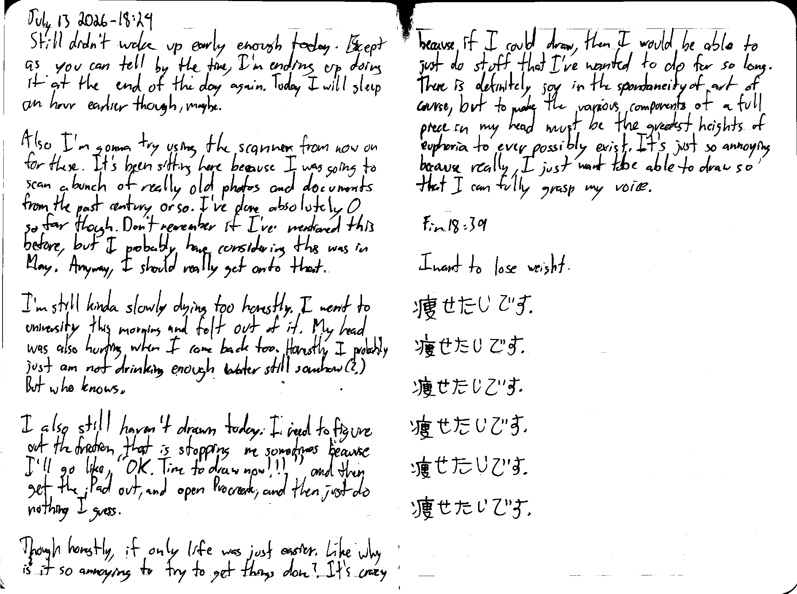

July 13 2026 - 18:24

Still didn't want up early enough today. Except as you can tell by the time, I'm ending up doing it at the end of the again [too]. Today I will sleep an hour earlier though, maybe.

Also I'm gonna try using the scanner from now on for these. It's been sitting here because I was going to scan a bunch of really old photos and documents from the past century or so. I've done absolutely 0 so far though. Don't remember if I've mentioned this before, but I probably have considering this was in May. Anyway, I should really get onto that.

I'm still kinda slowly dying too honestly. I went to university this morning and felt out of it. My head was also hurting when I came back too. Honestly I probably just am not drinking enough water somehow(?) But who knows.

I also still haven't drawn today. I need to figure out the friction that is stopping my sometimes because I'll go like "OK. Time to draw now!!!" and then get the iPad out, and open Procreate, and then just do nothing I guess.

Though honestly, if only life was just easier. Like why is it so annoying to try to get things done? It's crazy because if I could draw, then I would be able to just do stuff that I've wanted to do for so long. There is definitely joy in the spontaneity of art of course, but to make the various components of a full piece in my head must be the greatest heights of euphoria to ever possibly exist. It's just so annoying because really, I just want to be able to draw so that I can fully grasp my voice.

Fin 18:39

---

I want to lose weight.

瘦せたです。