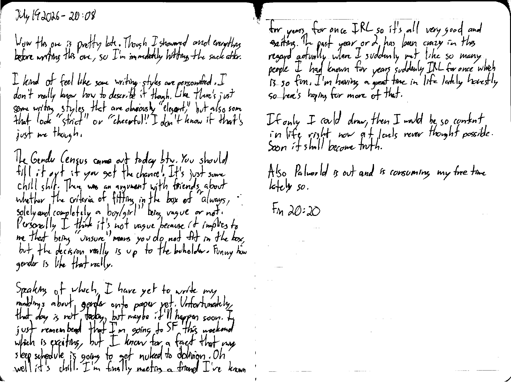

July 14 2026 - 20:08

Wow this one is pretty late. Though I showered and everything before writing this one, so I'm immediately hitting the sack after.

I kind of feel like some writing styles are personified. I don't really know how to describe it though. Like there's just some writing styles that are obviously "elegant," but also some that look "strict" or "cheerful." I don't know if that's just me though.

The [Gender Census](https://survey.gendercensus.com/) came out today btw. You should fill it out if you get the chance! It's just some chill shit. There was an argument with friends about whether the criteria of fitting in the box of "always, solely and completely a boy/girl" being [is] vague or not. Personally I think it's not vague because it implies to me that being "unsure" means you do not fit in the box, but the decision really is up to the beholder. Funny how gender is like that really.

Speaking of which, I have yet to write my ramblings about gender onto paper yet. Unfortunately, that day is not today, but maybe it'll happen soon. I just remembered that I'm going to SF this weekend which is exciting, but I know for a fact that my sleep schedule is going to get nuked to oblivion. Oh well it's chill. I'm finally meeting a friend I've known for years for once IRL so it's all very good and exciting. The past year or 2 has been crazy in this regard actually where I suddenly met like so many people I had known for years suddenly IRL for once which is so fun. I'm having a great time in life lately honestly so here's hoping for more of that.

If only I could draw, then I would be so content in life right now at levels never thought possible. Soon it shall become truth.

Also Palworld is out and is consuming my free time lately so.

Fin 20:20