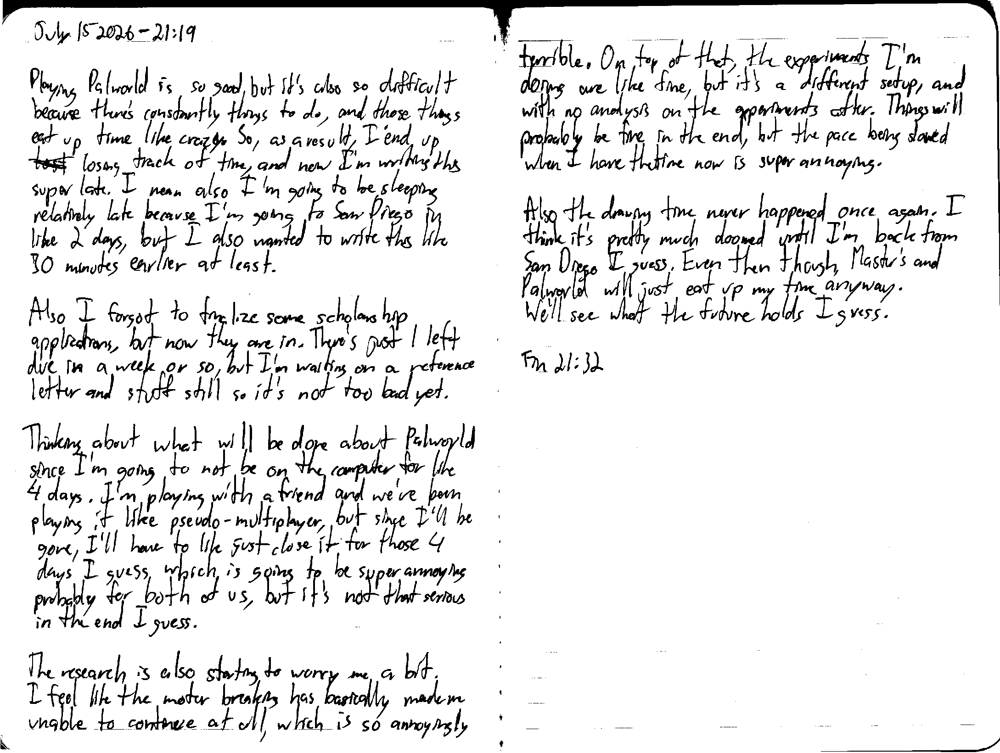

July 15 2026 - 21:19

Playing Palworld is so good, but it's also so difficult because there's constantly things to do, and these things eat up time like crazy. So, as a result, I end up ~~lost~~ losing track of time, and now I'm writing this super late. I mean also I'm going to be sleeping relatively late because I'm going to San Diego in like 2 days, but I also wanted to write this like 30 minutes earlier at least.

Also I forgot to finalize some scholarship applications, but now they are in. There's just 1 left due in a week or so, but I'm waiting on a reference letter and stuff still so it's not too bad yet.

Thinking about what will be done about Palworld since I'm going to not be on the computer for like 4 days. I'm playing with a friend and we've been playing it like pseudo-[singleplayer], but since I'll be gone, I'll have to like just close it for those 4 days I guess which is going to be super annoying probably for both of us, but it's not that serious in the end I guess.

The research is also starting to worry me a bit. I feel like the motor breaking has basically made me unable to continue at all, which is so annoyingly terrible. On top of that, the experiments I'm going are like fine, but it's a different setup, and with no analysis on the experiments after. Things will probably be fine in the end, but the pace being slowed when I have the time now is super annoying.

also the drawing time never happened once again. I think it's pretty much doomed until I'm back from San Diego I guess. Even though Master's and Palworld will just eat up my time anyway. We'll see what the future holds I guess.

Fin 21:32