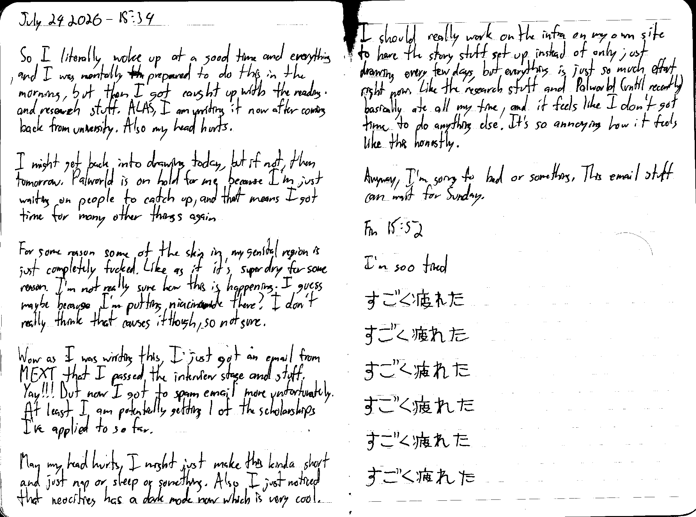

July 24 2026 - 15:34

So I literally woke up at a good time and everything and I was mentally ~~th~~ prepared to do this in the morning, but then I got caught up with the reading and research stuff. ALAS, I am writing it now after coming back from university. Also my head hurts.

I might get back into drawing today, but if not, then tomorrow. Palworld is on hold for me because I'm just waiting on people to catch up, and that means I got time for many other things again.

For some reason some of the skin in my genital region is just completely fucked. Like as if it's super dry for some reason. I'm not really sure how this is happening. I guess maybe because I'm putting niacinamide there? I don't really think that causes it though, so not sure.

Wow as I was writing this, I just got an email from MEXT that I passed the interview stage and stuff. Yay!!! But now I got to spam email more unfortunately. At least I am potentially getting 1 of the scholarships I've applied to so far.

Man my head hurts, I might just make this kinda short and just nap or sleep or something. Also I just noticed that [neocities](https://neocities.org/) has a dark mode now which is very cool. I should really work on the infra on my own site to have the story stuff set up instead of only just drawing every few days, but everything is just so much effort right now. Like the research stuff and Palworld (until recently) basically ate all my time, and it feels like I don't got time to do anything else. It's so annoying how it feels like this honestly.

Anyway, I'm going to bed or something. This email stuff can wait for Sunday.

Fin 15:52

---

I'm soo tired

すごく疲れた