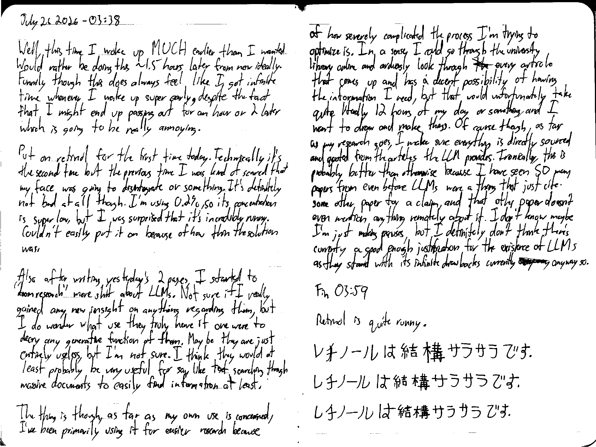

July 26 2026 - 03:38

Well, this time I woke up MUCH earlier than I wanted. Would rather be doing this ~1.5 hours later from now ideally. Funnily though this does always feel like I got infinite time whenever I wake up super early, despite the fact that I might end up passing out for an hour or 2 later which is going to be really annoying.

Put on retinol for the first time today. Technically it's the second time but the previous time I was kind of scared that my face was going to disintegrate or something. It's definitely not bad at all though. I'm using 0.2% so its concentration is super low, but I was surprised that it's incredibly runny. Couldn't easily put it on because of how thin the solution was.

Also after writing yesterday's 2 pages, I started to "doomresearch" more shit about LLMs. Not sure if I really gained any new insight on anything regarding this, but I do wonder what use they truly have if one were to decry any generative function of them. Maybe they are just entirely useless, but I'm not sure. I think they would at least probably be very useful  for say like text searching though massive documents to easily find information at least.

The thing is though, as far as my own use is concerned, I've been primarily using it for easier research because of how severely complicated the process I'm trying to optimize is. In a sense, I could go through the university library online and arduously look through ~~the~~ every article that comes up and has a decent possibility of having the information I need, but that would unfortunately take quite literally 12 hours of my day or something, and I want to draw and make things. Of course though, as far as my research goes, I make sure everything is directly sourced and quoted from the articles the LLM provides. Ironically, this is probably better than otherwise because I have seen SO many papers from even before LLMs were a thing that just cite some other paper for a claim, and that other paper doesn't even mention anything remotely about it. I don't know maybe I'm just making excuses, but I definitely don't think there's currently a good enough justification for the existence of LLMs as they stand with its infinite drawbacks currently ~~soanway~~ anyway so.

Fin 03:59

---

Retinol is quite runny.

レチノールは結構サラサラです。