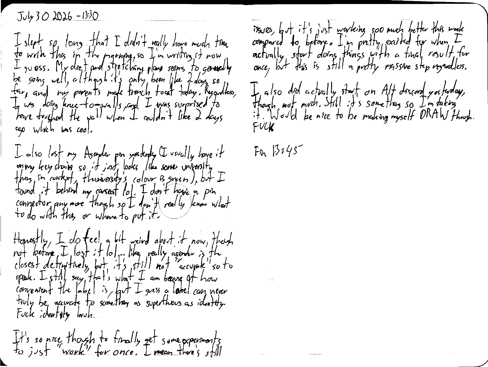

July 30 2026 - 13:30

I slept so long that I didn't really have much time to write this in the morning, so I'm writing it now I guess. My diet and stretching plan seems to generally be going well, although it's only been like 2 days so far, and my parents made french toast today. Regardless, I was doing knee-to-walls, and I was surprised to have touched the wall when I couldn't like 2 days ago which was cool.

I also lost my Agender pin yesterdat (I usually have it on my keychain so it just looks like some university thing in context, the university's colour is green), but I found it behind my car seat lol. I don't have a pin connector anymore though so I don't really know what to do with this or where to put it.

Honestly, I do feel a bit weird about it now, though not before I lost it lol... like really agender is teh closest definitively, but it's still not "accurate" so to speak. I still say that's what I am because of how convenient the label is, but I guess a label can never truly be accurate to something as superfluous as identity. Fuck identity bruh.

It's so nice though to finally get some experiments to just "work" for once. I mean there's still issues, but it's just working soo much better this week compared to before. I'm pretty excited for when I actually start doing things with a final result for once, but this is still a pretty massive step regardless.

I also did actually start on Alt discord yesterday, though not much. Still it's something so I'm taking it. Would be nice to be making myself DRAW though. FUCK

Fin 13:45