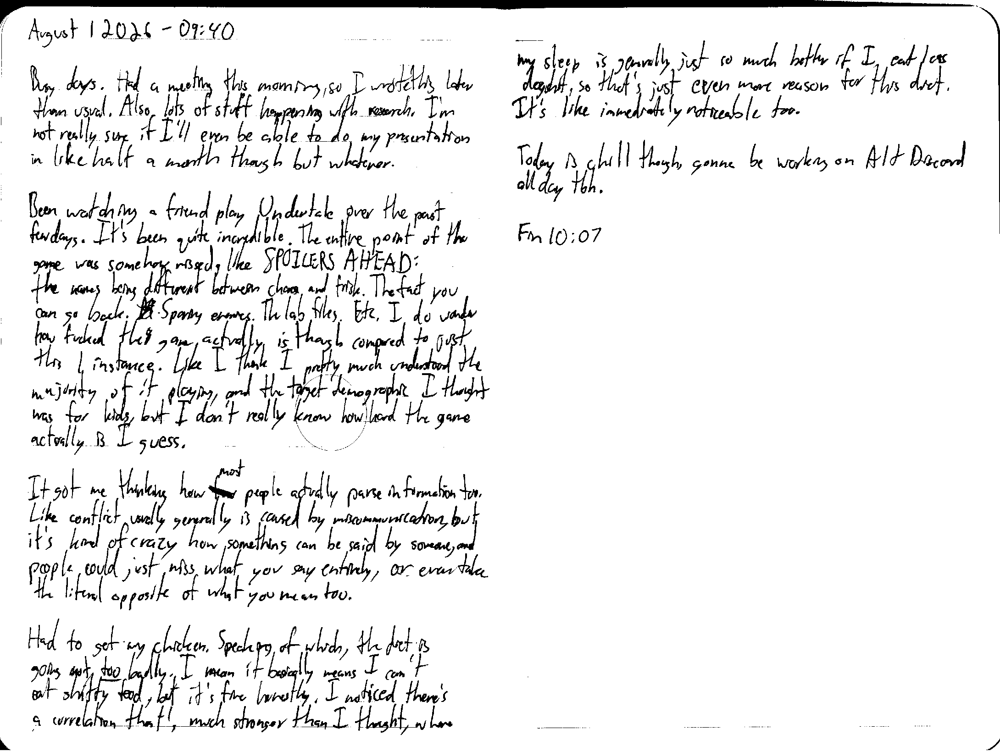

August 1 2026 - 09:40

Busy days. Had a meeting this morning, so I wrote this later than usual. Also, lots of stuff happening with research. I'm not really sure if I'll even be able to do my presentation in like half a month though but whatever.

Been watching a friend play Undertale over the past few days. It's been quite incredible. The entire point of the game was somehow missed, like SPOILERS AHEAD: the names being different between chara and frisk. The fact you can go back. Sparing enemies. The lab files. Etc. I do wonder how fucked this game actually is though compared to just this 1 instance. Like I think I pretty much understood the majority of it playing, and the target demographic I thought was for kids, but I don't really know how hard the game actually is I guess.

It got me thinking how ~~few~~ most people actually parse information too. Like conflict usually generally is caused by miscommunicating, but it's kind of crazy how something can be said by someone, and people could just miss what you say entirely, or even take the literal opposite if what you mean too.

Had to get my chicken. Speaking of which, the diet is going not *too* badly. I mean it basically means I can't eat shitty food, but it's fine honestly. I noticed there's a correlation that's much stronger than I thought, where my sleep is generally just so much better if I eat less dogshit, so that's just even more reason for this diet. It's like immediately noticeable too.

Today is chill though, gonna be working on Alt Discord all day tbh.

Fin 10:07