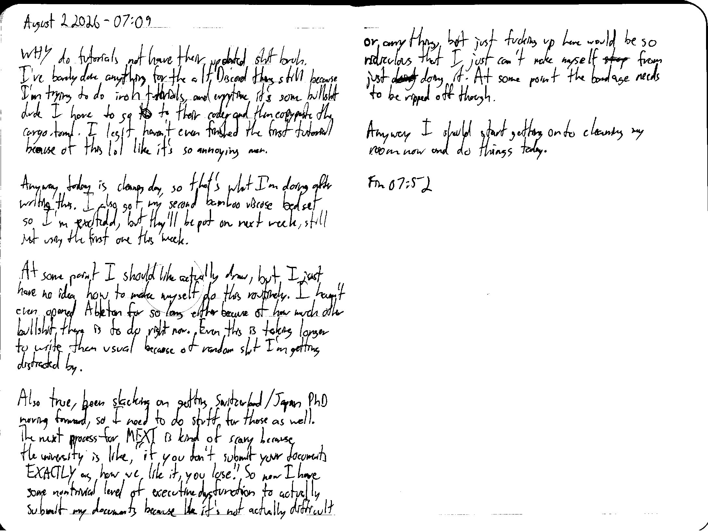

August 2 2026 - 07:09

WHY do tutorials not have their updated shit bruh. I've barely done anything for the alt Discord thing still because I'm trying to do iroh tutorials, and everytime it's some bullshit dude I have to go ~~the~~ to their code, and then copypaste the cargo.toml. I legit haven't even finished the first tutorial because of this lol like it's so annoying man.

Anyway today is cleaning day, so that's what I'm doing after writing this. I also got my second bamboo viscose bedset so I'm excited, but they'll be put on next week, still just using the first one this week.

At some point I should like actually draw, but I just have no idea how to make myself do this routinely. I haven't even opened Ableton for so long either because of how much other bullshit there is to do right now. Even this is taking longer to write than usual because of random shit I'm getting distracted by.

Also true, been slacking on getting Switzerland/Japan PhD moving forward, so I need to do stuff for those as well. The next process for MEXT is kind of scary because the university is like, "if you don't submit your documents EXACTLY as how we like it, you lose." So now I have some nontrivial level of executive dysfunction to actually submit my documents because like it's not actually difficult or anything, but just fucking up here would be so ridiculous that I just can't make myself ~~stop~~ from just ~~doing~~ doing it. At some point the bandage needs to be ripped off though.

Anyway I should start getting onto cleaning my room now and do things today.

Fin 07:52