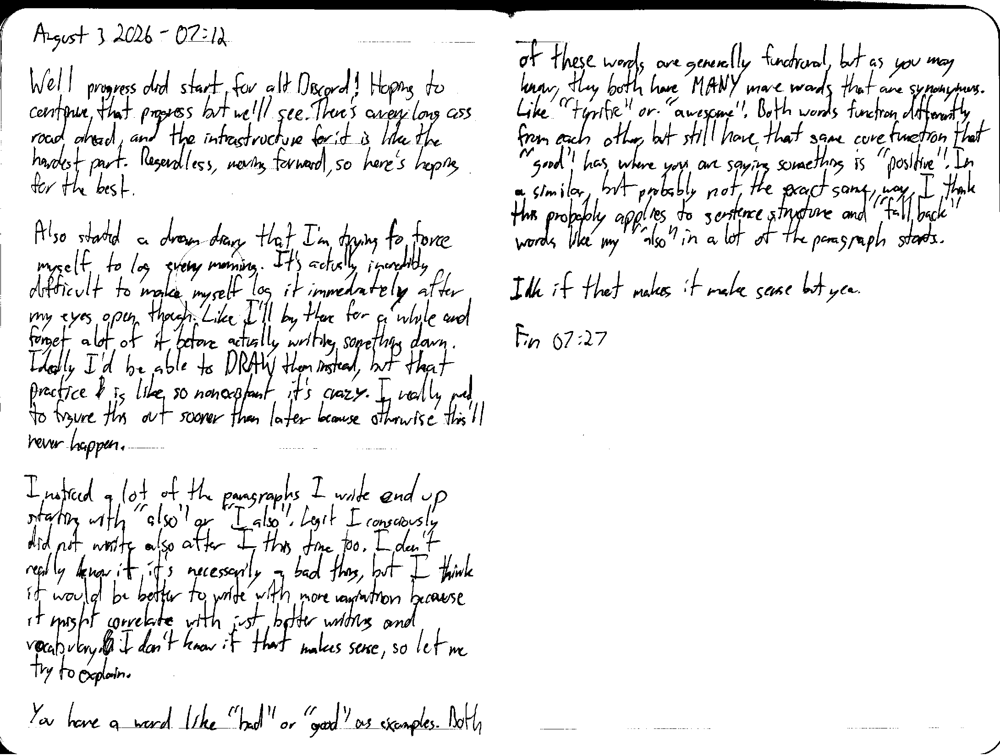

August 3 2026 - 07:12

Well progress did start for alt Discord! Hoping to continue that progress but we'll see. There's a very long ass road ahead, and the infrastructure for it is like the hardest part. Regardless, moving forward, so here's hoping for the best.

Also started a dream diary that I'm trying to force myself to log every morning. It's actually incredible difficult to make myself log it immediately after my eyes open though. Like I'll lay there for a while and forget a lot of it before actually writing something down. Ideally I'd be able to DRAW them instead, but that practice ~~l~~ is like so nonexist[e]nt it's crazy. I really need to figure this out sooner than later because otherwise this'll never happen.

I noticed a lot of the paragraphs I write end up starting with "also" or "I also". Legit I consciously did not write also after I this time too. I don't really know if it's necessarily a bad thing, but I think it would be better to write with more variation because it might correlate with just better writing and vocabulary. I don't know if that makes sense, so let me try to explain.

You have a word like "bad" or "good" as examples. Both of these words are generally functional, but as you may know, they both have MANY more words that are synonymous. Like "terrific" or "awesome". Both words function differently from each other, but still have that same core function that "good" has where you are saying something is "positive". In a similar, but probably not the exact same, way, I think this probably applies to sentence structure and "fallback" words like my "also" in a lot of the paragraph starts.

Idk it that makes it make sense but yea.

Fin 07:27