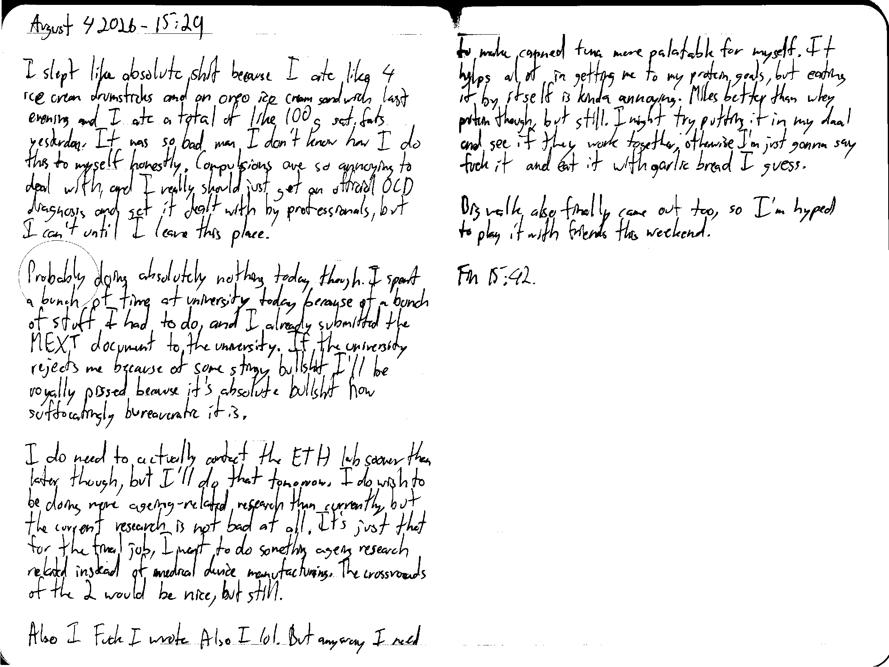

August 4 2026 - 15:29

I slept like absolute shit because I ate like 4 ice cream drumsticks and an oreo ice cream sandwich last evening and I ate a total of like 100 g sat. fats yesterday. It was so bad man I don't know how I do this to myself honestly. Compulsions are so annoying to deal with, and I really should just get an official OCD diagnosis and get it dealt with by professionals, but I can't until I leave this place.

Probably doing absolutely nothing today though. I spent a bunch of time at university today because of a bunch of stuff I had to do, and I already submitted the MEXT document to the university. If the university rejects me because of some stingy bullshit I'll be royally pissed because it's absolute bullshit how suffocatingly bureaucratic it is.

I do need to actually contact the ETH lab sooner than later though, but I'll do that tomorrow. I do wish to be doing more ageing-related research than currently, but the current research is not bad at all. It's just that for the final job, I want to do something ageing research related instead of medical device manufacturing. The crossroads of the 2 would be nice, but still.

Also I Fuck I wrote Also I lol. But anyway I need to make canned tuna more palatable for myself. It helps a lot in getting me to my protein goals, but eating it by itself is kinda annoying. Miles better than whey protein though, but still. I might try putting it in my daal and see if they work together; otherwise, I'm just gonna say fuck it and eat it with garlic bread I guess.

[Big walk](https://store.steampowered.com/app/1478500/Big_Walk/) also finally came out too, so I'm hyped to play it with friends this weekend.

Fin 15:42