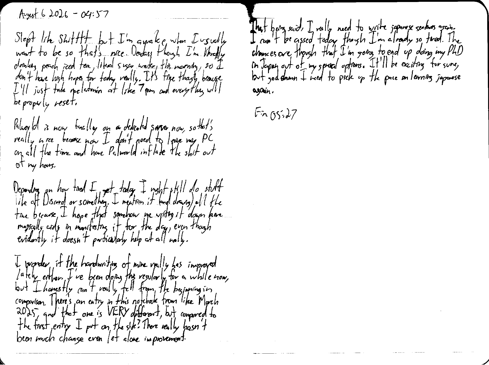

August 6 2026 - 04:57

Slept like Shitttt but I'm awake when I usually want to be so that's nice. Deadass though I'm literally drinking peach iced tea, literal sugar water, this morning, so I don't have high hopes for today really. It's fine though because I'll just take melatonin at like 7 pm and everything will be properly reset.

Palworld is now finally on a dedicated server now, so that's really nice because now I don't need to leave my PC on all the time and have Palworld inflate the shit out of my hours.

Depending on how tired I get today I might still do stuff like alt Discord or something. I mention it (and drawing) all the time because I hope that somehow me writing it down here magically aids in manifesting it for the day, even though evidently it doesn't particularly help at all really.

I wonder if the handwriting of mine really has improved lately either. I've been doing this regularly for a while now, but I honestly can't really tell from the beginning in comparison. There's a entry in this notebook from like March 2025, and that one is VERY different, but compared to the first entry I put on the site? There really hasn't been much change even let along improvement.

That being said, I really need to write japanese sentences again. I can't be assed today though I'm already so tired. The chances are though that I'm going to end up doing my PhD in Japan out of my general options. It'll be exciting for sure, but god damn I need to pick up the pace on learning japanese again.

Fin 05:27