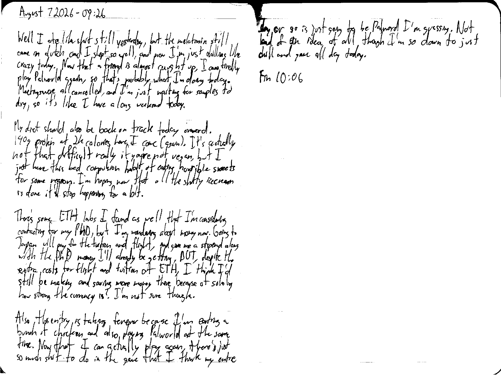

August 6 2026 - 09:26

Well I ate like shit still yesterday, but the melatonin still came in clutch and I slept so well, and now I'm just chilling like crazy today. Now that a friend is almost caught up, I can finally play Palworld again, so that's probably what I'm doing today. Meetings were all cancelled, and I'm just waiting for samples to dry, so it's like I have a long weekend today.

My diet should also be back on track today onward. 140g protein at 2k calories here I come (again). It's actually not that difficult really if you're not vegan, but I just have this bad compulsion habit of eating horrible sweets for some reason. I'm hoping now that all the shitty ice cream is done it'll stop happening for a bit.

There's some [more] ETH labs I found as well that I'm considering contacting for my PhD, but I'm wonder about money now. Going to Japan will pay for the tuition and flight, and give me a stipend along with the PhD money I'll already be getting, BUT, despite the extra costs for flight and tuition at ETH, I think I'd still be making and saving more money there because of solely how strong the curency is? I'm not sure though.

Also, this entry is taking forever because I'm eating a bunch of chicken and also playing Palworld at the same time. Now that I can actually play again, there's just so much shit to do in the game that I think my entire day or so is just going to be Palworld I'm guessing. Not bad of an idea at all though I'm so down to just chill and game all day today.

Fin 10:06