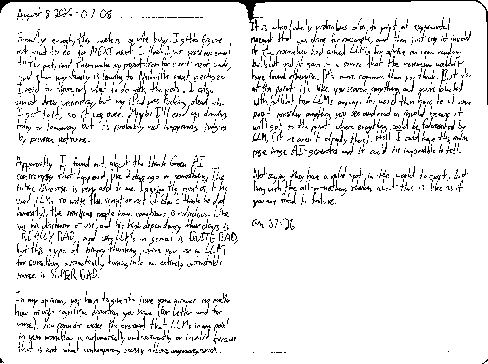

August 8 2026 - 07:08

Funnily enough, this week  is quite busy. I gotta figure out what to do for MEXT next, I think I just send an email to the prof, and then make my presentation for next next week, and then my family is leaving to Nashville next week, so I need to figure out what to do with the pets. I also almost drew yesterday, but my iPad was fucking dead when I got to it, so it was over. Maybe I'll end up drawing today or tomorrow, but it's probably not happening judging by previous patterns.

Apparently I found out about the Hank Green AI controversy that happened like 2 days ago or something. The entire discourse is very odd to me. Ignoring the point of if he used LLMs to write the script or not (I don't think he did honestly), the reactions people have sometimes is ridiculous. Like yes his disclosure of use, and his high dependency these days is REALLY BAD, and using LLMs in general is QUITE BAD, but this type of binary thinking where you use an LLM for something automatically turning into an entirely untrustable source is SUPER BAD.

In my opinion, you have to give the issue some nuance no matter how much cognitive distortion you have (for better and for worse). You cannot make the argument that LLMs in any point in your workflow is automatically untrustworthy or invalid because that is not what contemporary society allows anymore, and it is absolutely ridiculous also to [say] point at experimental resaerch that was done for example, and then just cry it invalid if the researcher had asked LLMs for advice on some random bullshit and it gave it a source that the researcher wouldn't have found otherwise. It's more common than you think. But also at this point it's like you search anything, and you're blasted with bullshit from LLMs anyway. You would then have to at some point consider anything you see and read as invalid because it will get to the point where everything could be fabricated by LLMs (if we aren't already there). Hell I could have this entire page image AI-generated [in the future] and it could be impossible to tell.

Not saying they have a valid spot in the world to exist, but living with the all-or-nothing thinking about this is like as if you are fated to failure.

Fin 07:26