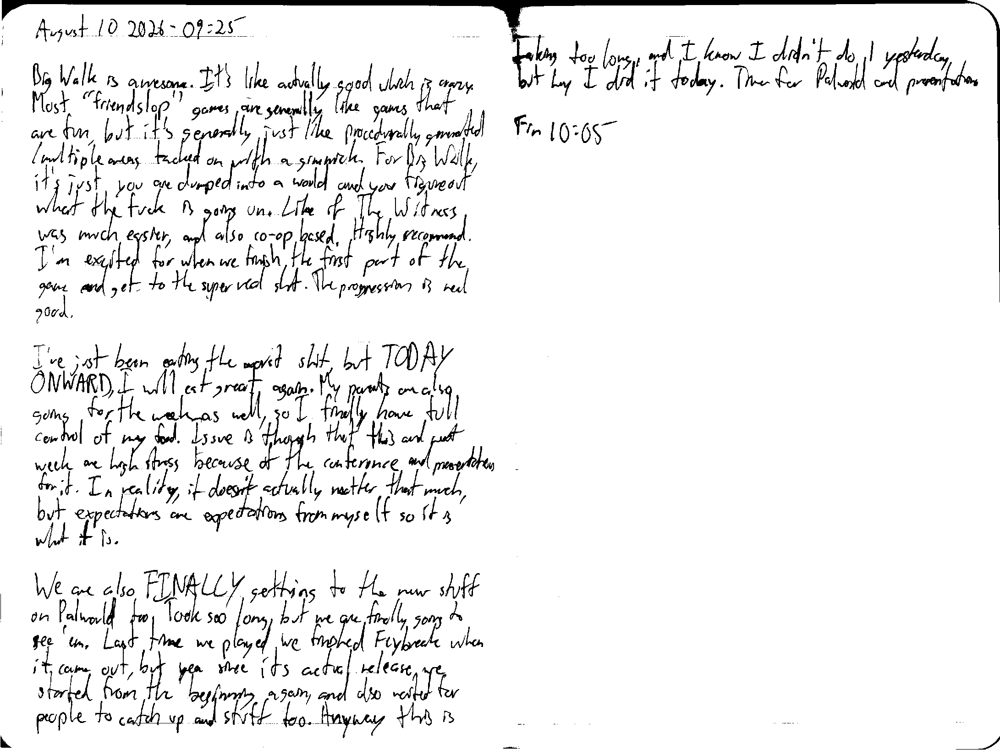

August 10 2026 - 09:25

Big Walk is awesome. It's like actually good which is crazy. Most "friendslop" games are generally like games that are fun, but it's generally just like procedurally generated/multiple areas tacked on with a gimmick. For Big Walk, it's just you are dumped into a world and you figure out what the fuck is going. Like if The Witness was much easier, and also co-op based. Highly recommend. I'm excited for when we finish the first part of the game and get to the super real shit. The progression is real good.

I've just been eating the worst shit, but TODAY ONWARD, I will eat great again. My parents are also going for the week as well, so I finally have full control of my food. Issue is though that this and next week are high stress because of the conference and presentation for it. In reality, it doesn't actually matter that much, but expectations are expectations from myself, so it is what it is.

We are also FINALLY getting to the new stuff on Palworld too. Took soo long, but we are finally going to see 'em. Last time we played we finished Feybreak when it came out, but yea since its actual release, we started from the beginning again, and also waited for people to catch up and stuff too. Anyway this is taking too long, and I know I didn't do 1 yesterday, but hey I did it today. Time for Palworld and presentation.

Fin 10:05