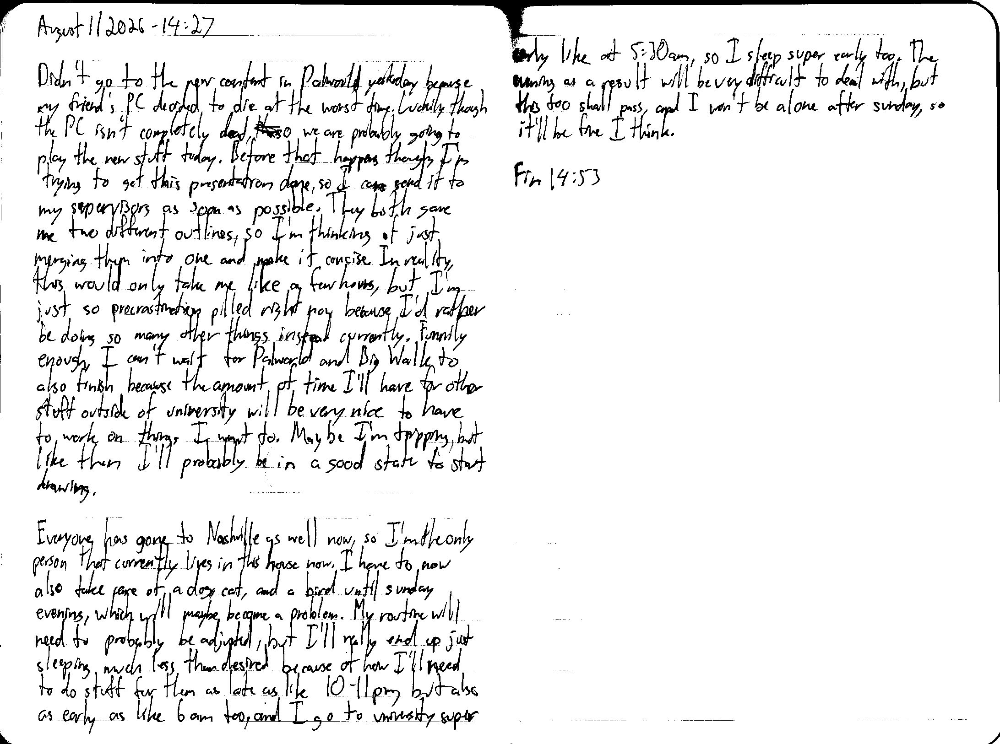

August 11 2026 - 14:27

Didn't go to the new content in Palworld yesterday because my friend's PC decided to die at the worst time. Luckily though the PC isn't completely dead, ~~tho~~ so we are probably going to play the new stuff today. Before that happens though, I'm trying to get this presentation done, so I can send it to my supervisors as soon as possible. They both gave me two different outlines, so I'm thinking of just merging them into one and make it concise. In reality, this would only take me like a few hours, but I'm just so procrastination pilled right now because I'd rather be doing so many other things instead currently. Funnily enough, I can't wait for Palworld and Big Walk to also finish because the amount of time I'll have for other stuff outside of university will be very nice to have to work on things I want to. Maybe I'm tripping, but like then I'll probably be in a good state to start drawing.

Everyone has gone to Nashville as well now, so I'm the only person that currently lives in the house now. I have to now also take care of a dog, cat, and a bird until sunday evening, which will maybe become a problem. My routine will need to probably be adjusted, but I'll really end up just sleeping much less than desired because of how I'll need to do stuff for them as late as like 10-11 pm, but also as early as like 6 am too, and I go to university super early like at 5:30 am, so I sleep super early too. The evening as a result will be very difficult to deal with, but this too shall pass, and I won't be alone after sunday, so it'll be fine I think.

Fin 14:53