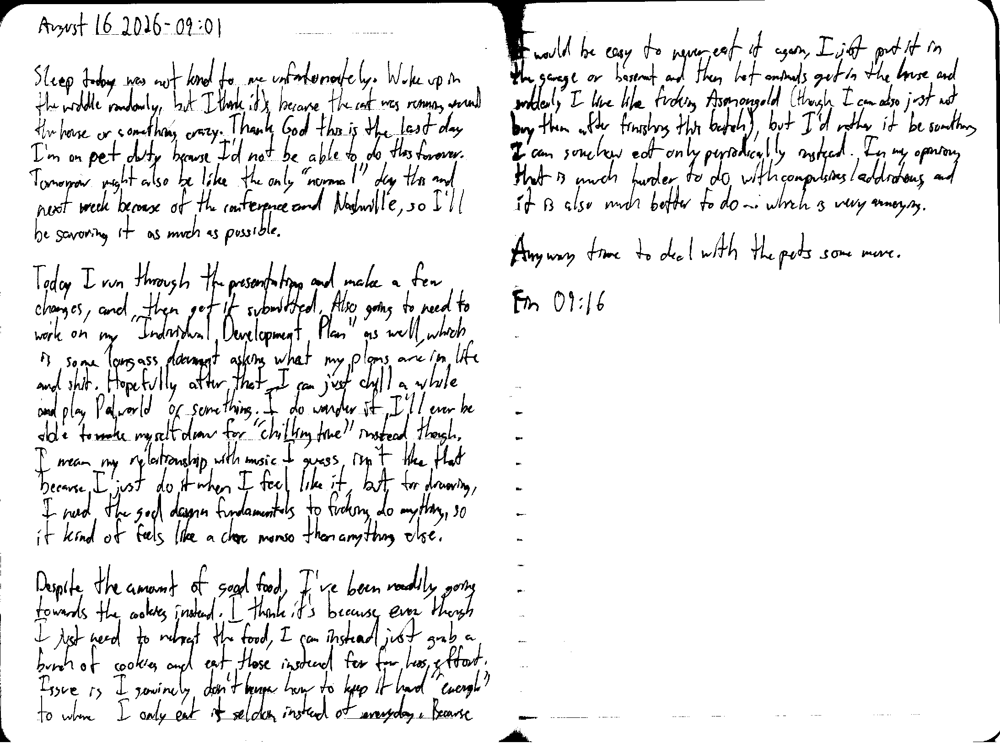

August 16 2026 - 09:01

Sleep today was not kind to me unfortunately. wake up in the middle randomly, but I think it's because the cat was running around the house or something crazy. Thank God this is the last day I'm on pet duty because I'd not be able to do this forever. Tomorrow might also be like the only "normal" day this and next week because of the conference and Nashville, so I'll be savoring it as much as possible.

Today I run through the presentation and make a few changes, and then get it submitted. Also going to need to work on my "Individual Development Plan" as well, which is some long ass document asking what my plans are in life and shit. Hopefully after that I can just chill a while and play Palworld or something. I do wonder if I'll ever be able to make myself draw for "chilling time" instead though. I mean my relationship with music I guess isn't like that because I just do it when I feel like it, but for drawing, I need the god damn fundamentals to fucking do anything, so it kind of feels like a chore moreso than anything else.

Despite the amount of good food, I've been readily going towards the cookies instead. I think it's because even though I just need to reheat the food, I can instead just grab a bunch fo cookies and eat those instead for far less effort. Issue is I genuinely don't know how to keep it hard "enough" to where I only eat it seldom instead of everyday. Because it would be easy to never eat it again, I just put it in the garage or basement and then let animals get in the house and suddenly I live like fucking Asmongold (though I can also just not buy them after finishing this batch), but I'd rather it be something I can somehow eat only periodically instead. In my opinion, that is muhc harder to do with compulsions/addictions, and it is also much better to do... which is very annoying.

Anyway time to deal with the pets some more.

Fin 09:16