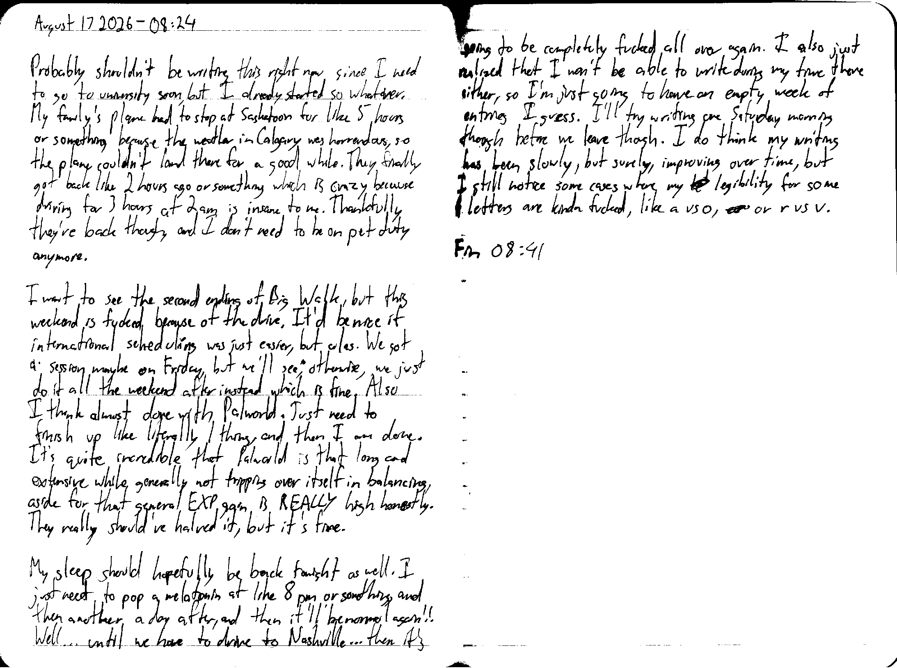

August 17 2026 - 08:24

Probably shouldn't be writing this right now since I need to go to university soon, but I already started so whatever. My family's plane had to stop at Saskatoon for like 5 hours or something because the weather in Calgary was horrendous, so the plane couldn't land there for a good while. They finally got back like 2 hours ago or something which is crazy because driving for 3 hours at 2 am is insane to me. Thankfully they're back though, and I don't need to be on pet duty anymore.

I want to see the second ending of Big Walk, but this weekend is fucked because of the drive. It'd be nice if international scheduling was just easier, but alas. We got a session maybe on Friday, but we'll see; otherwise, we just do it all the weekend after instead which is fine. Also I think [I'm] almost done with Palworld. Just need to finish up like literally 1 thing, and then I am done. It's quite incredible that Palworld is that long and extensive, while generally not tripping over itself in balancing, aside for that general EXP gain is REALLY high honestly. They really should've halved it, but it's fine.

My sleep should hopefully be back tonight as well. I just need to pop a melatonin at like 8 pm or something, and then another a day after, and then it'll be normal again!! Well... until we have to drive to Nashville... then it's going to be completely fucked all over again. I also just realized that I won't be able to write during my time there either, so I'm just going to have an empty week of entries I guess. I'll try writing one Saturday morning though because we leave though. I do think my writing has been slowly, but surely, improving over time, but I still notice some cases where my ~~let~~ legibility for some letters are kinda fucked, like a vs o, ~~or~~ or r vs v.

Fin 08:41