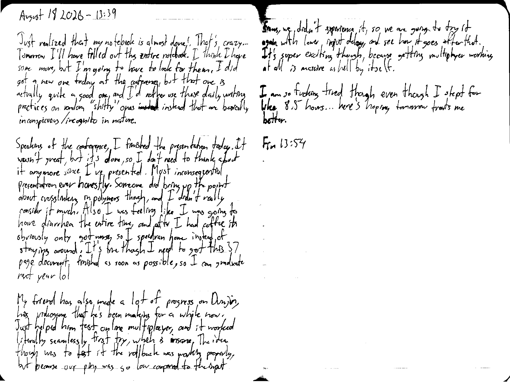

August 18 2026 - 13:39

Just realized that my notebook is almost done! That's crazy... Tomorrow I'll have filled out this entire notebook. I think I have some more, but I'm going to have to look for them. I did get a new one today at the conference, but that one is actually quite a good one, and I'd rather use these daily writing practices on random "shitty" ones ~~insted~~ instead that are basically inconspicuous/incognito in nature.

Speaking of the conference, I finished the presentation today. It wasn't great, but it's done, so I don't need to think about it anymore since I've presented. Most inconsequential presentation ever honestly. Someone did bring up the point about crosslinking in polymers though, and I didn't really consider it much. Also I was feeling like I was going to have diarrhea the entire time, and after I had coffee it obviously only got worse, so I speedran home instead of staying around. It's fine though I need to get this 37 page document finished as soon as possible, so I can graduate next year lol

My friend has also made a lot of progress on [Dunjin](https://immolation.works/dunjin/), his videogame that he's been making for a while now. Just helped him test online multiplayer, and it worked literally seamlessly first try, which is insane. The idea though was to test if the rollback was working properly, but because our ping was so low compared to the input frames, we didn't experience it, so we are going to try it again with lower input delay, and see how it goes after that. It's super exciting though, because getting multiplayer working at all is massive as hell by itself.

I am so fucking tired though even though I slept for like 8.5 hours... here's hoping tomorrow treats me better.

Fin 13:54