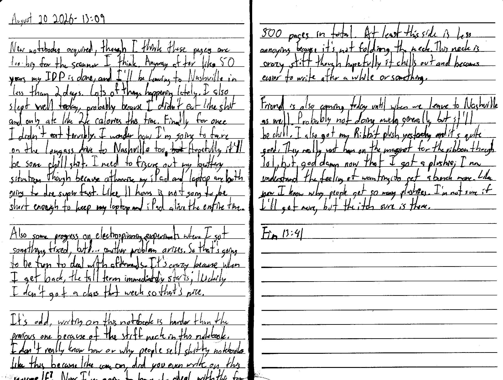

August 20 2026 - 13:09

New notebooks acquired, though I think these pages are too big for the scanner I think. Anyway after like 50 years my IDP is done, and I'll be leaving to Nashville in less than 2 days. Lots of things happening lately. I also slept well today, probably because I didn't eat like shit and only ate like 2k calories this time. finally for once I didn't eat terribly. I wonder how I'm going to fare on the longass drive to Nashville too. ~~but~~ Hopefully it'll be some chill shit. I need to figure out my battery situation though because otherwise my iPad and laptop are both going to die super fast. Like 11 hours is not going to be short enough to keep my laptop and [or] iPad alive the entire time.

Also some progress on electrospinning experiments where I got something fixed, but ~~l~~... another problem arises. So that's going to be fun to deal with afterwards. It's crazy because when I get back, the fall term immediately starts; luckily I don't got a class that week so that's nice.

It's odd, writing on this notebook is harder than the previous one because of the stiff neck in this notebook. I don't really know how or why people sell shitty notebooks like this because like come on, did you even write on this yourself? Now I'm going to have to deal with this for 500 pages in total. At least this side is less annoying because it's not folding the neck. This neck is crazy stiff though hopefully it chills out and becomes easier to write after a while or something.

Friend is also coming today until when we leave to Nashville as well. Probably not doing much generally but it'll be chill. I also got my Ribbit plush yesterday and it's quite good. They really went ham on the magnet for the ribbon though lol, but god damn now that I got a plushie, I now understand the feeling of wanting to get a bunch more. Like now I know why people get so many plushies. I'm not sure if I'll get more, but the itch sure is there.

Fin 13:41