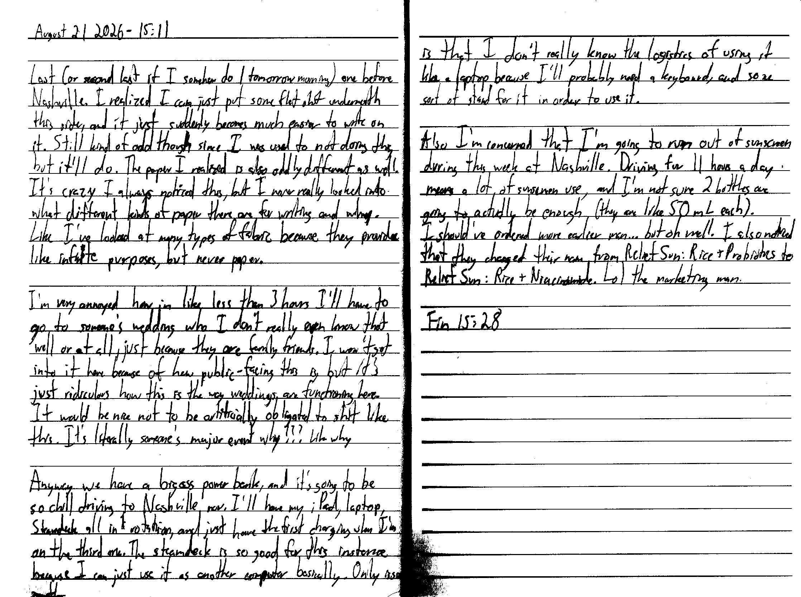

August 21 2026 - 15:11

Last (or second last if I somehow do 1 tomorrow morning) one before Nashville. I realized I can just put some flat shit underneath this side, and it just suddenly becomes much easier to write on it. Still kind of odd though since I was used to not doing this, but it'll do. The paper I realized is also oddly different as well. It's crazy I always noticed this, but I never really looked into what different kinds of paper there are for writing and why. Like I've looked at many types of fabric because they provide like infinite purposes, but never paper.

I'm very annoyed how in like less than 3 hours I'll have to go to someone's wedding who I don't really even know that well or at all, just because they are family friends. I won't get into it here because of how public-facing this is, but it's just ridiculous how this is teh way weddings are functioning here. It would be nice not to be artificially obligated to shit like this. It's litearly someone's major event why??? Like why

Anyway we have a bigass power bank, and it's going to be so chill driving to Nashville now. I'll have my iPad, laptop, Steamdeck all in rotation and just have the first charging when I'm on the third one. The steamdeck is so good for this instance because I can just use it as another computer basically. Only issue is that I don't really know the logistics of using it like a laptop because I'll probably need a keyboard, and some sort of stand for it in order to use it.

Also I'm concerned that I'm going to run out of sunscreen during the week at Nashville. Driving for 11 hours a day means a lot of sunscreen use, and I'm not sure 2 bottles are going to actually be enough (they are like 50 mL each). I should've ordered earlier man... but oh well. I also noticed that they changed their name from Relief Sun: Rice + Probiotics to [Relief Sun: Rice + Niacinamide](https://beautyofjoseon.com/products/relief-sun-rice-probiotics). Lol the marketing man.

Fin 15:28