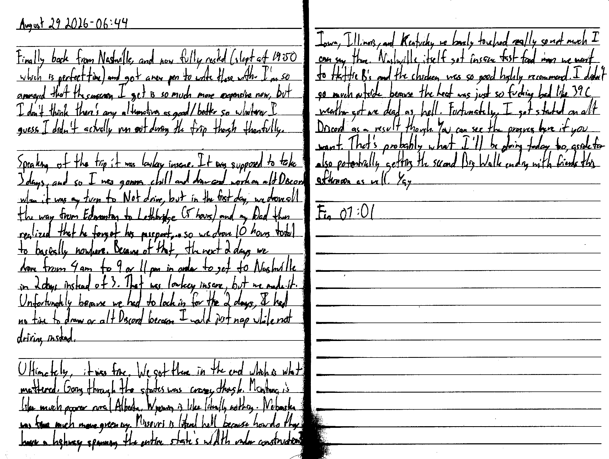

August 29 2026 - 06:44

Finally back from Nashville, and now fully rested (slept at 19:50 which is a perfect time) and got a new pen to write these with. I'm so annoyed that the sunscreen I get is so much more expensive now, but I don't think there's any alternatives as good/better so whatever I guess. I didn't actually run out during the trip though thankfully.

Speaking of the trip it was lowkey insane. It was supposed to take 3 days, and so I was gonna chill and draw and work on alt Discord when it was my turn to Not drive, but in the first day, we drove all the way from Edmonton to Lethbridge (5 hours) and my Dad then realized that he forgot his passport... so we drove 10 hours total to basically nowhere. Because of that, the next 2 days we drove from 4 am to 9 or [even] 11 pm in order to get to Nashville in 3 days instead of 3. That was lowkey insane, but we made it. Unfortunately because we had to lock in for the 2 days, I had no time to draw or alt Discord because I would just nap while not driving instead.

Ultimately, it was fine. We got there in the end which is what mattered. Going through the states was crazy though. Montana like much poorer rural Alberta. Wyoming is like literally nothing. Nebraska was fine much more greenery. Missouri is literal hell because how do they have a highway spanning the entire state's width under construction? Iowa, Illinois, Kentucky we barely touched really so not much I can say there. Nashville itself got insane fast food man we went to Hattie B's and the chicken was so good highly recommend. I didn't go much outside because the heat was just so fucking bad like 39C weather got me dead as hell. Fortunately, I got started on alt Discord as a result though. You can see the progress [here](https://github.com/Latex4000/meshmesh/commits/base-protocol/) if you want. That's probably what I'll be doing today too aside for potentially getting the second Big Walk ending with friends this afternoon as well. Yay

Fin 07:01