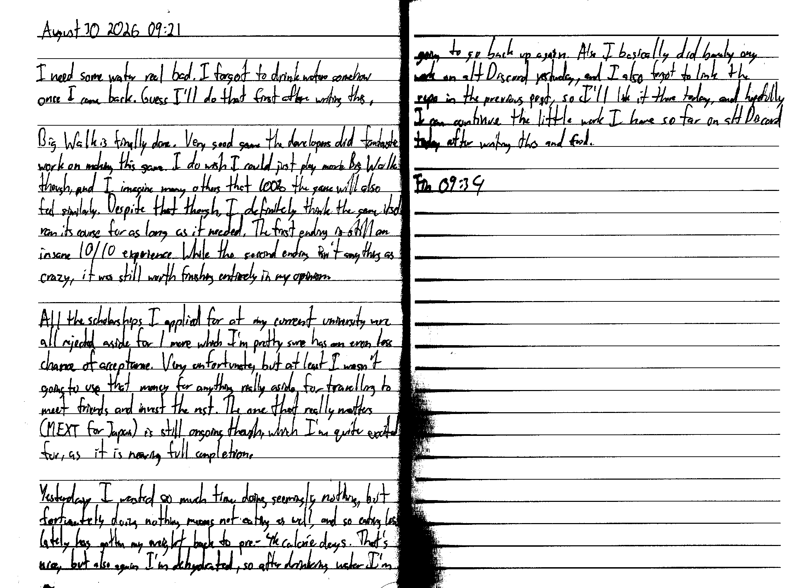

August 30 2026 - 09:21

I need some water real bad. I forgot to drink water somehow once I came back. Guess I'll do that first after writing this.

Big Walk is finally done. Very good game the developers did fantastic work on making this game. I do wish I could just play more Big Walk though, and I imagine many others that 100% the game will also feel similarly. Despite that though, I definitely think the game itself ran its course for as long as it needed. The first ending is still an insane 10/10 experience. While the second ending isn't anything as crazy, it was still worth finishing entirely in my opinion.

All the scholarships I applied for at my current university were all rejected aside for 1 more which I'm pretty sure has an even less chance of acceptance. Very unfortunate, but at least I wasn't going to use that money for anything really aside for travelling to meet friends and invest the rest. the one that really matters (MEXT for Japan) is still ongoing though, which I'm quite excited for, as it is nearing full completion.

Yesterday I wasted so much time doing seemingly nothing, but fortunately doing nothing means not eating as well, and so eating less lately has gotten my weight back to pre-4k calorie days. That's nice, but also again I'm dehydrated, so after drinking water I'm going to go back up again. Also I basically did barely any work on alt Discord yesterday, and I also forgot to link the repo in the previous post, so I'll link it there today, and hopefully I can continue the little work I have so far on alt Discord today after writing this and food.

Fin 09:34