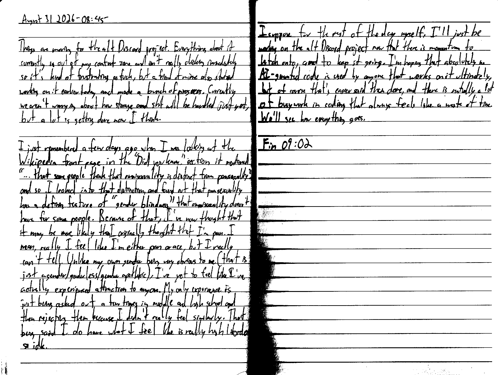

August 31 2026 - 08:45

Things are moving for the alt Discord project. Everything about it currently is out of my comfort zone and isn't really clicking immediately so it's kind of frustrating as fuck, but a friend of mine also started working on it earlier today and made a bunch of progress. Currently we aren't worrying about how storage and shit will be handled just yet, but a lot is getting done now I think.

I just remembered a few days ago when I was looking at the Wikipedia front page. [In] the "Did you know..." section it mentioned "...that some people think that omnisexuality is distinct from pansexuality?" and so I looked into that distinction and found out that pansexuality has a defining feature of "gender blindness" that omnisexuality doesn't have for some people. Because of that, I've now thought that it may be more likely than I originally thought that I'm pan. I mean, really I feel like I'm either pan or ace, but I really can't tell. Unlike my own gender being very obvious to me (that is just agender/genderless/gender apathetic), I've yet to feel like I've actually experienced attraction to anyone. My only experience is just being asked out a few times in middle and high school and then rejecting them because I didn't really feel similarly. That being said, I do have what I feel like is really high libido so idk.

I suppose for the rest of the day myself, I'll just be working on the alt Discord project now that there is momentum to latch onto, and to keep it going. I'm hoping that absolutely no AI-generated code is used by anyone that works on it ultimately, but of course that's easier said than done, and there is naturally a lot of busywork in coding that always feels like a waste of time. We'll see how everything goes.

Fin 09:02