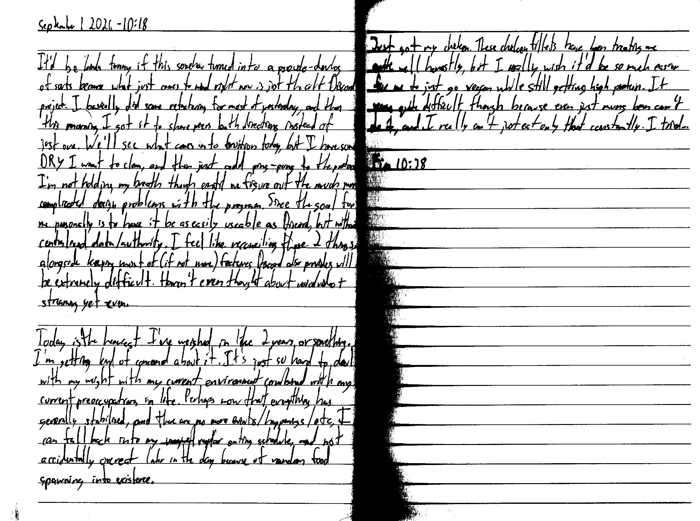

September 1 2026 - 10:18

It'd be kinda funny if this somehow turned into a pseudo-devlop of sorts because what just comes to mind right now is just the alt Discord project. I basically did some refactoring for most of yesterday, and then this morning I got it to share peers both directions instead of just one. We'll see what comes into fruition today, but I have some DRY I want to clean, and then just add ping-pong to the protocol. I'm not holding my breath though until we figure out the much more complicated design problems with the program. Since the goal for me personally is to have it be as easily useable as Discord, but without centralized data/authority, I feel like reconciling these 2 things alongside keeping most of (if not more) features Discord also provides will be extremely difficult. Haven't even thought about voice video + streaming yet even.

Today is the heaviest I've weighed in like 2 years or something. I'm getting kind of concerned about it. It's just so hard to deal with my weight with my current environment combined with my current preoccupations in life. Perhaps now that everything has generally stabilized, and there are no more events/happenings/e.t.c, I can fall back into my ~~regual~~ regular eating schedule, and not accidentally overeat later in the day because of random food spawning into existence.

Just got my chicken. These chicken fillets have been treating me quite well honestly, but I really wish it'd be so much easier for me to just go vegan while still getting high protein. It seems quite difficult though because even just mung bean can't do it, and I really can't just eat only that constantly. I tried...

Fin 10:38