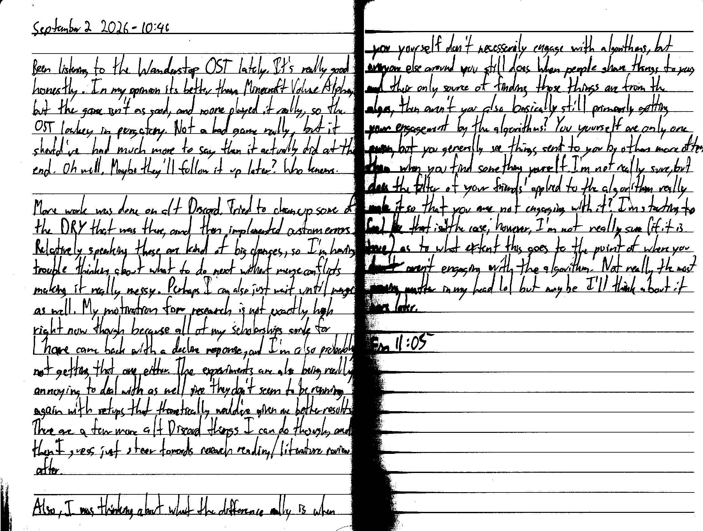

September 2 2026 - 10:46

Been listening to the Wanderstop OST lately. It's really good honestly. In my opinion it's better than Minecraft Volume Alpha, but the game isn't as good, and noone played it really, so the OST lowkey is in purgatory. Not a bad game really, but it should've had much more to say than it actually did at the end. Oh well. Maybe they'll follow it up later? Who knows.

More work was done on alt Discord. Tried to clean up some of the DRY that was there, and then implemented custom errors. Relatively speaking these are kind of big changes, so I'm having trouble thinking about what to do next without merge conflicts making it really messy. Perhaps I can also just wait until merge as well. My motivation for research is not exactly high right now though because all of my scholarships aside for 1 have come back with a decline response, and I'm also probably not getting that [last] one either. The experiments are also being really annoying to deal with as well since they don't seem to be running again with setups that theoretically would've given me better results. There are a few more alt Discord things I can do though, and then I guess just steer towards research reading/literature review after.

Also, I was thinking about what the difference really is when you yourself don't necessarily engage with algorithms, but everyone else around you still does. When people share things to you, and their only source of finding those things are from the algos, then aren't you also basically still primarily getting your engagement by the algorithms? You yourself are only one person, but you generally see things sent to you by others more often than when you find something yourself [, well at least in my case]. I'm not really sure, but does the filter of your friends' applied to the algorithm really make it so that you are not engaging with it? I'm starting to think that isn't the case; however, I'm not really sure (if it is true) as to what extent this goes to the point of where you ~~don't~~ aren't engaging with the algorithm. Not really the most pressing matter in my head lol but maybe I'll think about it more later.

Fin 11:05