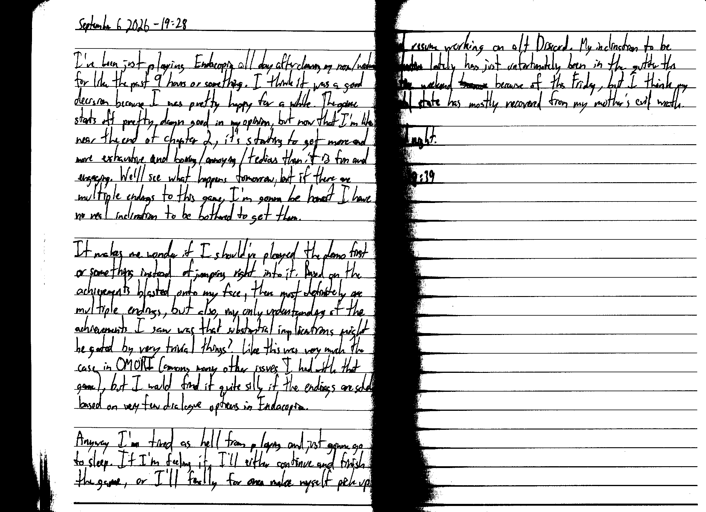

September 6 2026 - 19:28

I've just been playing Endacopia all day after cleaning my room/washroom for like the past 9 hours or something. I think it was a good decision because I was pretty happy for a while. The game starts off pretty damn good in my opinion, but now that I'm like near the end of chapter 2, it's starting to get more and more exhaustive and boring/annoying/tedious than it is fun and engaging. We'll see what happens tomorrow, but if there are multiple endings to this game, I'm gonna be honest I have no real inclination to be bothered to get them.

It makes me wonder if I should've played the demo first or something instead of jumping right into it. Based on the achievements blasted onto my face, there most definitely are multiple endings, but also, my only understanding of the achievements I saw was that the substantial implications might be gated by very trivial things? Like this was very much the case in OMORI (among many other issues I had with that game), but I would find it quite silly if the endings are solely based on very few dialogue options in Endacopia.

Anyway I'm tired as hell from playing and just gonna go to sleep. If I'm feeling it, I'll either continue and finish the game, or I'll finally for once make myself pick up and resume working on alt Discord. My inclination to be productive lately has just unfortunately been in the gutter this entire weekend ~~beeause~~ because of this Friday, but I think my mental state has mostly recovered my mother's evil wrath.

Good night.

Fin 19:39