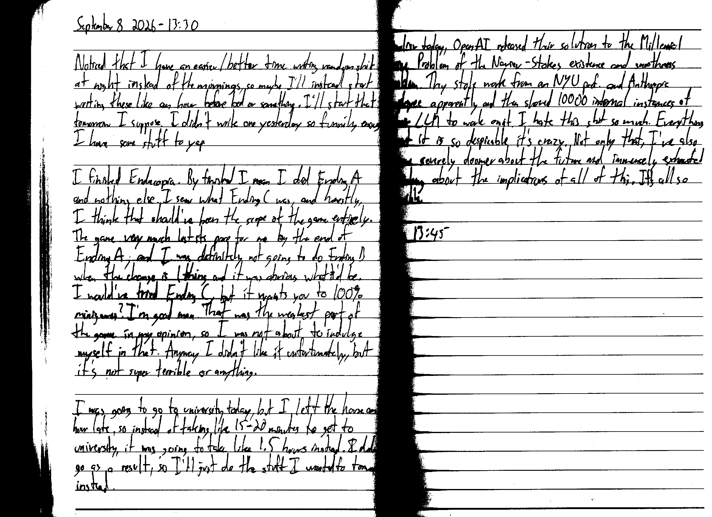

September 8 2026 - 13:30

Noticed that I have an easier/better time writing random shit at night instead of the mornings, so maybe I'll instead start writing these like an hour before bed or something. I'll start that tomorrow I suppose. I didn't write one yesterday so funnily enough I have some stuff to yap.

I finished Endacopia. By finished I mean I did Ending A and nothing else. I saw what Ending C was, and honestly, I think that should've been the scope of the game entirely [if not most of it]. The game very much lost its pace for me by the end of Ending A, and I was definitely not going to do Ending B when the change is 1 thing and it was obvious what it'd be. I would've tried Ending C, but it wants you to 100% minigames? I'm good man. That was the weakest part of the game in my opinion, so I was not about to indulge myself in that. Anyway I didn't like it unfortunately, but it's not super terrible or anything.

I was going to go to university today, but I left the house an hour late, so instead of taking like 15-20 minutes to get to university, it was going to take like 1.5 hours instead. I didn't go as a result, so I'll just do the stuff I wanted to tomorrow instead.

Earlier today, OpenAI released their solution to the Millennial Prize Problem of the Navier-Stokes existence and smoothness problem. They stole work from an NYU prof. and Anthropic employee apparently and then shoved 10000 internal instances of their LLM to work on it. I hate this shit so much. Everything about it is so despicable it's crazy. Not only that, I've also become severely doomer about the future and immensely exhausted thinking about the implications of all of this. It's all so terrible.

Fin 13:45