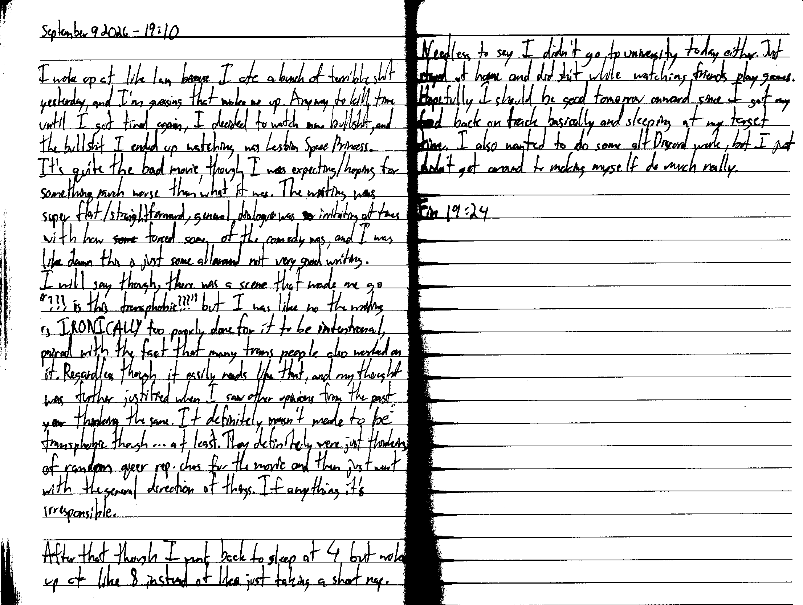

September 9 2026 - 19:10

I woke up at like 1 am because I ate a bunch of terrible shit yesterday, and I'm guessing that woke me up. anyway to kill time until I got tired again, I decided to watch some bullshit, and the bullshit I ended up watching was Lesbian Space Princess. It's quite the bad movie, though I was expecting/hoping for something much worse than what it was. The writing was super flat/straightforward, general dialogue was ~~so~~ irritating at times with how ~~some~~ forced some of the comedy was, and I was like damn this is just some all[-]around not very good writing. I will say though, there was a scene that made me go "???is this transphobic???" but I was like no the writing is IRONICALLY too poorly done for it to be intentional, paired with the fact that many trans people also worked on it. Regardless though it easily reads like that, and my thought was further justified when I [later] say other opinions from the past year thinking the same. It definitely wasn't made to be transphobic though... at least. They definitely were just thinking of random queer rep. chars for the movie and then just went with the general direction of things. If anything it's irresponsible [though].

After that though I went back to sleep at 4 but woke up at like 8 instead of like just taking a short nap. Needless to say I didn't go to university today either. Just stayed at home and did shit while watching friends play games. Hopefully I should be good tomorrow onward since I got my food back on track basically and sleeping at my target time. I also wanted to do some alt Discord work, but I just didn't get around to making myself to much really.

Fin 19:24