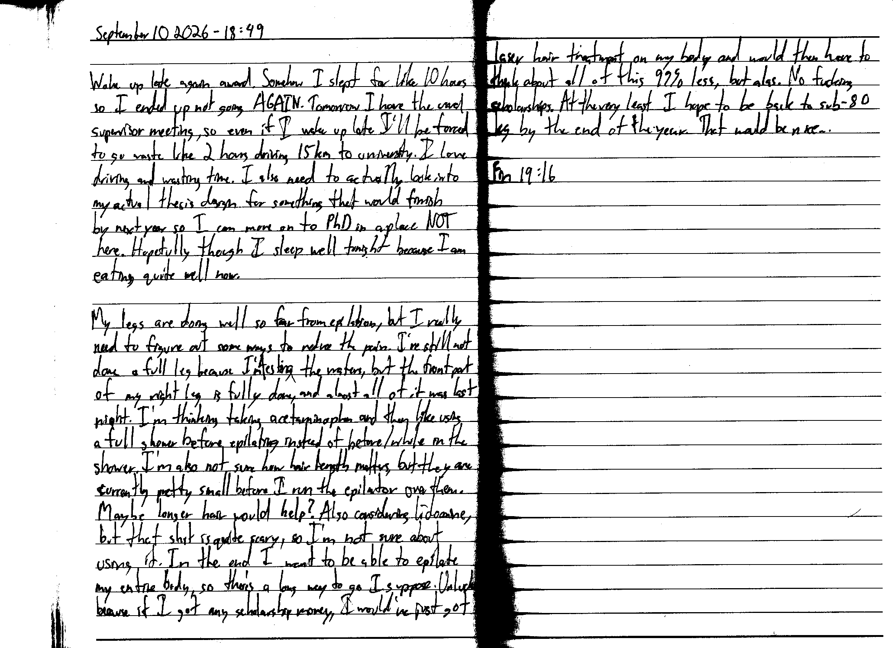

September 10 2026 - 18:49

Woke up late again award. Somehow I slept for like 10 hours so I ended up not going AGAIN. Tomorrow I have the usual supervisor meeting, so even if I wake up late I'll be forced to go waste like 2 hours driving 15 km to university. I love driving and wasting time. I also need to actually look into my actual thesis design for something that would finish by next year so I can move on to PhD in a place NOT here. Hopefully though I sleep well tonight because I am eating quite well now.

My legs are doing well so far from epilation, but I really need to figure out some ways to reduce the pain. I've still not done a full leg because I'm testing the waters, but the front part of my right leg is fully done, and almost all of it was last night. I'm thinking taking acetaminophen and then like using a full shower before epilating instead of before/while in the shower. I'm also not sure how hair length matters, but they are currently pretty small before I run the epilator over them. Maybe longer hair would help? Also considering lidocaine, but that shit is quite scary, so I'm not sure about using it. In the end I want to be able to epilate my entire body, so there's a long way to go I suppose. Unlucky because if I got my scholarship money, I would've just got laser hair treatment on my body and would then have to think about all of this 99% less, but alas. No fuckin scholarships. At the very least I hope to be back to sub-80 kg by the end of the year. That would be nice.

Fin 19:16