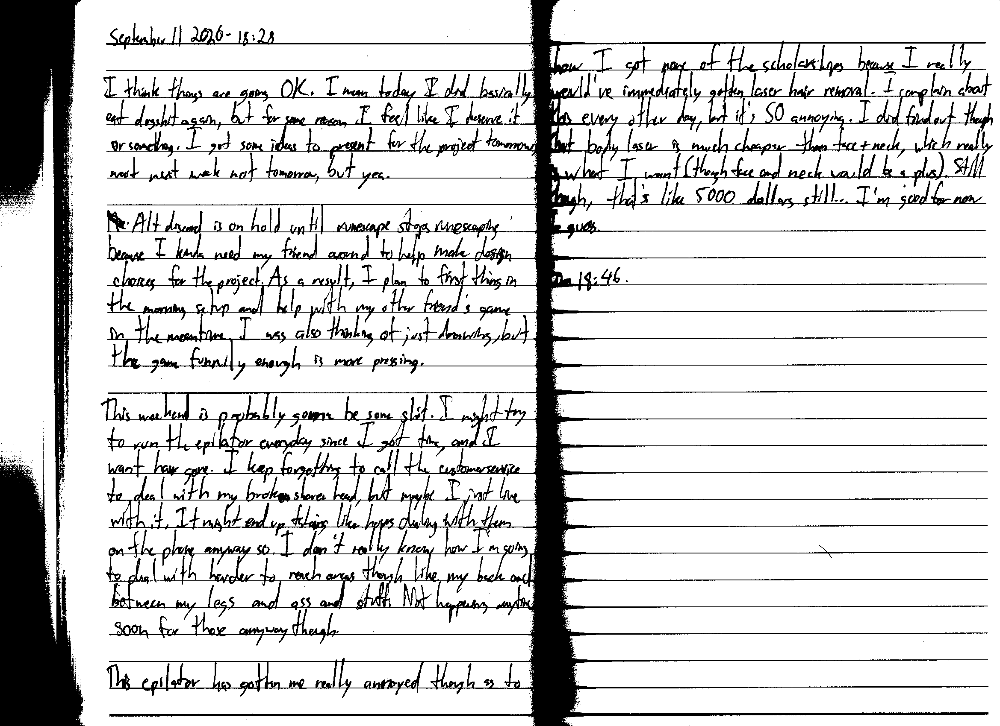

September 11 2026 - 18:28

I think things are going to be OK. I mean today I did basically eat dogshit again, but for some reason I feel like I deserve it or something. I got some ideas to present for the project tomorrow, ??? next week not tomorrow, but yea.

~~Me~~ Alt discord is on hold until runescape stops runescaping because I kinda need my friend around to help make design choices for the project. As a result, I plan to first thing in the morning setup and help with my other friend's game in the meantime. I was also thinking of just drawing, but the game funnily enough is more pressing.

This weekend is probably gonna be some shit. I might try to run the epilator everyday since I got time, and I want hair gone. I keep forgetting to call the customer service to deal with my broken shaver head, but maybe I just live with it. It might end up taking like hours dealing with them on the phone anyway so. I don't really know how I'm going to deal with harder to reach areas though like my back and between my legs and ass and stuff. Not happening anytime soon for those anyway though.

This epilator has gotten me really annoyed though as to how I got none of the scholarships because I really would've immediately gotten laser hair removal. I complain about this every other day, but it's SO annoying. I did find out though that body laser is much cheaper than face + neck, which really is what I want (though face and neck would be a plus). Still though, that's like 5000 dollars still... I'm good for now I guess.

Fin 18:46