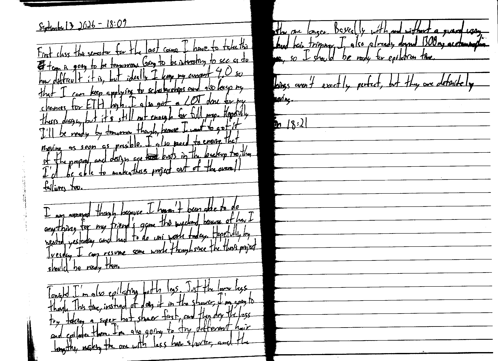

September 13 2026 - 18:09

First class this semester for the last course I have to take this ~~te~~ [program] is going to be tomorrow. Going to be interesting to see as to how difficult it is, but ideally I keep my current 4.0 so that I can keep applying to scholarships and also keep my chances for ETH high. I also got a LOT done for my thesis design, but it's still not enough for full prep. Hopefully I'll be ready by tomorrow though because I want to get it moving as soon as possible. I also need to ensure that if the proposal and design are ~~bot~~ busts in the backup too, then I'd be able to make a thesis project out of the overall failures too.

I am annoyed though because I haven't been able to do anything for my friend's game this weekend because of how I wasted yesterday and had to do uni work today. Hopefully by Tuesday I can resume some work though since the thesis project should be ready then.

Tonight I'm also epilating both legs. Just the lower legs though. This time, instead of doing it in the shower, I'm going to try taking a super hot shower first, and then dry the legs and epilate them. I'm also going to try different hair lengths, making the one with less hair [already] shorter, and the other one longer. Basically with and without a guard using a head hair trimmer. I also already downed 1300 mg acetaminophen again, so I should be ready for epilation time.

Things aren't exactly perfect, but they are definitely moving.

Fin 18:21