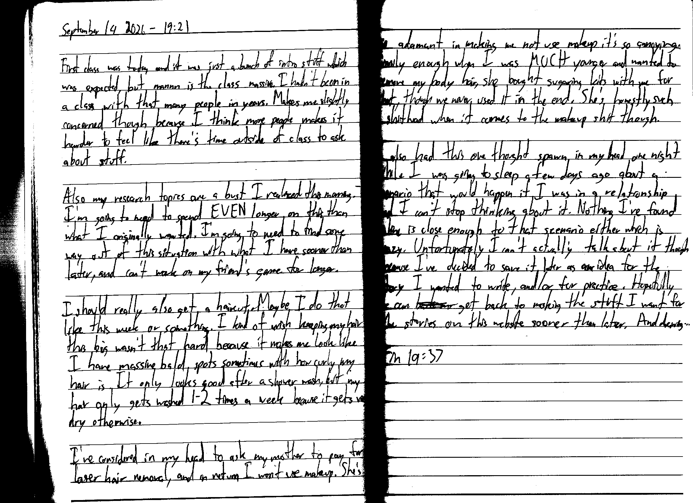

September 14 2026 - 19:21

First class was today and it was just a bunch of intro stuff which was expected, but mannn is this class massive. I hadn't been in a class with that many people in years. Makes me slightly concerned though because I think more people makes it harder to feel like there's time outside of class to ask about stuff.

Also my research topics are a bust I realized this morning. I'm going to need to spend EVEN longer on this than what I originally wanted. I'm going to need to find some way out of this situation with what I have sooner than later, and can't work on my friend's game for longer.

I should really also get a haircut. Maybe do that like this week or something. I kind of wish keeping any hair this big wasn't that hard because it makes me look like I have massive bald spots sometimes with how curly my hair is. It only looks good after a shower wash, but my hair only gets washed 1-2 times a week because it gets very dry otherwise.

I've considered in my head to ask my mother to pay for laser hair removal, and in return I won't use makeup. She's so adamant in making me not use makeup it's so annoying. Funnily enough when I was MUCH younger and wanted to remove my body hair she bought sugaring kits with me for that, though we never used it in the end. She's honestly such a shithead when it comes to the makeup shit though.

I also had this one thought spawn in my head one night while I was going to sleep a few days ago about a scenario that would happen if I was in a relationship and I can't stop thinking about it. Nothing I've found online is close enough to that scenario either which is crazy. Unfortunately I can't actually talk about it though because I've decided to save it later as an idea for the story I wanted to write, and/or for practice. Hopefully I can ~~back m~~ get back to making the stuff I want for the stories on this website sooner than later. And drawing...

Fin 19:37