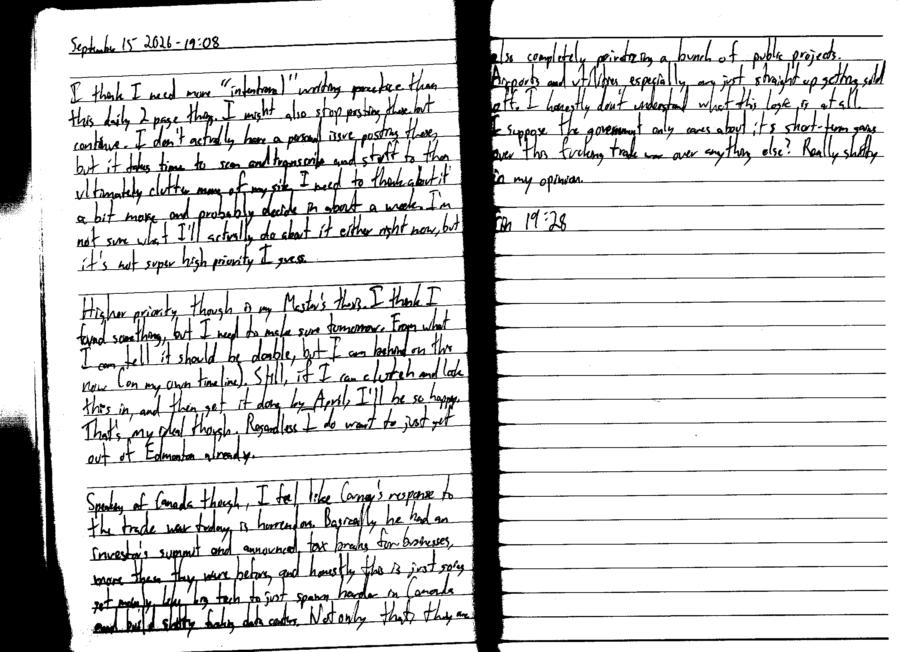

September 15 2026 - 19:08

I think I need more "intentional" writing practice than this daily 2 page thing. I might also stop posting these but continue. I don't actually have a personal issue posting these, but it takes time to scan and transcribe and stuff to then ultimately clutter more of my site [with these]. I need to think about it a bit more and probably decide in about a week. I'm not sure what I'll actually do about it either right now, but it's not super high priority I guess.

Higher priority though is my Master's thesis. I think I found something, but I need to make sure tomorrow. From what I can tell it should be doable, but I am behind on this now (on my own timeline). Still, if I can clutch and lock this in, and then get it done by April, I'll be so happy. That's my ideal though. Regardless I do want to just get out of Edmonton already.

Speaking of Canada though, I feel like Carney's response to the trade war today is horrendous. Basically he had an investor's summit and announced tax breaks for businesses, more than they were before, and honestly this is just going [to] get mainly like big tech to just spam harder in Canada and build shitty fucking data centers. Not only that, they are also completely privatizing a bunch of public projects. Airports and utilities especially are just straight up getting sold off. I honestly don't understand what this logic is at all. I suppose the government only cares about its short-term gains over this fucking trade war over anything else? Really shitty in my opinion.

Fin 19:28