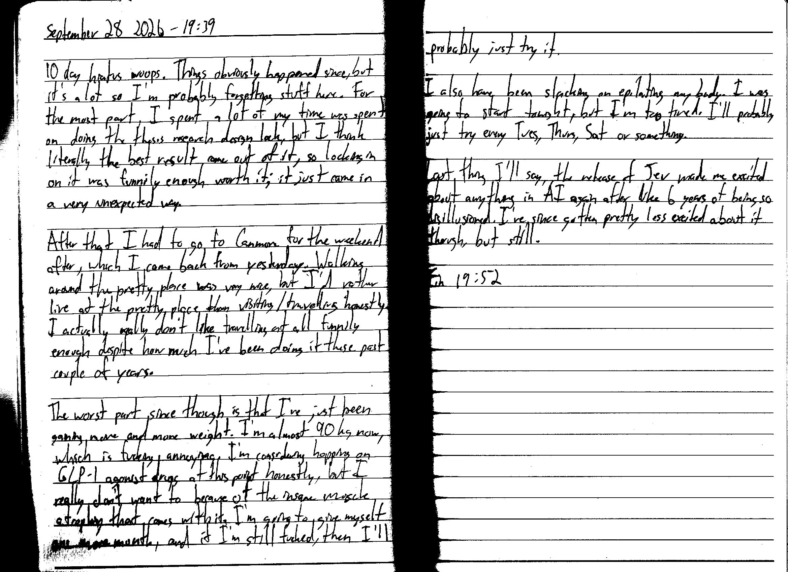

September 28 2026 - 19:39

10 day hiatus woops. Things obviously happened since, but it's a lot so I'm probably forgetting stuff here. For the most part, I spent a lot of my time [~~was spent~~] on doing the thesis research design lock, but I think literally the best result came out of it, so locking in on it was funnily enough worth it; it just came in a very unexpected way.

After that I had to go to Canmore for the weekend after, which I came back from yesterday. Walking around the pretty place was very nice, but I'd rather live at the pretty place than visiting/travelling honestly. I actually really don't like travelling at all funnily enough despite how much I've been doing it these past couple of years.

The worst part since though is that I've just been gaining more and more weight. I'm almost 90 kg now, which is fucking annoying. I'm considering hopping on GLP-1 agonist drugs at this point honestly, but I really don't want to because of the insane muscle atrophy that comes with it. I'm going to give myself one more month, and if I'm still fucked, then I'll probably just try it.

I also have been slacking on epilating my body. I was going to start tonight, but I'm too tired. I'll probably just try every Tues, Thurs, Sat or something.

Last thing I'll say, the release of Jev made me excited about anything in AI again after like 6 years of being so disillusioned. I've since gotten pretty less excited about it though, but still.

Fin 19:52