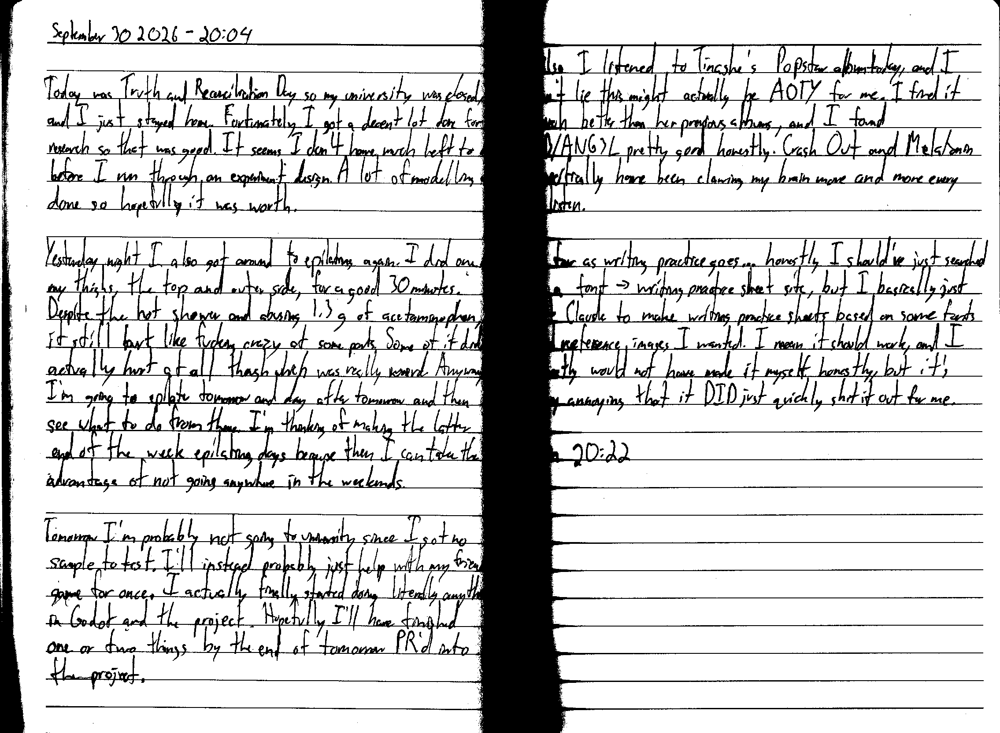

September 30 2026 - 20:04

Today was Truth and Reconciliation Day so my university was closed, and I just stayed home. Fortunately I got a decent lot done for research so that was good. It seems I don't have much left to do before I run through an experiment design. A lot of modelling was done so hopefully it was worth.

Yesterday night I also got around to epilating again. I did one of my thighs, the top and outer side, for a good 30 minutes. Despite the hot shower and abusing 1.3 g of acetaminophen, it still hurt like fucking crazy at some parts. Some of it didn't actually hurt at all though which was really weird. Anyway I'm going to epilate tomorrow and day after tomorrow and then see what to do from there. I'm thinking of making the latter end of the week epilating days because then I can take the advantage of not going anywhere in the weekends.

Tomorrow I'm probably not going to university since I got no sample to test. I'll instead probably just help with my friend's game for once. I actually finally started doing literally anything in Godot and the project. Hopefully I'll have finished one or two things by the end of tomorrow PR'd into the project.

Also I listened to Tinashe's Popstart album today, and I can't lie this might actually be AOTY for me. I find it much better than her previous albums, and I found BB/ANG3L pretty good honestly. Crash Out and Melatonin specifically have been clawing my brain more and more every relisten.

As far as writing practice goes... honestly I should've just searched up a font -> writing practice sheet site, but I basically just got Claude to make writing practice sheets based on some fonts and reference images I wanted. I mean it should work, and I honestly would not have made it myself honestly, but it's very annoying that it DID just quickly shit it out for me.

Fin 20:22