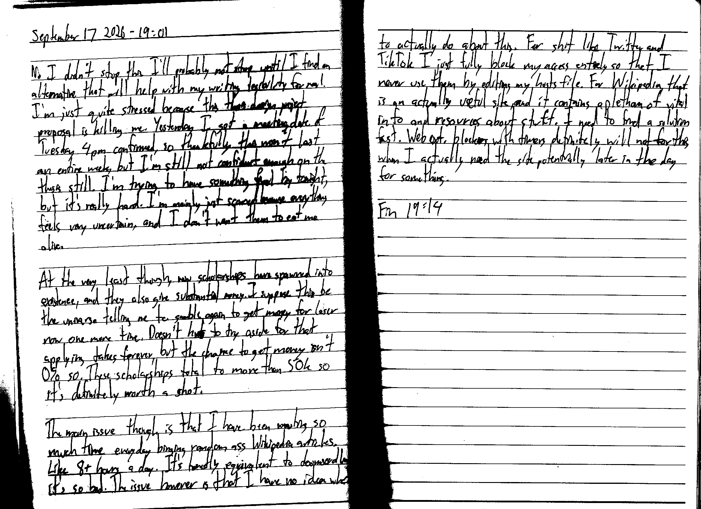

September 17 2026 - 19:01

No I didn't stop this. I'll probably not stop until I find an alternative that will help me with my writing legibility for real. I'm just quite stressed because this thesis design project proposal is killing me. Yesterday I got a meeting date of Tuesday 4 pm confirmed, so thankfully this won't last an entire week, but I'm still not confident enough on the thesis still. I'm trying to have something final by tonight, but it's really hard. I'm mainly just scared because everything feels very uncertain, and I don't want them to eat me alive.

At the very least though, new scholarships have spawned into existence, and they also give substantial money. I suppose this be the universe telling me to gamble again to get money for laser now one more time. Doesn't hurt~~s~~ to try aside for that applying takes forever, but the chance to get money isn't 0% so. These scholarships total to more than 50k so it's definitely worth a shot.

The main issue though is that I have been wasting so much time everyday binging random ass Wikipedia articles. Like 8+ hours a day. It's honestly equivalent to doomscrolling it's so bad. The issue however is that I have no idea what to actually do about this. For shit like Twitter and TikTok I just fully block my access entirely so that I never use them by editing my hosts file. For Wikipedia, that is an actually useful site, and it contains a plethora of vital info and resources about stuff. I need to find a solution fast. Web ext. blockers with timers definitely will not [work] for this when I actually need the site potentially later in the day for something.

Fin 19:14