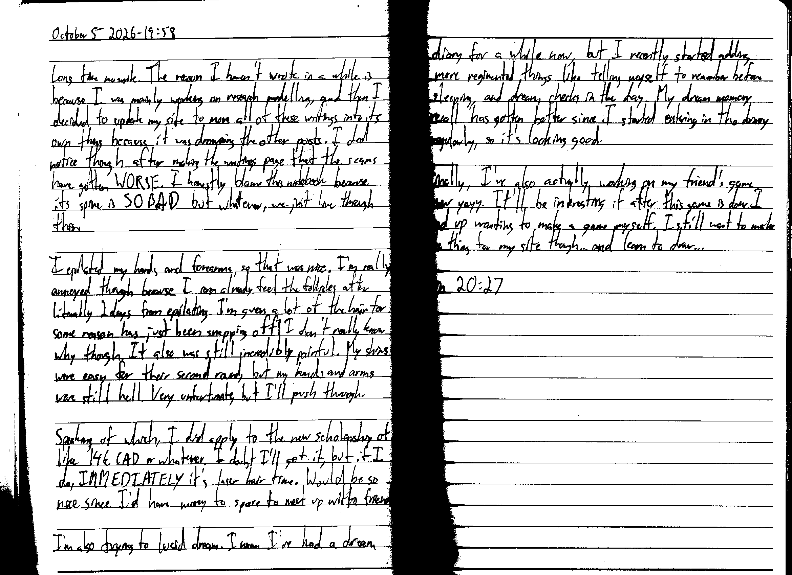

October 5 2026 - 19:58

Long time no write. The reason I haven't wrote in a while is because I was mainly working on research modelling, and then I decided to update my site to move all of these writings into its own thing because it was drowning the other posts. I did notice though after making the writings page that the scans have gotten WORSE. I honestly blame this notebook because its spine is SO BAD but whatever, we just live through this.

I epilated my hands and forearms, so that was nice. I'm really annoyed though because I can already feel the follicles after literally 2 days from epilating. I'm guess[ing] a lot of the hair for some reason has just been snapping off? I don't really know why though. It also was still incredibly painful. My shins were easy for their second round, but my hands and arms were still hell. Very unfortunate, but I'll push through.

Speaking of which, I did apply to the new scholarship of like 14k CAD or whatever. I doubt I'll get it, but if I do, IMMEDIATELY it's laser hair time. Would be so nice since I'd have money to spare to meet up with friends.

I'm also trying to lucid dream. I mean I've had a dream diary for a while now, but I recently started adding more regimented things like telling myself to remember before sleeping, and dream checks in the day. My dream memory recall has gotten better since I started entering in the diary regularly, so it's looking good.

Finally, I've also actually [started] working on my friend's game now yayy. It'll be interesting if after this game is done I end up wanting to make a game myself. I still want to make the thing for my site though... and learn to draw...

Fin 20:27