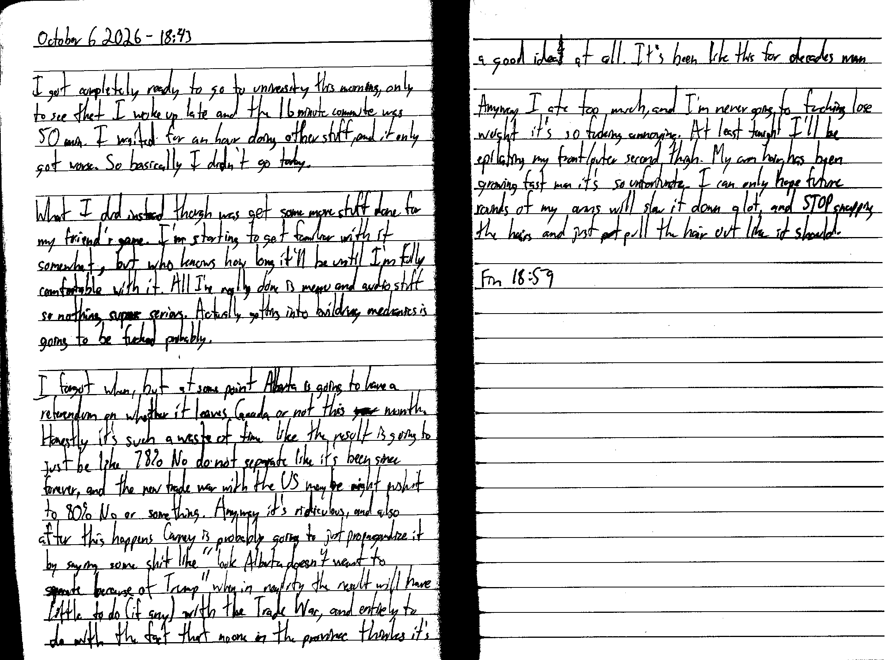

October 6 2026 - 18:43

I got completely ready to go to university this morning, only to see that I woke up late and the 16 minute commute was 50 min. I waited for an hour doing other stuff, and it only got worse. So basically I didn't go today.

What I did instead though was get some more stuff done for my friend's game. I'm starting to get familiar with it somewhat, but who knows how long it'll be until I'm fully comfortable with it. All I've really done is menu and audio stuff so nothing super serious. Actually getting into building mechanics is going to be fucked probably.

I forgot when, but at some point Alberta is going to have a referendum on whether it leaves Canada or not this ~~year~~ month. Honestly it's such a waste of time like the result is going to just be like 78% No do not separate like it's been since forever, and the new trade war with the US maybe might push it to 80% No or something. Anyway it's ridiculous, and also after this happens Carney is probably going to just propagandize it by saying some shit like "look Alberta doesn't want to separate because of Trump" when in reality the result will have little to do (if any) with the Trade War, and entirely do with the fact that no one in the province thinks it's a good idea~~t~~ at all. It's been like this for decades man.

Anyway I ate too much, and I'm never going to fucking lose weight it's so fucking annoying. At least tonight I'll be epilating my front/outer second thigh. My arm hair has been growing fast man it's so unfortunate. I can only hope future rounds of my arms will slow it down a lot, and STOP snapping the hair and just pull the hair out like it should.

Fin 18:59