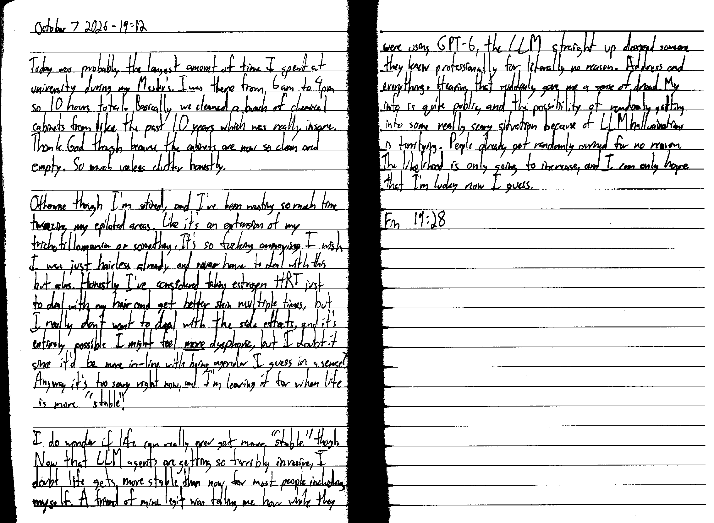

October 7 2026 - 19:12

Today was probably the longest amount of time I spent at university during my Master's. I was there from 6 am to 4 pm so 10 hours total. Basically we cleaned a bunch of chemical cabinets from like the past 10 years which was really insane. Thank God though because the cabinets are now so clean and empty. So much useless clutter honestly.

Otherwise though I'm so tired, and I've been wasting so much time tweezing my epilated areas. Like it's an extension of my trichotillomania or something. It's so fucking annoying I wish I was just hairless already and never have to deal with this, but alas. Honestly I've considered taking estrogen HRT just to deal with my hair and get better skin multiple times, but I really don't want to deal with the side effects, and it's entirely possible I might feel *more* dysphoric, but I doubt it since it'd be more "in-line" with being agender I guess in a sense? Anyway it's too scary right now, and I'm leaving it for when life is more "stable".

I do wonder if life can really ever get more "stable" though. Now that LLM agents are getting so terribly invasive, I doubt life gets more stable than now for most people including myself. A friend of mine legit was telling me how they were using GPT-6, the LLM straight up doxxed someone they knew professionally for literally no reason. Address and everything. Hearing that suddenly gave me a sense of dread. My info is quite public, and the possibility of randomly getting into some really scary situation because of LLM hallucinations is terrifying. People already get randomly owned for no reason. The likelihood is only going to increase, and I can only hope that I'm lucky now I guess.

Fin 19:28